# 高考数学选择、填空题专项练习题十六

| 一、本题共 12 小题,每小题 5 分,共 60 分,在每小题给出的四个选项中只有一个项是符合题目要求的.                                                                                                                                                                                        | 广选 |
|----------------------------------------------------------------------------------------------------------------------------------------------------------------------------------------------------------------------------------------------|----|
| 1. 两个非零向量 $\mathbf{e}_1$ , $\mathbf{e}_2$ 不共线,若( $k\mathbf{e}_1+\mathbf{e}_2$ ) //( $\mathbf{e}_1+k\mathbf{e}_2$ ),则实数 $k$ 的值为(                                                                                                              | )  |
| A. 1 B1 C. ±1 D. 0  2. 有以下四个命题,其中真命题为( ) A. 原点与点(2,3)在直线2x+y-3=0的同侧 B. 点(2,3)与点(3,1)在直线x-y=0的同侧 C. 原点与点(2,1)在直线2y-6x+1=0的异侧 D. 原点与点(2,1)在直线2y-6x+1=0的同侧 3. ①某高校为了解学生家庭经济收入情况,从来自城镇的150名学生和来自农村的名学生中抽取100名学生的样本;②某车间主任从100件产品中抽取10件样本进行产品量检验. |    |
| I. 随机抽样法; Ⅱ. 分层抽样法. 上述两问题和两方法配对正确的是 ( )                                                                                                                                                                                                   |    |
| 1. ①配 I,②配 II B. ①配 II,②配 I                                                                                                                                                                                                                  |    |
| C. ①配 I, ②配 I D. ①配 II, ②配 II                                                                                                                                                                                                                |    |
| 4. 己知函数 $f(x) = (\frac{1}{2})^x$ ,其反函数为 $g(x)$ ,则 $g(x)^2$ 是( )                                                                                                                                                                              |    |
| A. 奇函数且在(0, +∞)上单调递减                                                                                                                                                                                                                         |    |
| B. 偶函数且在 (0, +∞) 上单调递增                                                                                                                                                                                                                       |    |
| C. 奇函数且在 (-∞, 0) 上单调递减                                                                                                                                                                                                                       |    |
| <ul><li>D. 偶函数且在 (-∞, 0) 上单调递增</li><li>5. 以下四个命题:</li></ul>                                                                                                                                                                                  |    |
| 3. 以下四个可题: ①过一点有且仅有一个平面与已知直线垂直;                                                                                                                                                                                                           |    |
| ②若平面外两点到平面的距离相等,则过这两点的直线必平行于该平面;                                                                                                                                                                                                             |    |
| ③两条相交直线在同一平面内的射影必为相交直线;                                                                                                                                                                                                                      |    |
| ④两个互相垂直的平面,一个平面内的任一直线必垂直于另一平面的无数条直线.                                                                                                                                                                                                         |    |
| 其中正确的命题是 ( )                                                                                                                                                                                                                                 |    |
| A. ①和② B. ②和③ C. ③和④ D. ①和④                                                                                                                                                                                                                  |    |
| 6. 从单词 "education"中选取 5 个不同的字母排成一排,则含 "at" ("at"相连且顺                                                                                                                                                                                         | 页序 |
| 不变)的概率为( )                                                                                                                                                                                                                                   |    |
| A. $\frac{1}{18}$ B. $\frac{1}{378}$ C. $\frac{1}{432}$ D. $\frac{1}{756}$                                                                                                                                                                   |    |
| 7. 已知正二十面体的各面都是正三角形,那么它的顶点数为( )                                                                                                                                                                                                              |    |
| A. 30 B. 12 C. 32 D. 10                                                                                                                                                                                                                      |    |
| 8. 已知 $(x+1)^6(ax-1)^2$ 的展开式中, $x^3$ 系数为 56,则实数 $a$ 的值为( )                                                                                                                                                                                   |    |
| A. 6 或 5 B. −1 或 4                                                                                                                                                                                                                           |    |
| C. 6或-1 D. 4或5                                                                                                                                                                                                                               |    |

9. 对某种产品市场产销量情况如图所示,其中: $l_1$ 表示产品各年年产量的变化规律; $l_2$ 

表示产品各年的销售情况. 下列叙述:

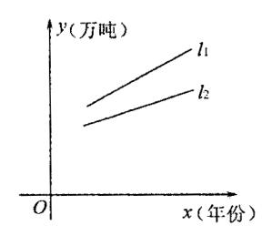

- (1) 产品产量、销售量均以直线上升,仍可按原生产计划进行下去;
- (2) 产品已经出现了供大于求的情况,价格将趋跌;
- (3) 产品的库存积压将越来越严重,应压缩产量或扩大销售量;
- (4)产品的产、销情况均以一定的年增长率递增. 你认为较合理的是( )
- A. (1), (2), (3)
- B. (1), (3), (4)

C. (2), (4)

- D. (2), (3)
- 10. (文) 函数  $y = \cos^2 \frac{x}{2} 1$  的最小正周期是 ( )

- A.  $4\pi$  B.  $2\pi$  C.  $\pi$  D.  $\frac{1}{2}\pi$

(理)函数 
$$y = \cos^2(x + \frac{\pi}{4}) - \cos^2(x - \frac{\pi}{4})$$
 是 ( )

- Α. 周期为π的偶函数
- B. 周期为π的奇函数
- C. 周期为  $2\pi$  的偶函数 D. 周期为  $2\pi$  的奇函数
- 11. (文) 如图,正四面体 ABCD 中,E 为 AB 中点,F 为 CD 的中点,则异面直线 EF与 SA 所成的角为( )

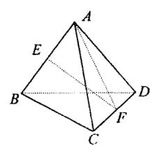

- A.  $90^{\circ}$  B.  $60^{\circ}$  C.  $45^{\circ}$
- D. 30°
- (理)如图,正三棱柱  $ABC-A_1B_1C_1$ 中, $AB=AA_1$ ,则  $AC_1$  与平面  $BB_1C_1C$  所成的角 的正弦值为()

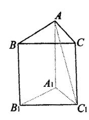

- A.  $\frac{\sqrt{2}}{2}$  B.  $\frac{\sqrt{15}}{5}$  C.  $\frac{\sqrt{6}}{4}$  D.  $\frac{\sqrt{6}}{3}$
- 12. (文) 抛物线 $(x-2)^2 = 2(y-m+2)$ 的焦点在x轴上,则实数m的值为( )

A. 0 B.  $\frac{3}{2}$  C. 2 D. 3

(理) 已知椭圆  $x^2 + \frac{1}{2}y^2 = a^2$  (a > 0) 与 A (2, 1), B (4, 3) 为端点的线段没有公 共点,则 a 的取值范围是()

A. 
$$0 < a < \frac{3\sqrt{2}}{2}$$

B. 
$$0 < a < \frac{3\sqrt{2}}{2}$$
  $\vec{x} = a > \frac{\sqrt{82}}{2}$ 

C. 
$$a < \frac{3\sqrt{2}}{2}$$
  $\vec{\boxtimes} a > \frac{\sqrt{82}}{2}$  D.  $\frac{3\sqrt{2}}{2} < a < \frac{\sqrt{82}}{2}$ 

D. 
$$\frac{3\sqrt{2}}{2} < a < \frac{\sqrt{82}}{2}$$

| 题号 | 1 | 2 | 3 | 4 | 5 | 6 | 7 | 8 | 9 | 10 | 11 | 12 | 得分 |
|----|---|---|---|---|---|---|---|---|---|----|----|----|----|
| 答案 |   |   |   |   |   |   |   |   |   |    |    |    |    |

### 二、填空题:本题共4小题,共16分,把答案填在题中的横线上

13. 己知 a = (3, 4), |a-b|=1, 则|b|的范围是 .

14. 己知直线 y=x+1 与椭圆  $mx^2 + ny^2 = 1$  (m>n>0) 相交于 A, B 两点,若弦 AB

的中点的横坐标等于 $-\frac{1}{3}$ ,则双曲线 $\frac{x^2}{m^2} - \frac{y^2}{n^2} = 1$ 的两条渐近线的夹角的正切值等于

15. 某县农民均收入服从  $\mu=500$  元,  $\sigma=20$  元的正态分布,则此县农民年均收入在 500 元到 520 元间人数的百分比为 .

16. 
$$\lim_{x \to 1} \frac{x + x^2 + \Lambda + x^n - n}{x - 1} = \underline{\qquad}.$$

1. C 2. C 3. B 4. D 5. D 6. A 7. B 8. C 9. D

10. (文) B (理) B 11. (文) C (理) C 12. (文) B (理) B 13. [4, 6]

14.  $\frac{4}{3}$  15. 34.15% 16.  $\frac{n(n+1)}{2}$ 

### 高考数学选择、填空题专项练习题十九

所成角的余弦值是\_\_\_\_\_

13. 双曲线的焦点是  $F_1$ 、 $F_2$ ,P 是双曲线上一点,P 到双曲线两条准线的距离之比为 5:3, ∠F1PF2=120°,则双曲线的离心率是

14. 已知函数 
$$f(x) = \begin{cases} \log_2(x+2), x > 0; \\ \frac{x}{x-1}, x \le 0. \end{cases}$$
 则  $f^{-1}(\frac{1}{2}) =$  \_\_\_\_\_\_;  $f(x)$ 的反函数 \_\_\_\_\_\_.

答案:

BADCD DBCAC

11. 
$$\frac{\sqrt{3}}{2}$$
,  $\frac{\sqrt{3}}{3}$  12. 3/4 13. 7/2(或 3.5) 14. -1;  $f^{-1}(x) = \begin{cases} 2^x - 2, x > 1; \\ \frac{x}{x - 1}, 0 \le x < 1. \end{cases}$ 

## 高考数学选择、填空题专项练习题十二

一、本题共 12 小题,每小题 5 分,共 60 分,在每小题给出的四个选项中只有一个选项是 符合题目要求的.

- 1. 满足条件 $\oslash \subsetneq M \subsetneq \{0, 1, 2\}$ 的集合共有 ( )
- A. 3 个 B. 6 个 C. 7 个 D. 8 个

- 2. (文) 等差数列  $\{a_n\}$ 中,若  $a_1 + a_4 + a_7 = 39$ ,  $a_3 + a_6 + a_9 = 27$ ,则前 9 项的和  $S_9$ 等于()
  - A. 66
- B. 99
- C. 144
- D. 297

(理)复数 $Z_1 = 3 + i$ , $Z_2 = 1 - i$ ,则 $Z = Z_1 \cdot Z_2$ 的复平面内的对应点位于( )

A. 第一象限

B. 第二象限

C. 第三象限

- D. 第四象限
- 3. 函数  $y = \log_2(x-1)$  的反函数图像是 ( )

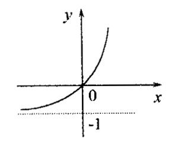

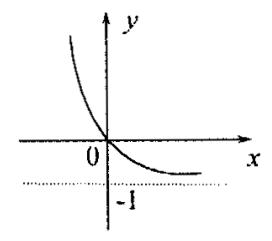

A

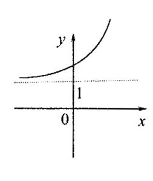

В

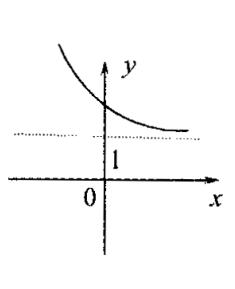

C

D

- 4. 已知函数  $f(x) = \sin(x + \varphi) + \cos(x + \varphi)$  为奇函数,则  $\varphi$  的一个取值为 ( )
- A. 0
- B.  $-\frac{\pi}{4}$  C.  $\frac{\pi}{2}$
- D.  $\pi$

5. 从10种不同的作物种子中选出6种放入6个不同的瓶子中展出,如果甲、乙两种种 子不能放入第1号瓶内,那么不同的放法共有()

- A.  $C_{10}^2 A_8^4$ 种
- B.  $C_9^1 A_9^5$ 种
- C.  $C_8^1 A_9^5$ 种

D.  $C_8^1 A_8^5$ 种

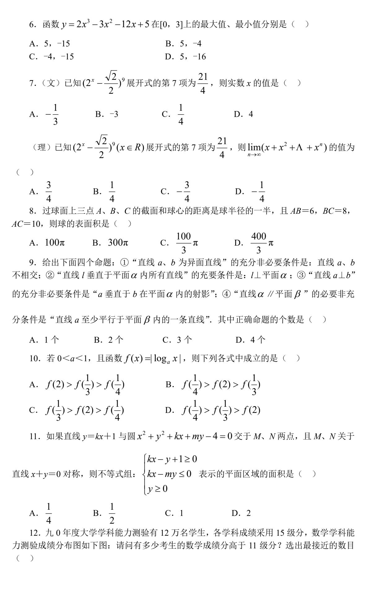

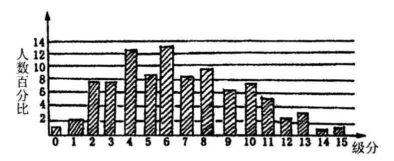

A. 4000 人

B. 10000 人

C. 15000 人

D. 20000 人

| 题号 | 1 | 2 | 3 | 4 | 5 | 6 | 7 | 8 | 9 | 10 | 11 | 12 | 得分 |
|----|---|---|---|---|---|---|---|---|---|----|----|----|----|
| 答案 |   |   |   |   |   |   |   |   |   |    |    |    |    |

### 二、填空题:本题共4小题,共16分,把答案填在题中的横线上

13. 已知:  $|\vec{a}| = 2$ ,  $|\vec{b}| = \sqrt{2}$ ,  $|\vec{a}| = \sqrt{2}$  的夹角为 45°,要使  $|\vec{a}| = \sqrt{2}$  与  $|\vec{a}|$  垂直,则  $\lambda$ 

14. 若圆锥曲线 
$$\frac{x^2}{k-2} + \frac{y^2}{k+5} = 1$$
 的焦距与  $k$  无关,则它的焦点坐标是\_\_\_\_\_\_.

15. 定义符号函数 
$$\operatorname{sgn} x = \begin{cases} 1 & x > 0 \\ 0 & x = 0 \text{, 则不等式: } x + 2 > (2x - 1)^{\operatorname{sgn} x} \text{ 的解集是} \\ -1 & x < 0 \end{cases}$$

16. 若数列  $\{a_n\}$ ,  $(n \in N^*)$  是等差数列,则有数列  $b_n = \frac{a_1 + a_2 + \Lambda + a_n}{n} (n \in N^*)$  也为等差数列,类比上述性质,相应地:若数列  $\{C_n\}$  是等比数列,且  $C_n > 0 (n \in N^*)$  ,则有  $d_n = \underline{\qquad} (n \in N^*)$  也是等比数列.

答案:

- 1. B 2. (文) B (理) D 3. C 4. B 5. C 6. A 7. (文) A (理) D
- 8. D 9. B 10. D 11. A 12. B 13. 2

14. 
$$(0, \pm \sqrt{7})$$
 15.  $\{x \mid -\frac{3+\sqrt{33}}{4} < x < 3\}$  16.  $\sqrt[n]{C_1 C_2 \Lambda \Lambda C_n}$ 

# 高考数学选择、填空题专项练习题十八

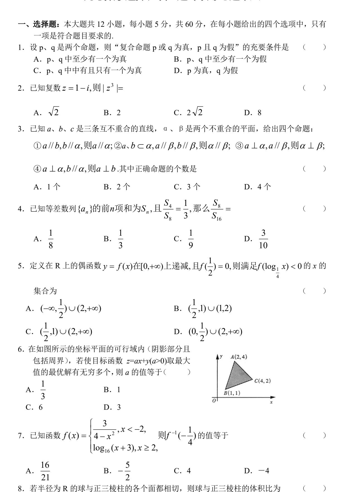

A. 
$$\frac{4\sqrt{3}}{27}\pi$$

B. 
$$\frac{2\sqrt{3}}{27}\pi$$

C. 
$$\frac{\sqrt{3}}{3}\pi$$

D. 
$$\frac{\sqrt{3}}{6}\pi$$

9. 如果以原点为圆心的圆经过双曲线  $\frac{x^2}{a^2} - \frac{y^2}{b^2} = 1(a > 0, b > 0)$  的焦点,而且被该双曲线

的右准线分成弧长为 2: 1 的两段圆弧,那么该双曲线的离心率 e 等于

A. 
$$\sqrt{5}$$

B. 
$$\frac{\sqrt{5}}{2}$$
 C.  $\sqrt{3}$  D.  $\sqrt{2}$ 

C. 
$$\sqrt{3}$$

- 10. 如图, 矩形 ABCD中, AB=3, BC=4, 沿对角 线 BD 将△ABD 折起, 使 A 点在平面 BCD 内 的射影落在 BC 边上, 若二面角 C-AB-D 的 平面角大小为  $\theta$  ,则  $\sin \theta$  的值等于 (

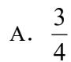

A. 
$$\frac{3}{4}$$
 B.  $\frac{\sqrt{7}}{4}$ 

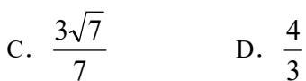

D. 
$$\frac{4}{3}$$

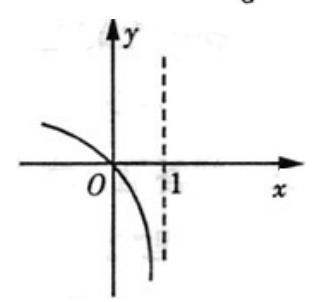

11. 若函数 y = f(x) 的图象如右图所示,则

函数 y = f(1-x) 的图象大致为(

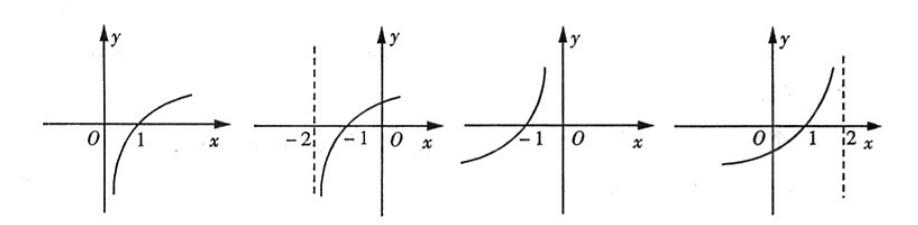

12. 已知函数 y = f(x)满足 $f(x+1) = -f(x)(x \in R)$ ,且f(x)在[0,1]上是减函数,有以下四

个函数: ①  $y = \sin \pi x$  ②  $y = \cos \pi x$  ③  $y = 1 - (x - 2k)^2, 2k - 1 < x \le 2k + 1, k \in Z$ 

 $\textcircled{4} \ y = 1 + (x - 2k)^2, 2k - 1 < x \le 2k + 1, k \in \mathbb{Z}$ 

其中满足f(x)所有条件的函数序号为

A. 12

B. 23

C. 24

D. 1)4)

)

- 二、填空题:本大题共4小题,每小题4分,共16分
- 13.  $(x^3 \frac{1}{2x^2})^{10}$  展开式中的常数项为\_\_\_\_\_\_.
- 14. 如图,一艘船上午9:30在A处测得灯塔S在 它的北偏东30°处,之后它继续沿正北方向匀 速航行,上午 10:00 到达 B 处,此时又测得 灯塔 S 在它的北偏东 75°处,且与它相距

 $8\sqrt{2}$  n mile.此船的航速是 n mile/h.

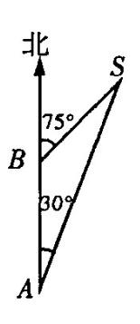

- 15. 若不等式 $|x^2 8x + a| \le x 4$ 的解集为[4,5],则实数a的值等于
- 16. 如图, 从点 $M(x_0,2)$  发出的光线沿平行于抛物线  $y^2=4x$ 的轴的方向射向此抛物线上的点 P, 反射后经焦点 F 又射 向抛物线上的点 Q, 再反射后沿平行于抛物线的轴的方向 射向直线l: x-2y-7=0上的点N, 再反射后又射回点

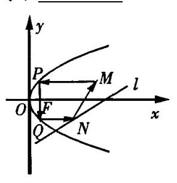

M,则

 $x_0 =$ 

答案:

- 一、选择题:本题考查基本知识和基本运算,每小题5分,满分60分.
- 1. C 2. C 3. B 4. D 5. D 6. B 7. D 8. B 9. D 10. A 11. A 12. B
- 二、填空题: 本题考查基本知识和基本运算,每小题 4 分,满分 16 分.
- 13.  $\frac{105}{32}$
- 14. 32 15. 16 16. 6

## 高考数学选择、填空题专项练习题十

一选择题、本题共12小题,每小题5分,共60分,在每小题给出的四个选项中只有一 个选项是符合题目要求的.

1. (理)全集设为 U, P、S、T均为 U的子集,若 P Y( $C_UT$ ) = ( $C_UT$ ) Y S 则 ( )

A. PYTYS = S B. P = T = S C. T = U D.  $PYC_{U}S = T$ 

(文) 设集合  $M = \{x \mid x + m \ge 0\}$ ,  $N = \{x \mid x^2 - 2x - 8 < 0\}$ , 若  $U = \mathbb{R}$ , 且

 $C_{U}MIN=\emptyset$ ,则实数 m 的取值范围是( )

A. m < 2

B.  $m \ge 2$  C.  $m \le 2$  D.  $m \le 2$  或  $m \le -4$ 

2. (理) 复数  $\frac{(\sqrt{5} + \sqrt{5}i)^3(3-4i)}{4+3i} = ($ 

A.  $-10\sqrt{5}i - 10\sqrt{5}$  B.  $10\sqrt{5} + 10\sqrt{5}i$  C.  $10\sqrt{5} - 10\sqrt{5}i$ 

D.  $-10\sqrt{5} + 10\sqrt{5}i$ 

(文) 点 M (8, -10), 按 a 平移后的对应点 M' 的坐标是 (-7, 4), 则 a= ( )

A. (1, -6) B. (-15, 14) C. (-15, -14) D. (15, -14)

3. 已知数列 $\{a_n\}$ 前 n 项和为 $S_n=1-5+9-13+17-21+\Lambda+(-1)^{n-1}(4n-3)$ ,则

 $S_{15} + S_{22} - S_{31}$  的值是 ( )

A. 13 B. -76

C. 46 D. 76

4. 若函数  $f(x) = -a(x-x^3)$  的递减区间为  $(-\frac{\sqrt{3}}{2}, \frac{\sqrt{3}}{2})$ ,则 a 的取值范围是  $(-\frac{\sqrt{3}}{2}, \frac{\sqrt{3}}{2})$ 

B. -1 < a < 0

C. a > 1

D. 0<a<1

5. 与命题"若 $a \in M$ 则 $b \notin M$ "的等价的命题是( )

A. 若 $a \notin M$ ,则 $b \notin M$  B. 若 $b \notin M$ ,则 $a \in M$  C. 若 $a \notin M$ ,则 $b \in M$  D. 若 $b \in M$ ,则 $a \notin M$ 

6. (理)在正方体  $ABCD - A_1B_1C_1D_1$  中, M, N 分别为棱  $AA_1$  和  $BB_1$  之中点, 则  $\sin(CM)$ 

 $\overrightarrow{D_1N}$ ) 的值为 ( )

A.  $\frac{1}{9}$  B.  $\frac{4}{5}\sqrt{5}$  C.  $\frac{2}{9}\sqrt{5}$  D.  $\frac{2}{3}$ 

(文) 已知三棱锥 S-ABC 中,SA,SB,SC 两两互相垂直,底面 ABC 上一点 P 到三个 面 SAB, SAC, SBC 的距离分别为 $\sqrt{2}$ , 1,  $\sqrt{6}$ , 则 PS 的长度为 ( )

|     |         |                                    |                                       |                         |                     |               |                       |               |                  |                          |                    | 被抽到        | 到的概                                                    | 率为( )                    |
|-----|---------|------------------------------------|---------------------------------------|-------------------------|---------------------|---------------|-----------------------|---------------|------------------|--------------------------|--------------------|------------|--------------------------------------------------------|--------------------------|
|     | A.      | $\frac{1}{20}$                     |                                       | В.                      | $\frac{1}{6}$       |               | С.                    | $\frac{1}{2}$ |                  | D. $\frac{5}{6}$         |                    |            |                                                        |                          |
|     |         |                                    |                                       |                         |                     |               |                       |               |                  |                          |                    |            |                                                        |                          |
|     | 8.      | (理)                                | 己知护                                   | 边物线                     | <i>C</i> : <i>y</i> | $=x^2+$       | - mx +                | 2 与经          | :过 <i>A</i> (    | (0, 1)                   | , B (              | 2, 3)      | 两点的                                                    | 的线段 AB                   |
| 有么  | .共2     | 点,则                                | ] m 的]                                | 取值范                     | 围是                  | ( )           |                       |               |                  |                          |                    |            |                                                        |                          |
|     | A.      | $(-\infty$                         | , -1]                                 | Y [3,                   | $+\infty$           |               | В. [                  | 3, +0         | o)               | C.                       | $(-\infty$ ,       | -1]        |                                                        | D. [-1,                  |
| 3]  |         |                                    |                                       |                         |                     |               |                       |               |                  |                          |                    |            |                                                        |                          |
|     | ()      | 文)设                                | $\forall x \in \mathbf{R}$            | ,则i                     | 函数 $f$              | (x) = 0       | (1- x )               | (1+x)         | :) 的图            | 像在 x                     | 轴上プ                | 方的充        | 要条件                                                    | :是( )                    |
|     | A.      | -1<                                | x < 1                                 |                         |                     |               | В.                    | <i>x</i> <-1  | 或 <i>x</i> >     | 1                        |                    |            |                                                        |                          |
|     | C.      | <i>x</i> <1                        |                                       |                         |                     |               | D.                    | -1 < x        | <1 或             | <i>x</i> <-1             |                    |            |                                                        |                          |
|     | 9.      | 若直                                 | 线 y=1                                 | kx+2                    | 与双曲                 | $ 线x^2 $      | $-y^{2} =$            | 6 的右          | 支交               | 于不同                      | 的两点                | 〔,则        | k 的取                                                   | 值范围是                     |
| (   | )       |                                    |                                       |                         |                     |               |                       |               |                  |                          |                    |            |                                                        |                          |
|     | Α.      | $\left(-\frac{\sqrt{2}}{2}\right)$ | $\frac{15}{3}$ , $\frac{\sqrt{3}}{3}$ | $(\frac{\sqrt{15}}{3})$ | F                   | 3. (0,        | $\frac{\sqrt{15}}{3}$ | )             | C. (             | $(-\frac{\sqrt{15}}{3})$ | $(\frac{1}{5}, 0)$ |            | D.                                                     | $(-\frac{\sqrt{15}}{3},$ |
|     |         |                                    | ,                                     | 3                       |                     |               | 3                     |               |                  | 3                        |                    |            |                                                        | 3                        |
| -1  | )       |                                    |                                       |                         |                     |               |                       |               |                  |                          |                    |            |                                                        |                          |
| 是   | 10      |                                    | <i>c</i> , <i>c</i> ∈                 | (0, -                   | +∞).                | 且表示           | 线段长                   | 长度, 「         | 則 a, b           | <b>,</b> <i>c</i> 能      | 构成银                | 说角三次       | 角形的                                                    | 充要条件                     |
|     | A       | Α.                                 | $a^2+b^2$                             | $c^2 < c^2$             |                     |               | В.                    | $ a^2-a^2 $   | $b^2 \mid < c^2$ | 2                        | С.                 | <i>a</i> - | -b  <c< td=""><td><math>\langle a+b  </math></td></c<> | $\langle a+b  $          |
| D.  | $ a^2 $ | $a^2-b^2$                          | $ < c^2 <$                            | $(a^2 + a^2)$           | $b^2$               |               |                       |               |                  |                          |                    |            |                                                        |                          |
|     | 11.     | <b>.</b> 今有                        | 「命题 】                      | q,                      | 若命匙                 | 5 万为       | "p且                   | q"则           | " —р             | 或一                       | · <b>q</b> "       | 皀" —       | ぷ"的                                                    | <b>j</b> ( )             |
|     | Α.      | 充分                                 | 而不必                                   | 要条件                     | 牛                   |               | В.                    | 必要で           | 可不充分             | 分条件                      |                    |            |                                                        |                          |
|     | C.      | 充要                                 | 条件                                    |                         |                     |               |                       |               | で分也を             |                          | 条件                 |            |                                                        |                          |
|     | 12      | . (理)                              | 函数                                    | y =                     | $\sqrt{x-4}$        | + $\sqrt{15}$ | -3x $f$               | 的值域。          | 是(               | )                        |                    |            |                                                        |                          |
|     | Α.      | [1, 2                              | 2]                                    |                         | В. [                | 0, 2]         |                       | С             | . (0,            | $\sqrt{3}$ ]             |                    | D          | . [1,                                                  | $\sqrt{3}$ ]             |
|     |         | 文)函                                | i数 <i>f</i> (.                        | x)与g                    | g(x) =              | $(\sqrt{7} -$ | $(\sqrt{6})^x$        | 图像关           | 于直线              | 戋 <i>x</i> − <i>y</i> =  | =0 对表              | 称,则        | f(4-                                                   | · x 2 ) 的单    |
| 调力  |         | 间是(                                |                                       | ,                       |                     |               | ,                     |               |                  | •                        |                    |            |                                                        | ,                        |
| 9.3 |         |                                    |                                       |                         | В. (                | -2, 0         | )                     | C             | . (0,            | +∞)                      | )                  | D          | . (-∝                                                  | , 0)                     |
| 题   | 号       | 1                                  | 2                                     | 3                       | 4                   | 5             | 6                     | 7             | 8                | 9                        | 10                 | 11         | 12                                                     | 得分                       |
| 答   | 案       |                                    |                                       |                         |                     |               |                       |               |                  |                          |                    |            |                                                        |                          |
|     |         |                                    |                                       |                         |                     |               |                       |               |                  |                          |                    |            |                                                        |                          |

A. 9 B.  $\sqrt{5}$  C.  $\sqrt{7}$  D. 3

### 二、填空题: 本题共 4 小题, 共 16 分, 把答案填在题中的横线上

13. 等比数列 $\{a_n\}$ 的前n项和为 $S_n$ , 且某连续三项正好为等差数列 $\{b_n\}$ 中的第1, 5,

6 项,则
$$\lim_{n\to\infty} \frac{S_{n+2}}{na_1} = ____.$$

- 14. 若  $\lim_{n \to \infty} (\sqrt{x^2 x + 1} + x k) = 1$ ,则 k =\_\_\_\_\_.
- 15. 有30个顶点的凸多面体,它的各面多边形内角总和是
- 16. 长为 l(0 < l < 1) 的线段 AB 的两个端点在抛物线  $y = x^2$  上滑动,则线段 AB 中点 M 到 x 轴距离的最小值是

#### 参考答案

- 1. (理) A (文) B 2. (理) B (文) B 3. B 4. A 5. D
- 6. (理) B (文) D 7. B 8. (理) C (文) D 9. D 10. D 11. C
- 12. (理) A (文)A 13. 1或0 14.  $\frac{1}{2}$  15. 10080° 16.  $\frac{l^2}{4}$

# 高考数学选择、填空题专项练习题三十一

# 一. 选择题: (本大题共 12 小题,每小题 5 分,共 60 分,在每小题给出的四个选项中,只有一个是符合题目要求的)

1.满足 $AUB = \{a,b\}$ 的集合 $A \setminus B$ 的组数有 ( )

| (A)4组 (B)6组 (C)7组 (D)9组                                                                                                                                                                                                                                                                                                                  |            |
|------------------------------------------------------------------------------------------------------------------------------------------------------------------------------------------------------------------------------------------------------------------------------------------------------------------------------------------|------------|
| 2.已知函数 $f(x) = 1 + \log_2 x$ ,则其反函数为 ( )                                                                                                                                                                                                                                                                                                 |            |
| (A) $f^{-1}(x) = 2^{x+1}(x \in R)$ (B) $f^{-1}(x) = 2^{x-1}(x \in R)$                                                                                                                                                                                                                                                                    |            |
| (C) $f^{-1}(x) = 2^x + 1(x \in R)$ (D) $f^{-1}(x) = 2^x - 1(x \in R)$                                                                                                                                                                                                                                                                    |            |
| $3.$ 函数 $y = \cos 2x$ 的图象的一个对称中心为( )                                                                                                                                                                                                                                                                                                     |            |
| (A) $(\frac{\pi}{2},0)$ (B) $(\frac{\pi}{4},0)$ (C) $(-\frac{\pi}{2},0)$ (D) $(0,0)$                                                                                                                                                                                                                                                     |            |
| 4.若关于 $x$ 的不等式 $ x-2 + x-a  \ge a$ 在 $R$ 上恒成立,则 $a$ 的最大值为(                                                                                                                                                                                                                                                                               |            |
| (A) $0$ (B) $1$ (C) $-1$ (D) $2$                                                                                                                                                                                                                                                                                                         |            |
| 5.给定性质: ①最小正周期为 $\pi$ ②图象关于直线 $x = \frac{\pi}{3}$ 对称,则下列函数中同时具有性质                                                                                                                                                                                                                                                                        | £(1),      |
| ②的是 ( )                                                                                                                                                                                                                                                                                                                                  |            |
| (A) $y = \sin(\frac{x}{2} + \frac{\pi}{6})$ (B) $y = \sin(2x + \frac{\pi}{6})$ (C) $y =  \sin x $ (D) $y = \sin(2x - \frac{\pi}{6})$                                                                                                                                                                                                     |            |
| $6$ . 已知 $\triangle$ $ABC$ 中, $\stackrel{\text{left}}{AB}=\stackrel{\text{left}}{a}$ , $\stackrel{\text{left}}{AC}=\stackrel{\text{left}}{b}$ , $\stackrel{\text{left}}{a}\cdot\stackrel{\text{left}}{b}<0$ , $S_{\triangle ABC}=\frac{15}{4}$ , $\begin{vmatrix}r\\a\end{vmatrix}=3, \begin{vmatrix}r\\b\end{vmatrix}=5$ ,则 $\angle BA$ | <i>C</i> = |
|                                                                                                                                                                                                                                                                                                                                          |            |
| $(A)30^{\circ}$ $(B)-150^{\circ}$ $(C)$ $150^{0}$ $(D)$ $30^{\circ}$ 或 $150^{0}$                                                                                                                                                                                                                                                         |            |
| 7.(理)等差数列 $\{a_n\}$ 中, $a_m=2004, a_{2004}=m$ 且 $m\neq 2004$ ,则 $a_{m+n}(n>2004)$ 项是(                                                                                                                                                                                                                                                    | )          |
| (A)一个正数 (B)一个负数 (C)零 (D)符号不能确定.                                                                                                                                                                                                                                                                                                          |            |
| (文)等比数列 $\{a_n\}$ 中, $a_1 + a_2 = 1$ , $a_3 + a_4 = 9$ ,则 $a_5 + a_6 = ($ )                                                                                                                                                                                                                                                              |            |
| (A) 27 (B) $-27$ (C) 81 (D) $-81$                                                                                                                                                                                                                                                                                                        |            |
|                                                                                                                                                                                                                                                                                                                                          |            |
| 8.偶函数 $f(x)$ 在 $[-1,0]$ 单调递减,若 $A$ 、 $B$ 是锐角三角形的两个内角,则( )                                                                                                                                                                                                                                                                                |            |
| (A) $f(\sin A) > f(\cos B)$ (B) $f(\sin A) > f(\sin B)$                                                                                                                                                                                                                                                                                  |            |
| (C) $f(\cos A) > f(\sin B)$ (D) $f(\cos A) > f(\cos B)$                                                                                                                                                                                                                                                                                  |            |
| 9.设[ $x$ ] 表示不超过 $x$ 的最大整数(例[5.5]=5,[-5.5]=-6),则不等式[ $x$ ] $^2$ -5[ $x$ ]+6 $\leq$ 0                                                                                                                                                                                                                                                     | 的解         |

集为( )

$$(A)(2,3)$$
  $(B)[2,4)$   $(C)[2,3]$   $(D)[2,4]$ 

10.(
$$\mathbb{H}$$
)  $\lim_{x\to 0} \frac{\sqrt{1+x}-1}{x} = ($  )

(A)1 (B)
$$\frac{1}{2}$$
 (C)0 (D)-1

(文)等差数列 
$$\{a_n\}$$
 中,若  $a_7 = a_5 - 2$ ,则  $a_{17} - a_{15} = ($ 

$$(A)-2$$
  $(B)2$   $(C)-1$   $(D)1$ 

11. 正四面体 
$$ABCD$$
 中,  $E$ 、 $F$  分别为棱  $AB$  和  $CD$  上的点, 且  $\frac{AE}{EB} = \frac{CF}{FD} = \lambda$ , 设 
$$f(\lambda) = \alpha_{\lambda} + \beta_{\lambda}$$
(其中

 $\alpha$ , 表示 EF 与 AC 成的角,  $\beta$ , 表示 EF 与 BD 成的角),则( )

(A) 
$$f(\lambda)$$
 在 $[0,+\infty)$  单调递增 (B)  $f(\lambda)$  在 $[0,+\infty)$  单调递减

(C) 
$$f(\lambda)$$
 在[0,1) 单调递增,在[1,+∞) 单调递减 (D)  $f(\lambda)$  在[0,+∞) 为常函数

12. 数 列 
$$\{a_n\}$$
 的 前  $n$  项 和  $S_n$  与 通 项  $a_n$  满 足 关 系 式  $S_n = na_n + 2n^2 - 2n$   $(n \in N_+)$  ,则 
$$a_{100} - a_{10} = ($$
 )

### 二.填空题: (本大题共 4 小题,每小题 4 分,共 16 分)

13.若实数x、y满足x+2y=1且 $x \le 0$ ,则 $x^2+y^2$ 的最小值为 \_\_\_\_\_\_\_\_\_\_\_\_\_\_\_\_\_\_\_\_\_\_\_\_\_\_\_\_\_\_\_\_\_\_\_\_

14. 若 
$$f(x)$$
 是 以 5 为 周 期 的 奇 函 数 ,且  $f(-3)=1$ , $\tan \alpha = 2$  ,则 
$$f(20\sin \alpha \cos \alpha) = \underline{\hspace{1cm}}$$
 .

15.若关于x的不等式 $-\frac{1}{2}x^2 + 2x > mx$ 的解集为(0,2),则实数m的值为 \_\_\_\_\_\_. 16.以下 5 个命题:

①对实数 
$$p$$
 和向量 $a = b$ ,恒有  $p(a-b) = pa - pb$ 

②对实数 
$$p \setminus q$$
 和向量  $a$  ,恒有  $(p-q)a = pa-qa$ 

③若 
$$pa = pb$$
  $(p \in R)$ ,则  $a = b$ 

④若 
$$pa = qa$$
  $(p, q \in R)$ ,则  $p = q$ 

⑤对任意的向量
$$a \cdot b$$
,恒有 $a \cdot b = b \cdot a$ 

写出所有真命题的序号\_\_\_\_\_\_.
一. 选择题: 1.D;2.B;3.B;4.B;5.D;6.C;7.(理)B;(文)C;8.A;9.B;10. (理)B; (文)A;11.D;12.C.

二.填空题: 13.  $\frac{1}{4}$ ;14. -1;15.1;16.①②⑤

# 高考数学选择、填空题专项练习题三十五

- 一、选择题(本大题共 12 小题,每小题 5 分,共 60 分,每小题给出的 4 个选项中,只有 1 项是符合题要求的)
- 1. 设 $0 \in A$ ,则满足 $A Y B = \{0,1\}$ 的集合 A,B 的组数是 ( )
  - A. 1组 B. 2组 C. 4组 D. 6组
- 2. 若0 < a < 1,且函数 $f(x) = \log_a x$ ,则下列各式中成立的是
  - A.  $f(2) > f(\frac{1}{3}) > f(\frac{1}{4})$  B.  $f(\frac{1}{4}) > f(2) > f(\frac{1}{3})$
  - C.  $f(\frac{1}{4}) > f(\frac{1}{3}) > f(2)$  D.  $f(\frac{1}{3}) > f(2) > f(\frac{1}{4})$
- 3. 在  $\triangle ABC$  中,如果  $\sin A = \frac{\sqrt{3}}{2}$ ,  $\cos B = \frac{\sqrt{19}}{10}$ ,则角 A 等于 ( )
- A.  $\frac{\pi}{3}$  B.  $\frac{2\pi}{3}$  C.  $\frac{\pi}{3}$  或  $\frac{2\pi}{3}$  D.  $\frac{\pi}{6}$  或  $\frac{5\pi}{6}$
- 4. 已知数列 $\{a_n\}$ 满足 $S_n = \frac{1}{3}a_n 1$ ,那么 $\lim_{n \to \infty} (a_2 + a_4 + \Lambda + a_{2n})$ 的值为 ( )
  - A.  $\frac{1}{2}$  B.  $\frac{2}{3}$  C. 1 D. -2
- 5. 直线 y = mx + 1与圆 $x^2 + y^2 10x 12y + 60 = 0$ 有交点,但直线不过圆心,则  $m \in ($ 
  - A.  $(\frac{3}{4},1) Y (1,\frac{4}{3})$  B.  $[\frac{3}{4},1) Y (1,\frac{4}{3}]$  C.  $[\frac{3}{4},\frac{4}{3}]$  D.  $(\frac{3}{4},\frac{4}{3})$
- 6. 如图,在正三角形  $\triangle ABC$  中,D、E、F 分别为各边的中点,G、H、I、J 分别为 AF,AD,BE,DE 的中点,将  $\triangle ABC$  沿 DE,EF,DF 折成三棱锥以后,GH 与 IJ 所成角的度数为 (

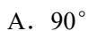

B.  $60^{\circ}$ 

C. 45°

D. 0°

7. 已知以x,y为自变量的目标函数 $\omega = kx + y(k > 0)$ 的可行域 如图阴影部分(含边界),若使 $\omega$ 取最大值时的最优解有无穷 多个,则k的值为

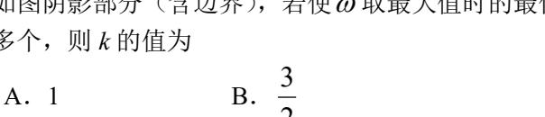

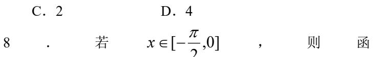

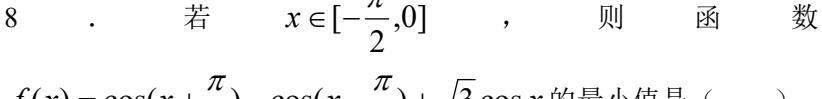

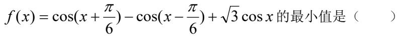

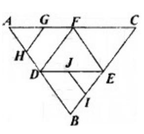

|                  |   | 1   |
|------------------|---|-----|
| $\boldsymbol{H}$ | _ | - 1 |

B. 
$$-1$$

B. 
$$-1$$
 C.  $-\sqrt{3}$  D.  $-2$ 

D. 
$$-2$$

- 9. 一个正四面体外切于球  $O_1$ ,同时又内接于球  $O_2$ ,则球  $O_1$  与球  $O_2$  的体积之比为 ( )
  - A.  $1:3\sqrt{3}$
- B.  $1:6\sqrt{3}$  C. 1:8
- D. 1:27
- 10. 若把英语单词"hello"的字母顺序写错了,则可能出现的错误的种数是
- B. 59
- C. 120
- 11. E, F 是随圆  $\frac{x^2}{4} + \frac{y^2}{2} = 1$  的左、右焦点,l 是椭圆的一条准线,点 P 在 l 上,则 $\angle$ EPF

的最大值是

- A. 15°
- B. 30°
- C. 60°
- D. 45°
- 12. 关于甲、乙、丙三人参加高考的结果有下列三个正确的判断: ①若甲未被录取,则乙、 丙都被录取;②乙与丙中必有一个未被录取;③或者甲未被录取,或者乙被录取,则三 人中被录取的是
  - A. 甲
- B. 丙
- C. 甲与丙 D. 甲与乙

#### 答题卡

| 题号 | 1 | 2 | 3 | 4 | 5 | 6 | 7 | 8 | 9 | 10 | 11 | 12 |
|----|---|---|---|---|---|---|---|---|---|----|----|----|
| 答案 |   |   |   |   |   |   |   |   |   |    |    |    |

- 二、填空题(本大题共4个小题,每小题4分,共16分,把答案填在题中的横线上.)
- 13. 把函数  $y = 2x^2 4x + 5$  的图象按向量 a 平移后,得  $y = 2x^2$  的图象,则  $a = _____$
- 14. 己知关于 x 的不等式  $\frac{ax-5}{x^2-a} < 0$  的解集为 M,若  $3 \in M$ ,且  $5 \notin M$ ,则实数 a 的取值范
- 15. 设  $f(x) = x^5 5x^4 + 10x^3 10x^2 + 5x + 1$ ,则f(x)的反函数的解析式是  $f^{-1}(x) =$ \_\_\_\_
- 16. 若 E, F 分别是四棱柱 ABCD—A1B1C1D1 的棱 AB, AD 的中点,则加上条件\_\_\_\_\_ 就可得结论: EF  $\bot$  平面  $DA_1C_1$ . (写出你认为正确的一个 条件即可)

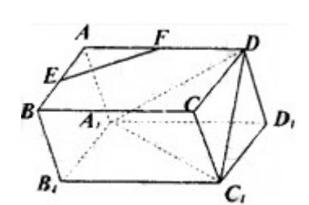

- 1.D 2.C 3.A 4.C 5.B 6.B 7.A 8.A 9.D 10.B 11.B 12.D
- 13. (-1, -3) 14.  $[1, \frac{5}{3}) Y(9,25]$  15.  $\sqrt[5]{x-2} + 1$
- 16. 底面是菱形且 DC1上底面(或填 AB=BC, AD=CD, DA上底面; 或填底面是正方形,  $DA_1 \perp A_1B_1$ , $DA_1 \perp A_1D_1$  等等)

# 高考数学选择、填空题专项练习题三十四

一、选择题:本大题共 12 小题,每小题 5 分。共 60 分.在每小题给出的四个选项中,只有

一项是符合题目要求的.

| 1、不等式 $(x^3-4x^2+4x)$ $(3+2x-x^2) > 0$ 的解集为 (                                           | )   |
|-----------------------------------------------------------------------------------------|-----|
| $A \setminus \{x \mid x < -1 \text{ od } 1 < x < 3\}$                                   |     |
| B, $\{x \mid 0 < x < 3 \text{ A. } x \neq 2\}$                                          |     |
| $C, \{x \mid -1 < x < 0 \text{ od } x > 3\}$                                            |     |
| D. $\{x \mid x < -1 \text{ od } 0 < x < 2 \text{ od } 2 < x < 3\}$                      |     |
| 2、若"p且q"与"¬p或q"均为假命题,则( )                                                               |     |
| A、"p"真"q"假                                                                              |     |
| B、"p" 假"q"真                                                                             |     |
| C、"p"与"q"均真                                                                             |     |
| D、"p"与"q"均假                                                                             |     |
| 3、设集合 $U = \{ (x, y) \mid x \in R, y \in R \}, A = \{ (x, y) \mid x + y > m \}, I$      | 3 = |
| $\{(x, y) \mid x^2 + y^2 \leq n\}$ , 那么点 $M$ $(1, 2) \in (C_U A) \cap B$ 的充要条件          | ‡是  |
| ( )                                                                                     |     |
| A、 <i>m</i> ≥3 且 <i>n</i> ≥5                                                            |     |
| B、 <i>m</i> ≤3 且 <i>n</i> ≥5                                                            |     |
| C、 <i>m</i> ≥3 且 <i>n</i> ≤5                                                            |     |
| D、 <i>m</i> ≤3 且 <i>n</i> ≤5                                                            |     |
| $4$ 、函数 $f(x) = x   sin x + a   + b (a, b \in R)$ 是奇函数的充要条件是( )                         |     |
| A, $ab = 0$ B, $a + b = 0$ C, $a = b$ D, $a^2 + b^2 = 0$                                |     |
| 5、从 4 名男生和 3 名女生中选出 4 人参加某个座谈会, 若这 4 人中必须既有男生有女生,则不同的选法共有()                             | 主又  |
| A、140 种 B、120 种 C、35 种 D、34 种                                                           |     |
| 6、已知椭圆方程 $\frac{x^2}{25} + \frac{y^2}{9} = 1$ ,椭圆上点 $M$ 到该椭圆一个焦点 $F_1$ 的距离为 $2$ , $P_2$ | Ⅴ是  |
| $MF_1$ 的中点, $O$ 是椭圆的中心,那么线段 $ON$ 的长度为(                                                  |     |
| A, 2 B, 4 C, 8 D, $\frac{3}{2}$                                                         |     |
|                                                                                         |     |

- 7、(理科做) 已知无穷等比数列  $\{a_n\}$  的各项和为 $\frac{1}{2}$ ,则  $a_1$  的范围是(
  - $A_{1} 1 < a_{1} < 1$

- B,  $0 < a_1 < 1$
- $C, 0 < a_1 < \frac{1}{2}$   $\vec{x} \leq \frac{1}{2} < a_1 < 1$
- D、所给条件不足以确定  $a_1$  的范围
- (文科做) 等差数列  $\{a_n\}$  中,  $a_1 + 3a_8 + a_{15} = 120$ , 则  $2a_9 a_{10}$ 的值是(
- A 20
- B2 22
- C24
- 8、设  $f^{1}(x)$  是函数 f(x) 的导数, $y=f^{1}(x)$  的图象如图甲所示,则 y=f(x) 的图象最 )中的图象: 有可能是图(

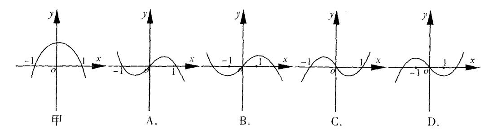

- 9、(理科做) 设  $f(n) = (\frac{1+i}{1-i})^n + (\frac{1-i}{1+i})^n \ (n \in z)$ , 则集合 |x|x = f(n)中元素的个数是(
  - $A_{\searrow} 1$
- B3 2
- C, 3
- D、无穷多个

- (文科做)  $\sin \frac{\pi}{12} + \cos \frac{\pi}{12}$ 的值为(
- $A \sqrt{\frac{3}{3}}$   $B \sqrt{\frac{3}{4}}$   $C \sqrt{\frac{6}{3}}$

- 10、已知集合  $M = \{$  直线的倾斜角 $\}$ ,集合  $N = \{$  两条异面直线所成的角 $\}$ ,集合 P= {直线与平面所成的角},则下列结论中正确的个数为(
  - ①  $(M \cap N) \cap P = (0, \frac{\pi}{2}]$
- ②  $(M \cap N) \cup P = (0, \pi]$
- 11、实数 x、y 满足不等式  $\begin{cases} x-y \ge 0 \\ 2x-y-2 \ge 0 \end{cases}$  ,则  $\omega = \frac{y-1}{x+1}$  的取值范围是 (
- A,  $[-1, \frac{1}{3}]$  B,  $[-\frac{1}{2}, \frac{1}{3}]$  C,  $[-\frac{1}{2}, +\infty)$  D,  $[-\frac{1}{2}, 1)$
- 12、直线 y=x+3 与曲线  $\frac{y^2}{9} \frac{x|x|}{4} = 1$  ( )

  - A、没有交点 B、只有一个交点 C、有两个交点 D、有三个交点

#### 答题卡

| 题号 | 1 | 2 | 3 | 4 | 5 | 6 | 7 | 8 | 9 | 10 | 11 | 12 |
|----|---|---|---|---|---|---|---|---|---|----|----|----|
| 答案 |   |   |   |   |   |   |   |   |   |    |    |    |

二、填空题:本大题共4小题,每小题4分,共16分.把答案填在题中横线上.

13、 $(x^2 - \frac{1}{2x})^9$  展开式中含  $x^9$  的项为

14、设地球  $\mathbf{0}$  的半径为 R, P 和 Q是地球上两地,P 在北纬 45°, 东经 20°, Q 在北纬 45°, 东经 110°, 则 P 与 Q 两地的球面距离为

15、(理科做)某同学在一次知识竞赛中有两道必答题,每道题答对得 10 分,答错扣5 分,假设每题回答正确的概率均为 0.7,且各题之间没有影响,则这名同学回答这两道题的总得分 ξ 的数学期望是\_\_\_\_\_\_\_\_\_\_\_\_\_\_\_\_\_\_\_\_\_\_\_\_\_\_\_\_\_\_\_\_\_\_\_\_

(文科做)若二次函数 f(x)满足 f(x+1)-f(x)=2x, f(0)=1, 则 f(x)=\_\_\_\_\_\_

16、下列命题:

- (1) 在空间, 若四点不共面, 则每三点一定不共线;
- (2) 若 A(m, 10) , B(m+2, 10) , 点 P 满足 PA PB =1 , 则点 P 的轨迹 是双曲线;
- (3)一个简单多面体的各面都是三角形,若它的顶点数为V,面数为F,则F与V间的关系是F=2V-4;
- (4) 若点 P(m, n) 到直线 l: 2x 3y + 10 = 0 的距离为 $\sqrt{m^2 + n^2}$ , 则点 P 的轨迹为抛物线.

其中正确的命题为\_\_\_\_\_\_

- -, 1. D 2. A 3. A 4. D 5. D 6. B
  - 7. C 8. B 9. C 10. C 11. D 12. D
- 二、13、 $-\frac{21}{2}x^9$  14、 $\frac{\pi}{3}R$  15、(理) 11 (文)  $f(x) = x^2 x + 1$

16、①③④

# 高考数学选择、填空题专项练习题三十三

| 中,只 | 有一项是很                    | 符合是                | 、 题                          | 勺)                       | 小题 5 分                  | ,共60分,               | 在每小题给出的四个:                                | 选项     |
|-----|--------------------------|--------------------|---------------------------------|--------------------------|-------------------------|----------------------|-------------------------------------------|--------|
| A.  | $\frac{1}{4}$            | В.                 | $-\frac{1}{4}$                  | $C.  \frac{\sqrt{3}}{4}$ | B D.                    | $-\frac{2}{3}$       |                                           |        |
| 2,  | 函数 y =                   | sin x              | $x + \cos x$ $\dot{\mathbf{f}}$ | り最小正                     | 周期是(                    | )                    |                                           |        |
| Α.  | $\frac{\pi}{4}$          | В.                 | $\frac{\pi}{2}$                 | C. π                     | D.                      | $2\pi$               |                                           |        |
| 3、  | 首项系数                     | 7为1                | 的二次函                            | 数 <i>y = f</i>           | f(x) 在 x =              | =1处的切线               | 与 $x$ 轴平行,则(                              | )      |
| Α.  | f(0) > 1                 | f(2)               | В.                              | f(0)<                    | f(2) C                  | f(-2)>               | f(2) D. $f(-2)$                           | < f(2) |
| 4、  | 己知定义                     | 人在[-               | - 1,1]上的                        | 函数 <i>y</i> =            | = f(x) 的t               | 直域为[- 2,             | $[0]$ ,则函数 $f(\cos x)$ 的                  | 的值域为   |
| (   | )                        |                    |                                 |                          |                         |                      |                                           |        |
| A.  | [-1,1]                   | В.                 | [-3,-1]                         | C.                       | [-2,0]                  | D. <i>∃</i>          | <b></b>                                   |        |
| 5、  | 函数 y =                   | $\frac{1}{2\pi}$ . | $e^{-\frac{(x-m)^2}{3}}(n$      | n > 0)                   | 的部分图像                   | 大致是(                 | )                                         |        |
| Α.  |                          |                    | В.                              |                          | C.                      |                      | D.                                        |        |
|     |                          | ]不等                | 式 $ax-b$                        | >0的解                     | 集为(1,+                  | ∞),则关于               | $\frac{1}{x}$ 的不等式 $\frac{ax+b}{x-2} > 0$ | 0 的解集  |
| 为(  |                          |                    |                                 |                          |                         |                      |                                           |        |
| Α.  | (-1,2)                   |                    | B. (−∞                          | $(-1) \cup ($            | $(2,+\infty)$           |                      |                                           |        |
| С.  | (1, 2)                   |                    | D.                              | $(-\infty, -2)$          | 2)∪(1,+∞                | ာ)                   |                                           |        |
| 7、  | 若0为△                     | ABC                | 了的内心,                           | 且满足                      | ( <i>OB</i> – <i>OC</i> | $(C) \cdot (OB + O)$ | $C-2OA$ ) = $0$ ,则 $\Delta A$             | BC 的形  |
| 状为( | )                        |                    |                                 |                          |                         |                      |                                           |        |
| A.  | 等腰三角                     | 角形                 | В.                              | 正三角是                     | 杉 C.                    | 直角三角用                | 》 D. 以上都不对                                |        |
| 8,  | 若平面α                     | : 与平               | 面 β 相交                          | 5,直线                     | $m\perp \alpha$ ,       | 则(                   | )                                         |        |
| Α.  | $\boldsymbol{\beta}$ 内必不 | 字在直                | 重线与 m ⁵                         | P行,且                     | 存在直线                    | 与 <i>m</i> 垂直。       |                                           |        |

B.  $\beta$ 内不一定存在直线与m平行,不一定存在直线与m垂直。

D.  $\beta$  内必存在直线与m 平行,不一定存在直线与m 垂直。 9、已知数列 $\{a_n\}$ 的前n项和 $S_n$ 满足 $S_n=1-\frac{2}{3}a_n$ ,则其各项和S( B.  $\frac{3}{2}$  C.  $\frac{5}{3}$  D.  $\frac{2}{3}$ 10、当圆锥的侧面积与底面积的比值是 $\sqrt{2}$  时,圆锥的轴截面的顶角是( A. 30° B. 45° C. 90° D. 120° 11、P 是双曲线  $\frac{x^2}{a^2} - \frac{y^2}{b^2} = 1(a > 0, b > 0)$  右支上一点, $F_1, F_2$  分别是其左、右焦点,且 焦距为2c,则 $\Delta PF_1F_2$ 的内切圆圆心的横坐标为: В. *b* C. c D. a+b-c12、如图所示,在正方体 ABCD - A'B'C'D' 的侧面 AB' 内有一动点 P 到直线 AB 与 直线 B'C'的距离相等,则动点 P 所在曲线的形状为( A. C. D. 二、填空题(本大题 4 个小题,每小题 4 分,共 16 分,只填结果,不要过程) 13、若指数函数  $f(x) = a^x (x \in R)$  的部分对应值如下表: 2 0.694 f(x)1.44 则不等式  $f^{-1}(x-1) < 0$  的解集为\_\_\_\_\_。 14、a = (4,-3), |b| = 1,且 $a \cdot b = 5$ ,则向量b =15、已知点P(2,-3), Q(3,2), 直线ax+y+2=0与线段PQ相交,则实数a的取值 范围是 16、若在所给条件下,数列 $\{a_n\}$ 的每一项的值都能唯一确定,则称该数列是"确定的",

在下列各组条件下,有哪些数列是"确定的"?请把对应的序号填在横线上\_\_\_\_。

① $\{a_n\}$ 是等差数列, $S_1 = a, S_2 = b$ (这里 $S_n$ 是 $\{a_n\}$ 的前n项和,a,b为实常数,下

C.  $\beta$  内不一定存在直线与m 平行,但必存在直线与m 垂直。

② $\{a_n\}$ 是等差数列, $S_1 = a, S_{10} = b$ 

同)

③ $\{a_n\}$ 是等比数列, $S_1 = a, S_2 = b$ 

④ $\{a_n\}$ 是等比数列, $S_1 = a, a_3 = b$ 

⑤  $\{a_n\}$  满足  $a_{2n+2}=a_{2n}+a, a_{2n+1}=a_{2n-1}+b, (n\in N^*), a_1=c$ 

答 案

1. B 2. D 3. C 4. C 5. C 6. B 7. A 8. C 9. A 10. C 11. A 12. C

13. (1,2) 14.  $\left(\frac{4}{5}, -\frac{3}{5}\right)$  15.  $\left[-\frac{4}{3}, \frac{1}{2}\right]$  16. ①②③

# 高考数学选择、填空题专项练习题三十七

# 一、选择题(本大题共 12 小题,每小题 5 分,共 60 分,在每小题给出的 4 个选项中,只有 1 项

1. 给出两个命题: p:|x|=x 的充要条件是 x 为正实数; q:存在反函数的函数一定是单调函数,

### 是符合题目要求的.)

|    | 则                       | 下                            | 列                     | 哪                | 个                         | 复                                    | 合                   | 例                       | 题                              | 是                              | 真                   | 命                 | 题             |
|----|-------------------------|------------------------------|-----------------------|------------------|---------------------------|--------------------------------------|---------------------|-------------------------|--------------------------------|--------------------------------|---------------------|-------------------|---------------|
|    | (                       | )                            |                       |                  |                           |                                      |                     |                         |                                |                                |                     |                   |               |
|    | А. р                    | 且q                           |                       | . ]              | B. p或                     | q  x²-x<0,x                       |                     | С. ¬р                   | p且q                            |                                | D.                  | . ¬p 或            | q             |
| 2  | •                       | 设、                           | 集                     | 合                | $M=\{x$                   | $ x^2-x<0,x $                        | $\in$               | <b>R</b> },             | $N = \{x    x\}$               | = <2,x                         | €                   | <b>R</b> },       | 则             |
|    |                         | ) J <i>N=M</i>            |                       | В                | . <i>M</i> ∩λ             | =M                                   |                     | $C.$ ( $C_R$            | $(M) \cap \Lambda$             | /=Ø                            | D. (0               | $(C_RN)\cap I$    | N=R           |
|    |                         |                              |                       |                  |                           | 油长、虚                                 |                     |                         |                                |                                |                     |                   |               |
|    | A. $\frac{\sqrt{5}}{2}$ |                              |                       | ]                | B. $\frac{\sqrt{5}+1}{2}$ | <u>:</u>                             |                     | C. √                    | 2                              |                                | D.                  | $\sqrt{3}$        |               |
| 4. | 设 = (                | $\frac{\sqrt{2}}{2}(\cos 1)$ | 4° + sin              | 14°), <i>b</i> = | = cos15                   | °cos14°-                             | -sin15°             | sin 14°,                | $c = \frac{\sqrt{3}}{2}$       | ,则                             | <i>a,b,c</i> É      | 的大小               | 关系            |
|    | 设有[0] ③侧 直 (   | 四个命题 棱垂直子 平 行 )     | i: ①底i F底面两 F 六 | 面是矩 万条边的 面 | 形的平 的平行方 体          | c <a 行六面体 六面体是 , 其</a  | 本是长方 :直平行 : 中 | ·体 ② 六面体 真        | 棱长都 (4)对; 命              | 相等的 角线相 © 题 的 | 直四棱/ 等的平/ 勺 个 | 柱是正元 行六面位 数 | 方体 体是      |
|    | A. 1                    |                              |                       |                  | В. 2                      |                                      |                     | C. 3                    | 3                              |                                | Ι                   | ). 4              |               |
| 6. | 数列                      | $\{a_n\}$ $\oplus$ ,         | $a_1=1$ ,             |                  | $a_n = \frac{1}{1}$       | $\frac{a_{n-1}}{+3a_{n-1}}(n$        | ≥ 2),则              | $\lim_{n\to\infty}na_n$ | 为                              |                                | (                   | )                 |               |
|    | A. 0                    |                              |                       |                  | B. 1                      |                                      |                     | C. 7                    | <u>1</u>                       |                                | Ι                   | ). 不存             | 在             |
| 7. | 己知ƒ                     | (x)是定义                       | 义在 <b>R</b> 占         | 上的奇丽             | 函数,且                      | 当 x<0 时                              | f, f(x)=2           | ex,则 f                  | $(-\frac{1}{4})^{\frac{1}{4}}$ | <b></b> 有值为                    |                     | (                 | )             |
|    | A. $-\frac{1}{2}$       |                              |                       | B. $\frac{1}{2}$ |                           |                                      | C2                  |                         |                                | D                              | . 2                 |                   |               |
| 8. | 则速 A. 10             | 度在[60, 00 辆               |                       | 车大约 B. 80     | 为有( 辆                  | 速度的频 )                            | 率分布」                | <b></b> 直方图,            | 0.04 0.03 0.02           | 频率/组员                          | E                   |                   |               |
| 9. |                         | •                            |                       | 1                | 线为 <i>l</i> ,             | 将圆 <i>x</i> ²+ 直为                 | -y²=9 按             | 向量 <i>ā</i> (        | 0.01                           |                                | 0 50 60             | 70 80 返           | ► 速度(km/h) |

| Α.    | $\frac{1}{2}$                         |                    | В.                                     | 2                 |        |                  | С.        | <u>1</u>    |                      | D                  | . 4    |              |            |
|-------|---------------------------------------|--------------------|----------------------------------------|-------------------|--------|------------------|-----------|-------------|----------------------|--------------------|--------|--------------|------------|
| 尹     |                                       |                    |                                        |                   |        |                  |           |             | 不同,则 <b>{</b> } 的 |                    |        |              |            |
| ,     | . 9个                                  |                    | В                                      | . 8个              |        |                  | С.        | 5个          |                      | D                  | . 4个   |              |            |
| 11. 兵 | 为 周                                   |                    | 其中任 为                               | 意两点 4 <i>л</i> |        |                  |           | 穿于球点 这 ′ | 的大圆居 个 球          | 1 日长的 6 的 | ;,经过   |              | 的小圆 只 为 |
|       | . 64 π                                |                    |                                        | 3. 48 π           |        |                  |           |             |                      |                    | . 12 π |              |            |
|       | ē将两种 反块数如                          |                    | 同的钢                                    | 板截成               | A, B,  | C 三 5 | 种规        | 格,每         | 张钢板                  | 可同时                | · 截得三  | <b>注</b> 种规格 | 的小钢        |
| 12    | 以厌奴如                                  | 1下次:               |                                        | A                 |  规格 |                  |           | B 规         |  格                |                    | C 规格   |              |            |
|       | 第                                     | 一种钢                | 板                                      |                   | 2      |                  |           | 1           |                      |                    | 1      |              |            |
|       |                                       | 二种钢                | -                                      |                   | 1      |                  |           | 2           |                      |                    | 3      |              |            |
|       |                                       |                    |                                        |                   |        |                  |           |             | 需两种规                 |                    |        |              |            |
|       | (m  ,                                 | n                  | 为                                      | 整                 | 数      | ),               | 则         | n           | n+n                  | 的                  | 最      | 小 值          | i 为        |
| `     | . 10                                  |                    | В                                      | B. 11             |        |                  | С.        | 12          |                      | D                  | . 13   |              |            |
|       |                                       |                    |                                        |                   |        | 答題               | <b>返卡</b> |             |                      |                    |        |              |            |
| 题号    | 1                                     | 2                  | 3                                      | 4                 | 5      | 6                | 5         | 7           | 8                    | 9                  | 10     | 11           | 12         |
| 答案    | da . N . Introd                       |                    | - 11 · A                               | P. Indian         |        |                  |           |             | to the               |                    |        | 144.5.1      | <u> </u>   |
|       | <b>冥空趣</b> ( 足复数 2                 |                    | _                                      | _                 |        |                  |           |             | ,把答                  |                    | 题中的    | J横线上         | .)         |
|       |                                       |                    | -                                      |                   |        | -                | -         | _           | , 则λ=                |                    |        |              |            |
|       | -                                     | - 2,  0  - 1       | ∠, <i>u</i> —J <i>u</i> 1 ; | J/C/H/J           | 4,安区   | <i>7.0</i> –     | и⊸ји      | ,           | , , <b>, , ,</b>     |                    |        |              |            |
|       | 已知(1-2 第 项.                        | x) n 的展 | 是开式中                                   | ,二项               | [式系数   | 的和               | 为(        | 64,则        | 它的二                  | 项展开                | 式中,    | 系数最          | 大的是        |
|       | ===================================== | ABC 中              | ,角A、                                   | В, С              | 的对边    | 分别               | 为a        | , b, c      | e,且 a=               | 1, A=3             | 0°,c=  | √3, 则 △      | ABC 的      |
|       | 可积为_                                  |                    |                                        |                   |        |                  |           |             |                      |                    |        |              |            |
| 答案    | ī积为 <u>_</u>                          |                    | ·                                      |                   | 5. A   | 6.               | C 7       | 7. D        | 8. C 9               |                    | 10. A  | 11. B        | 12. C      |

# 高考数学选择、填空题专项练习题三十六

- 一、选择题(本大题共 12 小题,每小题 5 分,共 60 分,每小题给出的四个选项中,只有 1 项是符合题要求的)
- 1. 若集合  $A = \{a^2, a+1, -1\}, B = \{2a-1, |a-2|, 3a^2+4\}, 且AIB = \{-1\}, 则a$ 的值是(
- B. 0 或 1
- C. 2

)

- 2. 若0 < a < 1,且函数 $f(x) = \log_a x$ ,则下列各式中成立的是
  - A.  $f(2) > f(\frac{1}{2}) > f(\frac{1}{4})$  B.  $f(\frac{1}{4}) > f(2) > f(\frac{1}{2})$
  - C.  $f(\frac{1}{4}) > f(\frac{1}{3}) > f(2)$  D.  $f(\frac{1}{3}) > f(2) > f(\frac{1}{4})$
- 3. 在  $\triangle ABC$  中,如果  $\sin A = \frac{\sqrt{3}}{2}$ ,  $\cos B = \frac{\sqrt{19}}{10}$ ,则角 A 等于

- A.  $\frac{\pi}{3}$  B.  $\frac{2\pi}{3}$  C.  $\frac{\pi}{3}$  或 $\frac{2\pi}{3}$  D.  $\frac{\pi}{6}$  或 $\frac{5\pi}{6}$
- 4. 在等差数列  $\{a_n\}$  中,若  $a_3+a_5+a_7+a_9+a_{11}=100$ ,则 $3a_9-a_{13}$ 的值为
  - A. 20
- B. 30
- C. 40
- 5. 直线 y = mx + 1与圆 $x^2 + y^2 10x 12y + 60 = 0$ 有交点,但直线不过圆心,则  $m \in ($ 
  - A.  $(\frac{3}{4},1) Y(1,\frac{4}{2})$  B.  $[\frac{3}{4},1) Y(1,\frac{4}{2}]$  C.  $[\frac{3}{4},\frac{4}{2}]$  D.  $(\frac{3}{4},\frac{4}{2})$

- 6. 如图,在正三角形  $\triangle ABC$  中,D、E、F 分别为各边的中点,G、 H、I、J分别为 AF, AD, BE, DE 的中点,将 ΔABC 沿 DE, EF, DF 折成三棱锥以后, GH 与 IJ 所成角的度数为 (

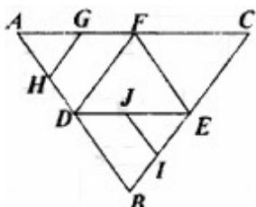

- A. 90°
- B. 60°
- C. 45°
- D.  $0^{\circ}$

$$\begin{cases} x-4y+3 \le 0, \\ 3x+5y \le 25, \text{ 所表示的平面区域图形是} \end{cases}$$

)

- A. 第一象限内的三角形
- B. 四边形
- C. 第三象限内的三角形
- D. 以上都不对
- 8. 若  $x \in [-\frac{\pi}{2}, 0]$ ,则函数  $f(x) = \cos(x + \frac{\pi}{6}) \cos(x \frac{\pi}{6}) + \sqrt{3}\cos x$  的最小值是(
  - A. 1
- B. -1 C.  $-\sqrt{3}$
- 9. 一个正四面体外切于球  $O_1$ ,同时又内接于球  $O_2$ ,则球  $O_1$  与球  $O_2$  的体积之比为 (

- A.  $1:3\sqrt{3}$  B.  $1:6\sqrt{3}$  C. 1:8 D. 1:27
- 10. 若把英语单词"hello"的字母顺序写错了,则可能出现的错误的种数是
- B. 59
- C. 120
- 11. E, F 是随圆  $\frac{x^2}{4} + \frac{y^2}{2} = 1$  的左、右焦点,l 是椭圆的一条准线,点 P 在 l 上,则 $\angle$ EPF

的最大值是 ( )

- A. 15°
- B. 30°
- C. 60°
- D. 45°
- 12. 关于甲、乙、丙三人参加高考的结果有下列三个正确的判断: ①若甲未被录取,则乙、 丙都被录取:②乙与丙中必有一个未被录取:③或者甲未被录取,或者乙被录取,则三 人中被录取的是
  - A. 甲
- B. 丙
- C. 甲与丙 D. 甲与乙

| 题号 | 1 | 2 | 3 | 4 | 5 | 6 | 7 | 8 | 9 | 10 | 11 | 12 |
|----|---|---|---|---|---|---|---|---|---|----|----|----|
| 答案 |   |   |   |   |   |   |   |   |   |    |    |    |

- 二、填空题(本大题共4个小题,每小题4分,共16分,把答案填在题中的横线上.)
- 13. 把函数  $y = 2x^2 4x + 5$  的图象按向量 a 平移后,得  $y = 2x^2$  的图象,则  $a = _____$ .
- 14. 已知关于 x 的不等式  $\frac{ax-5}{x^2-a} < 0$  的解集为 M,若  $3 \in M$ ,且  $5 \notin M$ ,则实数 a 的取值范 围是
- 15. 设  $f(x) = x^5 5x^4 + 10x^3 10x^2 + 5x + 1$ ,则f(x)的反函数的解析式是  $f^{-1}(x) =$
- 16. 若 E, F 分别是四棱柱 ABCD—A1B1C1D1 的棱 AB, AD 的中点,则加上条件 就可得结论:  $EF \perp \text{平面 } DA_1C_1$ . (写出你认为正确的-

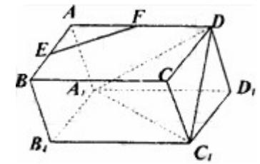

- 1.D 2.C 3.A 4.C 5.B 6.B 7.A 8.A 9.D 10.B 11.B 12.D
- 13. (-1, -1) 14.  $[1, \frac{5}{3}) Y(9,25]$  15.  $\sqrt[5]{x-2} + 1$
- 16. 底面是菱形且 DC1 上底面(或填 AB=BC, AD=CD, DA 上底面; 或填底面是正方形,  $DA_1 \perp A_1 B_1$ , $DA_1 \perp A_1 D_1$  等等)

## 高考数学选择、填空题专项练习题三十九

# 一、选择题(本大题共 12 小题,每小题 5 分,共 60 分,在每小题给出的 4 个选项中,只有 1 项

### 是符合题目要求的.)

①若  $a \perp b$ ,  $a \perp \alpha$ , 则  $b // \alpha$ 

( )

A. 0 个

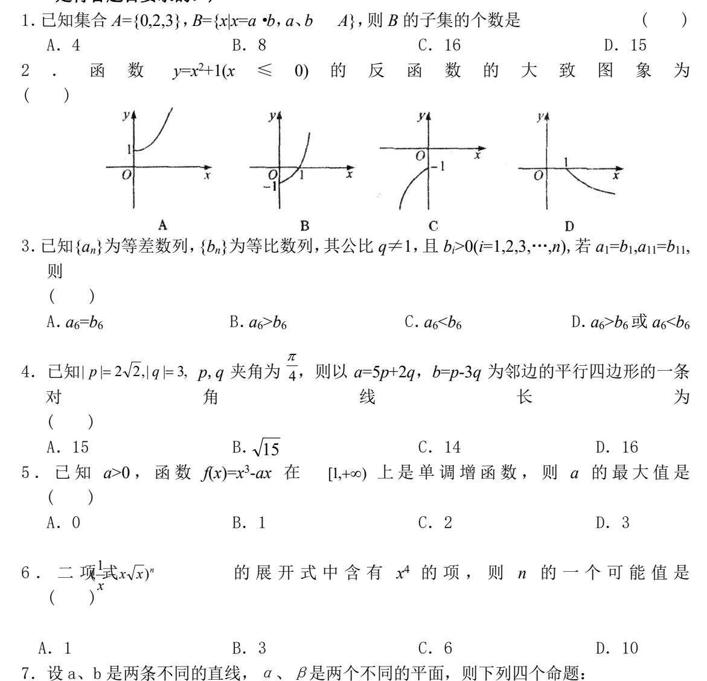

8. 使函数 $(x) = \sin(2x + \theta) + \sqrt{3}\cos(2x + \theta)$  是奇函数,且整 $\frac{\pi}{4}$  上是减函数的  $\theta$ 的一个值是

②若 a// a,  $a \perp \beta$ , 则  $a \perp \beta$ 

B. 1 个 C. 2 个

是

A.  $\frac{\pi}{3}$  B.  $\frac{2\pi}{3}$  C.  $\frac{4\pi}{3}$  D.  $\frac{5\pi}{3}$   $\frac{x^2}{4} - y^2 = 1$ 

| 9. | $\partial F_1$ 、 | $F_2$ 是双曲组 | 4 |
|----|------------------|------------|---|
|    |                  |            |   |

的两个焦点,P 在双曲线上,当  $\Delta F_1 P F_1$  的面积为 1 时,

 $\overrightarrow{PF_1} \cdot \overrightarrow{PF_2}$  的值为

A. 0 B. 1 C.  $\frac{1}{2}$ 

10. 如图所示,已知正四棱椎 S—ABCD 侧棱长为 $\sqrt{2}$  ,底面边长为 $\sqrt{3}$  ,E 是 SA 的中点,则异面直线 BE 与 SC 所成角的大小为 ( )

A. 90°

B. 60°

C. 45°

D. 30°

11. 已知函数 y=f(x)(x R)满足 f(x+1)=f(x-1),且 x [-1,1]时, $f(x)=x^2$ ,则 y=f(x)与  $\log_5 x$  的图象的交点的个数为 ( )

A. 3个

B. 4个

C. 5个

D. 6个

D. 2

12. 已知三个不等式  $x^2$ -4x+3<0①,  $x^2$ -6x+8<0②,  $2x^2$ -9x+m<0③,要使同时满足①和②的所有 x 的 值 都 满 足 ③ , 则 实 数 m 的 取 值 范 围 是 ( )

A. m > 9

B. m=9

C. *m*≤9

D. 0<*m*≤9

| 答题卡 |  |
|-----|--|
|     |  |

| 题号 | 1 | 2 | 3 | 4 | 5 | 6 | 7 | 8 | 9 | 10 | 11 | 12 |
|----|---|---|---|---|---|---|---|---|---|----|----|----|
| 答案 |   |   |   |   |   |   |   |   |   |    |    |    |

### 二、填空题(本大题共4个小题,每小题4分,共16分,把答案填在题中的横线上。)

13. 已知两变量x,y之间的关系为  $\lg(y-x)=\lg y-\lg x$ ,则以x为自变量的函数y的最小值为\_\_\_\_。

14. 已知圆
$$x^2 + y^2 + mx - \frac{1}{4} = 0$$
与抛物线 $y = \frac{1}{4}x^2$ 的准线相切,则  $m = \underline{\qquad}$ .

15. 若 
$$A$$
 是  $\triangle ABC$  的一个内角,且 $\sin A + \cos A = \frac{7}{13}$ ,则  $\frac{5 \sin A + 4 \cos A}{15 \sin A - 7 \cos A} = \frac{15 \sin A + 4 \cos A}{15 \sin A - 7 \cos A} = \frac{15 \sin A + 4 \cos A}{15 \sin A - 7 \cos A} = \frac{15 \sin A + 4 \cos A}{15 \sin A - 7 \cos A} = \frac{15 \sin A + 4 \cos A}{15 \sin A - 7 \cos A} = \frac{15 \sin A + 4 \cos A}{15 \sin A - 7 \cos A} = \frac{15 \sin A + 4 \cos A}{15 \sin A - 7 \cos A} = \frac{15 \sin A + 4 \cos A}{15 \sin A - 7 \cos A} = \frac{15 \sin A + 4 \cos A}{15 \sin A - 7 \cos A} = \frac{15 \sin A + 4 \cos A}{15 \sin A - 7 \cos A} = \frac{15 \sin A + 4 \cos A}{15 \sin A - 7 \cos A} = \frac{15 \sin A + 4 \cos A}{15 \sin A - 7 \cos A} = \frac{15 \sin A + 4 \cos A}{15 \sin A - 7 \cos A} = \frac{15 \sin A + 4 \cos A}{15 \sin A - 7 \cos A} = \frac{15 \sin A + 4 \cos A}{15 \sin A - 7 \cos A} = \frac{15 \sin A + 4 \cos A}{15 \sin A - 7 \cos A} = \frac{15 \sin A + 4 \cos A}{15 \sin A - 7 \cos A} = \frac{15 \sin A + 4 \cos A}{15 \sin A - 7 \cos A} = \frac{15 \sin A + 4 \cos A}{15 \sin A - 7 \cos A} = \frac{15 \sin A + 4 \cos A}{15 \sin A - 7 \cos A} = \frac{15 \sin A + 4 \cos A}{15 \cos A} = \frac{15 \cos A + 4 \cos A}{15 \cos A} = \frac{15 \cos A + 4 \cos A}{15 \cos A} = \frac{15 \cos A + 4 \cos A}{15 \cos A} = \frac{15 \cos A + 4 \cos A}{15 \cos A} = \frac{15 \cos A + 4 \cos A}{15 \cos A} = \frac{15 \cos A + 4 \cos A}{15 \cos A} = \frac{15 \cos A + 4 \cos A}{15 \cos A} = \frac{15 \cos A + 4 \cos A}{15 \cos A} = \frac{15 \cos A + 4 \cos A}{15 \cos A} = \frac{15 \cos A + 4 \cos A}{15 \cos A} = \frac{15 \cos A + 4 \cos A}{15 \cos A} = \frac{15 \cos A + 4 \cos A}{15 \cos A} = \frac{15 \cos A + 4 \cos A}{15 \cos A} = \frac{15 \cos A + 4 \cos A}{15 \cos A} = \frac{15 \cos A + 4 \cos A}{15 \cos A} = \frac{15 \cos A + 4 \cos A}{15 \cos A} = \frac{15 \cos A + 4 \cos A}{15 \cos A} = \frac{15 \cos A + 4 \cos A}{15 \cos A} = \frac{15 \cos A + 4 \cos A}{15 \cos A} = \frac{15 \cos A + 4 \cos A}{15 \cos A} = \frac{15 \cos A + 4 \cos A}{15 \cos A} = \frac{15 \cos A + 4 \cos A}{15 \cos A} = \frac{15 \cos A + 4 \cos A}{15 \cos A} = \frac{15 \cos A + 4 \cos A}{15 \cos A} = \frac{15 \cos A}{15 \cos A} = \frac{15 \cos A}{15 \cos A} = \frac{15 \cos A}{15 \cos A} = \frac{15 \cos A}{15 \cos A} = \frac{15 \cos A}{15 \cos A} = \frac{15 \cos A}{15 \cos A} = \frac{15 \cos A}{15 \cos A} = \frac{15 \cos A}{15 \cos A} = \frac{15 \cos A}{15 \cos A} = \frac{15 \cos A}{15 \cos A} = \frac{15 \cos A}{15 \cos A} = \frac{15 \cos A}{15 \cos A} = \frac{15 \cos A}{15 \cos A} = \frac{15 \cos A}{15 \cos A} = \frac{15 \cos A}{15 \cos A} = \frac{15 \cos A}{15 \cos A} = \frac{15 \cos A}{15 \cos A} = \frac{15 \cos A}{15 \cos A} = \frac{15 \cos A}{15 \cos A} = \frac{15 \cos A}{15 \cos A} = \frac{15 \cos A}{15 \cos A} = \frac{15 \cos A}{15 \cos A} = \frac{15 \cos A}{15 \cos A} = \frac{15 \cos A}{15 \cos A} = \frac{15 \cos A}{15 \cos A} = \frac{15 \cos A}{15 \cos A} = \frac{15 \cos A}{15 \cos A} = \frac{15 \cos A}{15 \cos A} = \frac{15 \cos A}{15$ 

16. 用砖砌墙,第一层(底层)用去了全部砖块的一半多一块,第二层用去了剩下的一半多一块,…,依次类堆,每一层都用去了上层剩下的砖块的一半多一块,如果到第九层恰好砖块用完,那么一共用了块砖。

# 高考数学选择、填空题专项练习题三十二

- 一、选择题(5'×12=60')
- 1. 函数 y=3sinx+4cosx+5 的最小正周期是

A. 
$$\frac{\pi}{5}$$

B. 
$$\frac{\pi}{2}$$

С. π

D.  $2\pi$ 

2. 已知定义域在[-1,1]上的函数 y=f(x)的值域为[-2,0],则函数 y=f( $\cos\sqrt{x}$ )的值域为

A. 
$$[-1,1]$$

A. 
$$[-1,1]$$
 B.  $[-3,-1]$  C.  $[-2,0]$ 

C. 
$$[-2,0]$$

D. 不能确定

3. 已知函数 y=f(x)是一个以 4 为最小正周期的奇函数,则 f(2)=

D. 不能确定

4. 设  $f(x-1)=x^2-2x+3$  ( $x \le 1$ ),则函数  $f^{-1}(x)$  的图象为

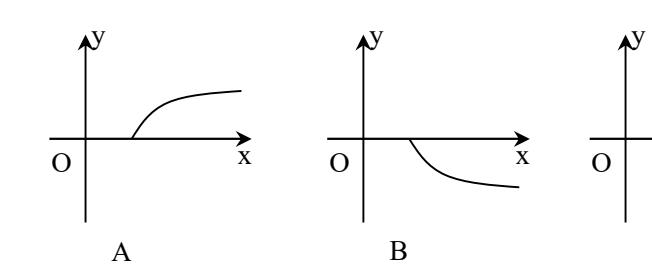

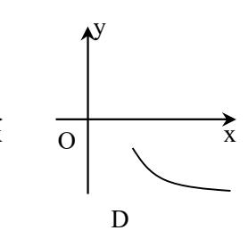

5. 首项系数为 1 的二次函数 y=f(x)在 x=1 处的切线与 x 轴平行,则

A. 
$$f(\arcsin \frac{1}{3}) > f(\arcsin \frac{2}{3})$$

B. 
$$f(\arcsin \frac{1}{3}) = f(\arcsin \frac{2}{3})$$

C. 
$$f(\arcsin \frac{1}{3}) > f(\arcsin \frac{2}{3})$$

D. 
$$f(\arcsin\frac{1}{3})$$
与  $f(\arcsin\frac{2}{3})$ 的大小不能确

定

6. 关于 x 的不等式 ax − b>0 的解集为(1,+∞),则关于 x 的不等式  $\frac{ax+b}{x-2}$  >0 的解集为

A. 
$$(-1,2)$$
  $(1,+\infty)$ 

B. 
$$(-\infty, -1) \cup (2, +\infty)$$
C.  $(1,2)$ 

D. 
$$(-\infty, -2) \cup$$

- 7. 若 O 为  $\triangle$  ABC 的内心,且满足( $\overrightarrow{OB} \overrightarrow{OC}$ )•( $\overrightarrow{OB} + \overrightarrow{OC} 2\overrightarrow{OA}$ )=0
  - A. 等腰三角形
- B. 正三角形 C. 直角三角形 D. 以上都不对

- 8. 设有如下三个命题
  - $\mathbb{P}: \mathbf{m} \cap l = \mathbf{A}, \mathbf{m}, l \subset \alpha, \mathbf{m}, l \not\subset \beta;$
  - 乙: 直线 m、l中至少有一条与平面β相交;
  - 丙: 平面α与平面β相交。
  - 当甲成立时,乙是丙的\_\_\_ 条件。
  - A. 充分而不必要
- C. 充分必要
- D. 既不充分又不

- 必要
- B. 必要而不充分
- 9. ⊿ABC 中, 3sinA+4cosB=6, 3cosA+4sinB=1, 则∠C 的大小为

| A. $\frac{\pi}{6}$ |                                                                                     | $\frac{5\pi}{6}$                               | 0 (                            | $\frac{\pi}{6}$ D.     | $\frac{\pi}{3}$ $\frac{2\pi}{3}$  |
|--------------------|-------------------------------------------------------------------------------------|------------------------------------------------|--------------------------------|------------------------|-----------------------------------|
|                    | 只的球和正方体,它 >S 正方体                                                      | C们的衣曲你的丿 、S 球 <s正方体</s |                                | D.                     | S 球 =2S 正方体 |
| 11. 若连绰            | 吉双曲线 $\frac{x^2}{a^2} - \frac{y^2}{b^2}$                                            | =1 与其共轭双曲                                      | 由线的四个顶点构                       | 肉成面积为 S 1 的 | 四边形,连结                            |
| 四个焦                | 点构成面积为 S2 的                                                                         | 四边形,则 $\frac{S_1}{S_2}$                        | 的最大值为                          |                        |                                   |
| A. 4               | В                                                                                   | . 2                                            | C. $\frac{1}{2}$               | D.                     | $\frac{1}{4}$                     |
| 相邻正                | 个正方体形状的积z 方体中上底各边的 能直接看到的表面                                                   | 中点,最下面的                                        | 正方体的棱长为                        | 1,平放在桌面                |                                   |
| A. 2 一 博空题      | B (4'×4=16')                                                                        | . 3                                            | C. 4                           | D.                     | 6                                 |
|                    | xxxxxxxxxxxxxxxxxxxxxxxxxxxxxxxxxxxx                                                | R)的部分对应值如                                      | 如下表:                           |                        |                                   |
|                    | X                                                                                   | -2                                             | 0                              | 2                      |                                   |
|                    | f(x)                                                                                | 0.694                                          | 1                              | 1.44                   |                                   |
| 14. 若两             | 式 $f^{-1}( \mathbf{x}-1 )<0$ 的个向量 $\vec{a}$ 与 $\vec{b}$ 的夹                          | . 角为θ, 则称向                                     | 可量" $\vec{a} \times \vec{b}$ " | 为"向量积",                | 其长度 $ \vec{a} $ ×                 |
|                    | •  $\vec{b}$  •sinθ。今已知  点 P(2,-3),Q(3,2                                         |                                                | ·                              |                        | 。 a 的取值范围                      |
| 16. 若在原 在下列     | 听给的条件下,数列 条件下,有哪些数                                                               | 列是"确定的"                                        | ? 请把对应的序                       | 号填在横线上_                | 0                                 |
|                    | 差数列, $S_1=a$ , $S_2=$                                                               |                                                | {a n }的前n项          | 的和,a,b 为实数             | 数,下同);                            |
| . ,                | 差数列, S 1 =a, S 10 比数列, S 1 =a, S 2 = |                                                |                                |                        |                                   |
|                    | 比数列, $S_1=a$ , $S_2$                                                                |                                                |                                |                        |                                   |
| . ,                | $a_{2n+2}=a_{2n}+a$ , $a_{2n+1}=$                                                   |                                                | $a_1=c$                        |                        |                                   |
|                    | A BACAB CB                                                                          |                                                |                                |                        |                                   |
| 二、13. (0           | $(0,1) \cup (1,2) $ 14. 315.                                                        | $[-\frac{4}{3},\frac{1}{2}]16.$                | 123                            |                        |                                   |

## 高考数学选择、填空题专项练习题三十八

# 一、选择题(太大题共12小题, 每小题5分, 共60分, 在每小题给出的4个选项中, 只有

| 、这种区(中人区人127)区,每70区0万,人00                            | יי יולע ט  | T-04-1-1-05-31 TT H11 - |   | \\ \\ \D |
|------------------------------------------------------|------------|-------------------------|---|----------|
| 1 项                                                  |            |                         |   |          |
| 是符合题目要求的.)                                           |            |                         |   |          |
| 1. 己知集合 $A=\{x x^2-11x-12<0\}$ ,集合 $B=\{x x=2(3n+1)$ | $,n$ $Z$ } | ,则 $A$ ∩ $B$ 等于         | ( | )        |

B. {2,8} C. {4,10} D. {2,4,8,10} 果 命 题 p 或 q 为 假 命 题 , 则 A.  $\{2\}$ 2. 如 ( ) B. p、q 中至少有一个为真命题 A. p、q均为真命题

 

 C. p、q 中至多有一个为真命题
 D. p、q 均为假命题

 3. 在 100, 101, 102, …, 999 这些数中, 各位数字按严格递增(如"145")或严格递减(如

" 321 " ) 顺序排列的数的个数 ( ) C. 204 A. 120 В. 168

4 . 不 等 式  $|x+\log_2 x| < |x|+|\log_2 x|$  的 解 集 ( )

A. (0, 1)B.  $(1, +\infty)$  C.  $(0, +\infty)$  D.  $(-\infty, +\infty)$ 

5. 已知 a 、  $\beta$  以及  $a+\beta$  均为锐角, $x=\sin(a+\beta),y=\sin a+\sin \beta,z=\cos a+\cos \beta$ ,那么 x 、y 、z小 大 关 系 ( )

C. *x*<*z*<*y* B. *y<x<z* A. x < y < z

6. 过曲线  $xy=a^2(a\neq 0)$ 上任意一点处的切线与两坐标轴构成的三角形的面积是 ( )

B.  $\sqrt{2}a^2$  C.  $2a^2$ A.  $a^2$ D. 不确定

7. 若  $(1-2^{x_0})^9$  展开式的第 3 项为 144,则  $\lim_{x\to x_0} (\frac{1}{r-1} - \frac{2}{r^2-1})$  的值是

 $C. \frac{1}{2}$ 

8. 正四面体的内切球和外接球的半径分别为 r 和 R,则 r:R 为 ( )

B. 1: 3 C. 1: 4 A. 1: 2

9. 已知椭圆的中心在原点,离心率  $e=\frac{1}{2}$  且它的一个焦点与抛物线 y2=4x 的焦点重合,则此 椭圆的方程为

A.  $\frac{x^2}{4} + \frac{y^2}{3} = 1$ B.  $\frac{x^2}{8} + \frac{y^2}{6} = 1$ D.  $\frac{x^2}{4} + y^2 = 1$ C.  $\frac{x^2}{2} + y^2 = 1$ 

B. 1

A. 2

10. 如果直线 y=kx+1 与圆  $x^2+y^2+kx+my-4=0$  交于 M、N 两点,且 M、N 关于直线 x+y=0 对 称,

| (   | 则 ) | 不等: | 式组: | $\begin{cases} kx - y + 1 \ge 0 \\ kx - my \le 0 \end{cases}$ | ≥ 0 0 | 表示   | 的 | 平頂 | 面区 均 | 或 的 正 | 可积 是 |
|-----|--------|-----|-----|---------------------------------------------------------------|----------|------|---|----|------|-------|------|
|     |        | •   |     | $B. \frac{1}{2}$                                              |          |      |   |    |      |       | 三复欠战 |
| 11. |        |     |     | 由于改进〕 ·半,同时,                                               |          |   |   |    |      |       |      |
|     |        |     |     | 的                                                             |          |      |   |    |      |       |      |
|     | (      | )   |     |                                                               |          |      |   |    |      |       |      |

- A. 第一年 B. 第三年 C. 第四年 D. 第五年
- 12 . 设  $\triangle$  ABC 的 三 边 a 、 b 、 c 满 足  $a^n+b^n=c^n(n>2)$ ,则  $\triangle$  ABC 是 ( )
- A. 钝角三角形
- B. 锐角三角形 C. 等腰直角三角形 D. 非等腰的直角三

角形

#### 答题卡

| 题号 | 1 | 2 | 3 | 4 | 5 | 6 | 7 | 8 | 9 | 10 | 11 | 12 |
|----|---|---|---|---|---|---|---|---|---|----|----|----|
| 答案 |   |   |   |   |   |   |   |   |   |    |    |    |

- 二、填空题(本大题共4个小题,每小题4分,共16分,把答案填在题中的横线上。)
- 13. 一个容量为n的样本,分成若干组,已知某数的频数和频率分别为 36 和 0.25,则n 等 于 .
- 14. 设数列 $\{a_n\}$ 的前 n 项和为 $S_n,S_n = \frac{a_1(3^n-1)}{2} (n \ge 1, n \in N)$ ,且 $a_4=54$ ,则 $a_1=$
- 15. 如图,已知 ABC— $A_1B_1C_1$  是各棱长均为 5 的正三棱柱,E、 $E_1$  分别是 AC,  $A_1C_1$  的中点,则平面  $AB_1E_1$  与平面  $BEC_1$  的距离为\_

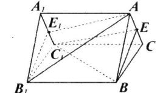

16. 函数  $f(x) = \begin{cases} x, x \in P, \\ -x, x \in M \end{cases}$ , 其中 P、M 为实数集 R 的两个非空子集,又规

定  $f(P)=\{y|y=f(x),x P\},f(M)=\{y|y=f(x),x M\}.$  给出下列四个判断,①若  $P\cap M=\emptyset$ ,则  $f(P) \cap f(M) = \emptyset$  ②若  $P \cap M \neq \emptyset$ ,则  $f(P) \cap f(M) \neq \emptyset$  ③若  $P \cup M = R$ ,则  $f(P) \cup f(M) = R$  ④若  $P \cup M \neq R$ ,则  $f(P) \cup f(M) \neq R$ ,其中正确的判断为\_\_\_\_\_\_

1. B 2. D 3. B 4. A 5. A 6. C 7. C 8. B 9. A 10. A 11. D 12. B 13. 144 14. 2 15.  $\sqrt{5}$  16. 24

# 高考数学选择、填空题专项练习题三十

| 一、选择题(本题共 1                                                    | 2 小题,每题 5 分,                                                  | 共60分)                                               |                    |
|----------------------------------------------------------------|---------------------------------------------------------------|-----------------------------------------------------|--------------------|
| <ol> <li>已知集合 M = {x    x</li> </ol>                           | -1 ≤1},Z 为整数集,                                                | ,则M∩Z为                                              | ( )                |
| A. {2, 1}                                                      |                                                               |                                                     | D. {0, -1}         |
| 2. 已知复数 $z = 2 + i$ ,则 A. I                                    | ] z² 对应的点中第( B.Ⅱ                                           |                                                     | D. IV              |
| $3. \lim_{n\to\infty} \frac{3^n - 1}{2\times 3^n + 1} = \dots$ |                                                               |                                                     | ( )                |
| A. $\frac{1}{2}$                                               | B. $\frac{1}{3}$                                              | C. 1                                                | D. 0               |
| 4. 函数 $y = \sin(2x + \psi)$                                    | (0≤ψ≤π) 是 R 上向                                                | 的偶函数,则ψ的值                                           | 是 ( )              |
| A. 0                                                           | B. $\frac{\pi}{2}$                                            | C. $\frac{\pi}{4}$                                  | D. π               |
| 5. 由圆 $x^2 + y^2 = 2$ 与 $x = 2$                                | 区域 $\begin{cases} y - x \ge 0 \\ y + x \le 0 \end{cases}$ 所围图 | 图形(含边界)含整点                                          | <b>点(纵横坐标都为整数的</b> |
| 点)的个数为                                                         |                                                               | C. 4                                                |                    |
| A. 2                                                           |                                                               |                                                     |                    |
| 6. 数列 $\{a_n\}$ 中,若对 $n$                                       |                                                               |                                                     | 1 = ( )            |
| A. 2                                                           | B2                                                            |                                                     | D. 0               |
| 7. $a, b$ 为非零向量,   $a$                                         | g =  b  =  a - b , M                                          | β与α+b的夹角为.                                          | ( )                |
| A. 30°                                                         | B. 45°                                                        | C. 60°                                              | D. 90°             |
| 8. 函数 $y = \cos x \sin x + \cos x \sin x$                      | $-\sqrt{3}\cos^2 x$ 相邻两条                                      | 对称轴的距离为                                             | ( )                |
| Α. 2π                                                          | B. $\frac{\pi}{4}$                                            | C. $\frac{\pi}{2}$                                  | D. π               |
| 9. 过曲线 $f(x) = x^4 - x^4$                                      | :上点 P 处的切线平符                                                  | 厅于直线 $3x - y = 0$ ,                                 | 则点 P 的坐标为()        |
| A. (0, 1) 10. 地球仪上北纬 30° 约 A. 48π cm²                    | <b>纬线圈周长为</b> 12 π cn                                         | n,则地球仪的表面积                                          | 只为 ( )             |
| 11. 若 $(1+mx)^6 = a_0 +$                                       | $a_1x + a_2x^2 + \bullet \bullet \bullet +$                   | $a_{c}x^{6} $ $\exists a_{1}+a_{2}+\bullet \bullet$ | ● + a ∈ 63 、则实数 m  |
| Ţ.                                                             | -                                                             | _                                                   | -                  |
| 的值为 A. 1                                                    | B1                                                            | C3                                                  | ( ) D. 1或-3     |
|                                                                |                                                               |                                                     | 等的小正方体,从中任取        |

2个,其中1个恰有一面涂有红色,另1个恰有两面涂有红色的概率为(

A. 
$$\frac{16}{117}$$

B. 
$$\frac{32}{117}$$
 C.  $\frac{8}{39}$ 

C. 
$$\frac{8}{39}$$

D. 
$$\frac{16}{39}$$

二、填空题(本题共4小题, 每题4分, 共14分)

13. 若双曲线 
$$\frac{x^2}{a^2} - \frac{y^2}{b^2} = 1$$
 过点  $(-3\sqrt{2}, 2)$  ,则该双曲线的焦距为\_\_\_\_\_\_

14. 若 
$$\tan \theta = \frac{1}{2}$$
则  $\frac{\sin 2\theta - \cos^2 \theta}{2\cos^2 \theta} = \underline{\hspace{1cm}}$ 

15. 已知 f(x) 是定义在  $(-\infty, +\infty)$  上的减函数, 其图像经过 A (-4, 1), B (0, -1)

两点, 
$$f(x)$$
 的反函数是  $f^{-1}(x)$  ,则  $f^{-1}(1) = _______;$  不等式  $|f(\frac{1-4x}{x})| < 1$  的解集是

16. 给出下列四个命题: ①各侧面都是正方形的棱柱一定是正棱柱; ②若一个简单多面体 的各顶点都有 3 条棱,则其顶点数 V、面数 F 满足的关系式为 2F-V=4; ③若直线 $\lambda$ ⊥平面α, λ//平面β, 则α⊥β; ④命题 "异面直线 a、b 不垂直, 则过 a 的任一平面与 b都不垂直"的否定。其中,正确的命题是

| 1 | 2 | 3 | 4 | 5 | 6 | 7 | 8 | 9 | 10 | 11 | 12 |
|---|---|---|---|---|---|---|---|---|----|----|----|
| В | A | A | С | С | В | Α | С | Α | D  | D  | С  |

$$13.2\sqrt{13}$$

13. 
$$2\sqrt{13}$$
 14.0 15.  $-4 \{x \mid x > \frac{1}{4}\}$  16. ②③

# 高考数学选择、填空题专项练习题三

- 一、选择题: 本大题共 12 小题, 每小题 5 分, 共 60 分,在每小题给出的四个选项中, 只有 一项是符合题目要求的.
- 1. 设集合 P={3, 4, 5}, Q={4, 5, 6, 7}, 定义 P★Q={  $(a,b) | a \in P, b \in Q$ } 则 P★Q 中

元素的个数为 ( )

A. 3

B. 7

C. 10

D. 12

2. 函数  $y = \frac{1}{2\pi} \cdot e^{-\frac{x^2}{3}}$  的部分图象大致是 )

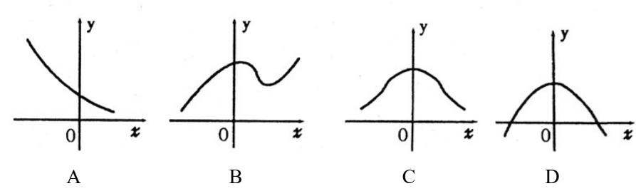

3. 在 $(1+x)^5 + (1+x)^6 + (1+x)^7$ 的展开式中,含 $x^4$ 项的系数是首项为-2,公差为3的等 差数列的

A. 第13项

B. 第18项

C. 第11项

D. 第20项

4. 有一块直角三角板 ABC, ∠A=30°, ∠B=90°, BC 边在桌面上,当三角板所在平面与 桌面成 45°角时,AB 边与桌面所成的角等于

A.  $\arcsin \frac{\sqrt{6}}{4}$  B.  $\frac{\pi}{6}$  C.  $\frac{\pi}{4}$  D.  $\arccos \frac{\sqrt{10}}{4}$ 

( )

5. 若将函数 y = f(x) 的图象按向量  $\vec{a}$  平移,使图象上点 P 的坐标由(1,0)变为(2,2), 则平移后图象的解析式为

A. y = f(x+1) - 2

B. y = f(x-1)-2

C. y = f(x-1) + 2

D. y = f(x+1) + 2

6. 直线  $x\cos 140^{\circ} + y\sin 40^{\circ} + 1 = 0$  的倾斜角为

A.  $40^{\circ}$ 

B. 50°

C. 130°

7. 一个容量为 20 的样本,数据的分组及各组的频数如下:(10,20],2;(20,30],3; (30, 40], 4; (40, 50], 5; (50, 60], 4; (60, 70], 2. 则样本在区间(10, 50] 上

的频率为

A. 0.5

B. 0.7

C. 0.25

D. 0.05

8. 在抛物线  $y^2 = 4x$  上有点 M, 它到直线 y = x 的距离为  $4\sqrt{2}$ , 如果点 M 的坐标为(m,n),

且  $m, n \in \mathbb{R}^+, 则 \frac{m}{n}$  的值为

B. 1

C.  $\sqrt{2}$  D. 2

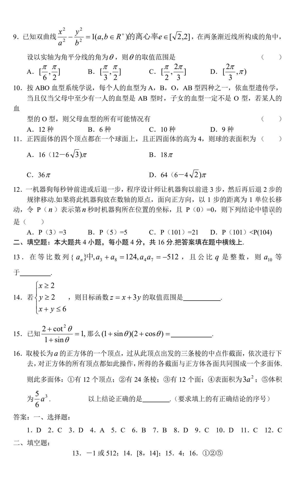

# 高考数学选择、填空题专项练习题七

一、选择题(本大题共 12 小题,每小题 5 分,共 60 分,在每小题给出的四个选项中,只有

| 1. | 一项是符合题目要求的.) 准线方程为 $x = 3$ 的抛物线的标准方程为                                                 |                                                                        | (          | )   |
|----|---------------------------------------------------------------------------------------|------------------------------------------------------------------------|------------|-----|
|    | A. $y^2 = -6x$ B. $y^2 = -12x$                                                        | C. $y^2 = 6x$ D. $y^2 = 12x$                                           |            |     |
| 2. | 函数 $y = \sin 2x$ 是                                                                    |                                                                        | (          | )   |
|    | A. 最小正周期为π的奇函数 C. 最小正周期为2π的奇函数                                                     | B. 最小正周期为π的偶函数 D. 最小正周期为2π的偶函数                                      |            |     |
| 3. | 函数 $y = x^2 + 1(x \le 0)$ 的反函数是                                                       |                                                                        | (          | )   |
|    | A. $y = -\sqrt{x+1}(x \ge 1)$ B. $y = -\sqrt{x+1}(x \ge 1)$                           | -1) C. $y = \sqrt{x-1}(x \ge 1)$ D. $y = -\sqrt{x-1}$                  | $-1(x \ge$ | :1) |
| 4. | 已知向量 $\vec{a} = (2,1), \vec{b} = (x,-2)$ 且 $\vec{a} + \vec{b}$ 与 $2\vec{a} - \vec{b}$ | 平行,则 x 等于                                                              | (          | )   |
|    | A6 B. 6                                                                               | C4 D. 4                                                                |            |     |
| 5. | a = -1是直线 $ax + (2a - 1)y + 1 = 0$ 和直                                                 | 直线 $3x + ay + 3 = 0$ 垂直的                                               | (          | )   |
|    | A. 充分而不必要的条件 C. 充要条件                                                               | B. 必要而不充分的条件 D. 既不充分又不必要的条件                                            |            |     |
| 6. | 已知直线 $a$ 、 $b$ 与平面 $\alpha$ ,给出下列四个                                                   |                                                                        |            |     |
|    |                                                                                       | ②若 a∥α,b⊂α,则 a∥b; ④a⊥α,b∥α,则 a⊥b.                                   |            |     |
|    | 其中正确的命题是 A. 1 个 B. 2 个                                                             | C. 3个 D. 4个                                                            | (          | )   |
|    |                                                                                       |                                                                        |            |     |
| 7. | 函数 $y = \sin x + \cos x, x \in R$ 的单调递增                                               | 区间是                                                                    | (          | )   |
|    | A. $[2k\pi - \frac{\pi}{4}, 2k\pi + \frac{3\pi}{4}](k \in \mathbb{Z})$                | B. $[2k\pi - \frac{3\pi}{4}, 2k\pi + \frac{\pi}{4}](k \in \mathbb{Z})$ |            |     |
|    | C. $[2k\pi - \frac{\pi}{2}, 2k\pi + \frac{\pi}{2}](k \in \mathbb{Z})$                 | D. $[k\pi - \frac{3\pi}{8}, k\pi + \frac{\pi}{8}](k \in \mathbb{Z})$   |            |     |
| 8. | 设集合 $M=\{y\mid y=2^x, x\in R\}, N=\{y\mid y=1\}$                                      | $y = x^2 + 1, x ∈ R$ }, 则 $M I N 是$                                    | (          | )   |
|    | A. φ B. 有限集                                                                           | C. M D. N                                                              |            |     |

| 9.   | 已知函数 $f(x)$ 满足2 $f(x)-f(\frac{1}{x})=\frac{1}{ x }$                 | $\frac{1}{ x }$ ,则 $f(x)$ 的最小                | 值是                                                                                          | ( )              |
|------|---------------------------------------------------------------------|----------------------------------------------|---------------------------------------------------------------------------------------------|------------------|
|      | A. $\frac{2}{3}$ B. 2                                               | $C. \ \frac{2\sqrt{2}}{3}$                   | D. $2\sqrt{2}$                                                                              |                  |
| 10.  | 若双曲线 $x^2 - y^2 = 1$ 的左支上一点 P                                       | (a, b) 到直线;                                  | $y = x$ 的距离为 $\sqrt{2}$ ,                                                                   | 则 <i>a</i> +b 的值 |
|      | 为( )                                                                |                                              |                                                                                             |                  |
|      | A. $-\frac{1}{2}$ B. $\frac{1}{2}$                                  | C2                                           | D. 2                                                                                        |                  |
| 11.  | 若一个四面体由长度为1,2,3的三种                                                  |                                              |                                                                                             | 是 ( )            |
| 10   | A. 2 B. 4                                                           |                                              | D. 8                                                                                        | 040 = D #4       |
| 12.  | 某债券市场常年发行三种债券,A种面贴水债券面值为1000元,但买入价为1000元,半年到期本息和为1020元.的大小关系是       | 960元,一年到其                                    | 阴本息和为 1000 元;                                                                               | C 种面值为           |
|      | A. $a = c \coprod a < b$                                            | B. $a < b < a$                               | 2                                                                                           |                  |
|      | C.  a < c < b                                                       | D.  c < a < b                                | )                                                                                           |                  |
| 13.  | 生中抽取一个容量为 N 的样本进行调整                                                 | 00 人,老师 120 £ 查,如果应从高中                    | 人,现用分层抽样方 中学生中抽取 60 人,                                                                   | ī法从所有师 那么 N   |
| 14.  | 在经济学中,定义 $Mf(x) = f(x+1)$                                           | $-f(x)$ , $\forall Mf(x)$                    | 为函数 $f(x)$ 的边际                                                                              | <b>示函数,某企</b>    |
|      | 业的一种产品的利润函数 $P(x) = -x^3$                                           | $+30x^2+1000(x^2)$                           | $x \in [10,25] \exists x \in N$                                                             | *),则它的边          |
|      | 际函数 MP (x) = 示)                                                  |                                              | (注:                                                                                         | 用多项式表            |
| 15.  | 已知 $a,b,c$ 分别为 $\triangle$ ABC的三边,且3                                | $3a^2 + 3b^2 - 3c^2 +$                       | $-2ab=0$ ,则 $\tan C=$                                                                       | =                |
| 16 . | . 已知下列四个函数: ① y=1                                                   | $\log_{\frac{1}{2}}(x+2); \ \textcircled{2}$ | $y = 3 - 2^{x+1}; \ \ \Im \ \ y$                                                            | $=1-x^2$ ; ④     |
|      | $y = 3 - (x + 2)^2$ .其中图象不经过第一                                      | 象限的函数有                                       | (注: 把伤                                                                                      | <b>ぶ</b> 认为符合条   |
|      | 件的函数的序号都填上)                                                         |                                              |                                                                                             |                  |
| 答第一、 | ₹: 选择题: (每小题 5 分,共 60 分)                                         |                                              |                                                                                             |                  |
| _    | BADCA ABDCA BC                                                      |                                              |                                                                                             |                  |
|      | 填空题: (每小题 4 分, 共 16 分) 148; 14. $-3x^2 + 57x + 29$ ( $x \in [1]$ | 0.25] 目 r = N*)(ラ                            | · · · · · · · · · · · · · · · · · · · |                  |
|      | $-2\sqrt{2}$ ; 16. ①,④(多填少填均不约                                      |                                              | - 147C2C7MH 1 71 );                                                                         |                  |

# 高考数学选择、填空题专项练习题六

| 只有   | 一、选择题 ( 可一项是符合是                                                                      |                                                                    | 2 小题,每小题                                                                       | 题 5 分,共 60 分                                                                                                                 | ↑.在每小题给                                        | 出的四个选项中                                                               | Ι, |
|------|-----------------------------------------------------------------------------------------|--------------------------------------------------------------------|--------------------------------------------------------------------------------|------------------------------------------------------------------------------------------------------------------------------|------------------------------------------------|-----------------------------------------------------------------------|----|
| 1. ½ | 合出两个命题:                                                                                 | p:  x =x 的                                                         | 充要条件是 x                                                                        | 为正实数; q: 7                                                                                                                   | 字在反函数的                                         | 函数一定是单调                                                               | 函  |
|      | 数,则下列哪                                                                                  | 个复合命题点                                                             | 是真命题                                                                           |                                                                                                                              |                                                | (                                                                     | )  |
|      |                                                                                         | _                                                                  | o或 q                                                                           | C. ¬p 且 q                                                                                                                    | <b>D.</b> ¬                                    | p或q                                                                   |    |
|      | 2.给出下列命                                                                                 | 题:                                                                 |                                                                                |                                                                                                                              |                                                |                                                                       |    |
|      | $ \textcircled{1}_{a \sqsubset a, b \not\subseteq a}^{a / \! / b} $                     | $\left  \frac{1}{2} \alpha \right  \Rightarrow b // \alpha$        | $: (2) \frac{a \perp a}{b \perp a} \Rightarrow$                                | $\cdot a /\!\!/ b; 3 = \frac{a \perp a}{a \perp b}$                                                                          | $\Rightarrow b//\alpha;$                       | $\widehat{\mathbb{D}}_{a\perp b}^{\alpha/\!\!/a} \Rightarrow b \perp$ | α. |
|      | 其中正确的                                                                                   | 判断是 (                                                              | )                                                                              |                                                                                                                              |                                                |                                                                       |    |
|      | A.①④ 3.抛物线 <i>y=ax</i>                                                               | 0 0                                                                | 点坐标是 (                                                                         | )                                                                                                                            | C.23                                           | D.1)24                                                                |    |
|      | A. $(0, \frac{a}{4})$                                                                   | B.(0                                                               | $(0, \frac{1}{4a})$                                                            | C.(0,-                                                                                                                       | $-\frac{1}{4a}$ )                              | D. $(-\frac{1}{4a},0)$                                                |    |
|      |                                                                                         |                                                                    |                                                                                |                                                                                                                              |                                                | 如(1101)²表示                                                            |    |
|      |                                                                                         |                                                                    |                                                                                | $\times 2^2 + 0 \times 2^1 + 1 \times 2$                                                                                     | 0=13,那么将1                                      | 二进制数 (1111…                                                           |    |
| 特孙   | 英成十进制形式 A.2 17 一2                                                         | 戊是 ( B.2 16 −2                                       | )                                                                              | $C.2^{16}-1$                                                                                                                 |                                                | 16位 D.2 15 —1                                           |    |
|      | 5.已知 f(cosx)                                                                            |                                                                    |                                                                                |                                                                                                                              |                                                | D.2 1                                                                 |    |
|      |                                                                                         | 000000000000000000000000000000000000000                            |                                                                                | . \                                                                                                                          |                                                |                                                                       |    |
|      | , , ,                                                                                   | _                                                                  | )•                                                                             | , ( )                                                                                                                        |                                                |                                                                       |    |
|      | A.1                                                                                     | B. $\frac{\sqrt{3}}{2}$                                            | ,,,,,, <u>,</u> ,,,,                                                           |                                                                                                                              | D                                              | -1                                                                    |    |
|      | A.1                                                                                     | $B.\frac{\sqrt{3}}{2}$                                             |                                                                                | C.0                                                                                                                          |                                                |                                                                       |    |
|      | A.1                                                                                     | $B.\frac{\sqrt{3}}{2}$                                             |                                                                                | C.0                                                                                                                          |                                                | −1 记 <i>ƒ(x</i> )的最大值                                              | 门为 |
| т,   | A.1                                                                                     | B. $\frac{\sqrt{3}}{2}$ 是偶函数,当                                  | á x>0 时,f(x)                                                                   | C.0                                                                                                                          | -3,-1] 时,                                      |                                                                       | ĺ为 |
| m,   | A.1 6.己知 <i>y=f(x)</i> ;                                                             | B. $\frac{\sqrt{3}}{2}$ 是偶函数,当                                  | á x>0 时,f(x)                                                                   | C.0                                                                                                                          |                                                |                                                                       | i为 |
|      | A.1 6.己知 <i>y=f(x)</i> ; 最小值为 <i>n</i> , A.2 7.某村有旱地 7 15 亩旱地 45         | B. $\frac{\sqrt{3}}{2}$ 是偶函数,当则 $m-n$ 等于B.1                        | á x>0 时,f(x) - ( ) . 现在需要估 . 调查,则这个                                   | C.0 $= x + \frac{4}{x}, \stackrel{\text{def}}{=} x \in [-1]$ C.3                                                             | $-3,-1$ ] 时, $D.\frac{3}{2}$ 用按 $5\%$ 比例的亩数分别为 | 记 <i>f(x</i> )的最大值  分层抽样的方法                                        |    |
|      | A.1 6.己知 <i>y=f(x)</i> ;最小值为 <i>n</i> , A.2 7.某村有旱地 15 亩旱地 45 A.150, 450 | B. $\frac{\sqrt{3}}{2}$ 是偶函数,当则 $m-n$ 等于B.1。与水田若干,5 亩水田进行B.300,900 | 台 x>0 时,f(x) - ( ) . 现在需要估证 记调查,则这个                                   | C.0 $=x + \frac{4}{x},  \exists  x \in [-1]$ C.3 $+ \text{平均亩产量},  \text{村的旱地与水田}$ C.600, 600                                | D. $\frac{3}{2}$ 用按 5%比例的亩数分别为D.75,225      | 记 <i>f(x</i> )的最大值  分层抽样的方法                                        | 抽  |
| 取了   | A.1 6.己知 <i>y=f(x)</i> ;最小值为 <i>n</i> ,A.2 7.某村有旱地 15 亩旱地 45 A.150,450 8.己知两点 <i>A</i>  | B. $\frac{\sqrt{3}}{2}$ 是偶函数,当则 $m-n$ 等于B.1。与水田若干,5 亩水田进行B.300,900 | á <i>x</i> >0 时, <i>f</i> ( <i>x</i> ) : ( ) : 现在需要估证 : 调查,则这个 ( ) | C.0 $=x + \frac{4}{x},  \exists  x \in [-1]$ C.3 $+ \text{平均亩产量},  \text{村的旱地与水田}$ C.600, 600                                | D. $\frac{3}{2}$ 用按 5%比例的亩数分别为D.75,225      | 记 <i>f(x)</i> 的最大值  分层抽样的方法  为 ( )                              | 抽  |
| 取了   | A.1 6.己知 <i>y=f(x)</i> ;最小值为 <i>n</i> ,A.2 7.某村有旱地715 亩旱地 45A.150,450                   | B. $\frac{\sqrt{3}}{2}$ 是偶函数,当则 $m-n$ 等于B.1。与水田若干,5 亩水田进行B.300,900 | á <i>x</i> >0 时, <i>f</i> ( <i>x</i> ) : ( ) : 现在需要估证 : 调查,则这个 ( ) | C.0 $=x + \frac{4}{x}, \exists x \in [-4]$ C.3 $+ \text{平均亩产量},  \text{村的旱地与水田}$ C.600, 600 $+ \text{P 是椭圆} \frac{(x-3)}{4}$ | D. $\frac{3}{2}$ 用按 5%比例的亩数分别为D.75, 225        | 记 <i>f(x)</i> 的最大值  分层抽样的方法  为 ( )                              | 抽  |

- 9.设向量  $a=(x_1, y_1), b=(x_2, y_2),$ 则下列为 a = b 共线的充要条件的有 ( )
- ①存在一个实数  $\lambda$  ,使得  $\mathbf{a} = \lambda \mathbf{b}$  或  $\mathbf{b} = \lambda \mathbf{a}$  ;② $|\mathbf{a} \cdot \mathbf{b}| = |\mathbf{a}| \cdot |\mathbf{b}|$ ; ③  $\frac{x_1}{x_2} = \frac{y_1}{y_2}$  ;④ $(\mathbf{a} + \mathbf{b}) // (\mathbf{a} \mathbf{b})$ .
- A.1 个 B.2 个
- C.3 个
- D.4 个

10.点 P是球 O的直径 AB 上的动点,PA=x,过点 P 且与 AB 垂直的截面面积记为 y,则  $y=\frac{1}{2}f(x)$ 

的

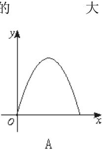

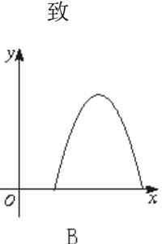

冬

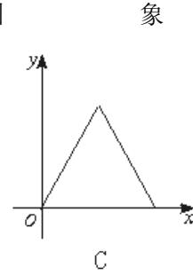

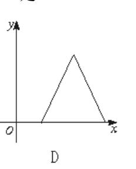

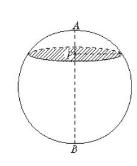

11.三人互相传球,由甲开始发球,并作为第一次传球,经过5次传球后,球仍回到甲手中, 则不同的传球方式共有

- A.6 种
- B.10 种
- C.8 种 D.16 种

12.已知点  $F_1$ 、 $F_2$ 分别是双曲线  $\frac{x^2}{a^2} - \frac{y^2}{b^2} = 1$  的左、右焦点,过  $F_1$ 且垂直于 x 轴的直线

与双曲线交于  $A \times B$  两点,若 $\triangle ABF_2$  为锐角三角形,则该双曲线的离心率 e 的取值范围是

A.(1.+
$$\infty$$
) B.(1. $\sqrt{3}$ )

A.(1,+
$$\infty$$
) B.(1, $\sqrt{3}$ ) C.( $\sqrt{2}$  -1,1+ $\sqrt{2}$ ) D.(1,1+ $\sqrt{2}$ )

- 二、填空题(本大题共4小题,每小题4分,共16分.把答案填在题中横线上)
- 13. 方程  $\log_2|x|=x^2-2$  的实根的个数为

14.1996年的诺贝尔化学奖授予对发现 C60有重大贡献的三位科学家.C60是由 60个C原 子组成的分子,它结构为简单多面体形状.这个多面体有60个顶点,从每个顶点都引出3条 棱,各面的形状分为五边形或六边形两种,则 C60 分子中形状为五边形的面有 个,形状 为六边形的面有 个.

15.在底面半径为6的圆柱内,有两个半径也为6的球面,两球的球心距为13,若作一 个平面与两个球都相切,且与圆柱面相交成一椭圆,则椭圆的长轴长为 .

16.定义在**R**上的偶函数 f(x)满足 f(x+1)=-f(x),且在[-1,0]上是增函数,给出下列 关于 f(x)的判断:

①f(x)是周期函数;②f(x)关于直线 x=1 对称;③f(x)在[0,1]上是增函数;④f(x)在 [1, 2] 上是减函数; ⑤f(2)=f(0),其中正确判断的序号为 (写出所有正确判断的序号).

#### 答案:

- -, 1.D 2.B 3.B 4.C 5.D 6.B 7.A 8.B 9.C 10.A 11.C 12.D
- 二、13.4 14.12 20 15.13 16.①②⑤

## 高考数学选择、填空题专项练习题九

一、选择题(本大题共 12 小题,每小题 5 分,共 60 分,在每小题给出的四个选项中,只有一项是符合题目要求的)

1.集合  $A = \{x | x = 2k, k \in \mathbb{Z}\}, B = \{x | x = 2k+1, k \in \mathbb{Z}\}, C = \{x | x = 4k+1, k \in \mathbb{Z}\}, \emptyset \in A, b \in B, \emptyset \in B, \emptyset \in B, \emptyset \in B, \emptyset \in B, \emptyset \in B, \emptyset \in B, \emptyset \in B, \emptyset \in B, \emptyset \in B, \emptyset \in B, \emptyset \in B, \emptyset \in B, \emptyset \in B, \emptyset \in B, \emptyset \in B, \emptyset \in B, \emptyset \in B, \emptyset \in B, \emptyset \in B, \emptyset \in B, \emptyset \in B, \emptyset \in B, \emptyset \in B, \emptyset \in B, \emptyset \in B, \emptyset \in B, \emptyset \in B, \emptyset \in B, \emptyset \in B, \emptyset \in B, \emptyset \in B, \emptyset \in B, \emptyset \in B, \emptyset \in B, \emptyset \in B, \emptyset \in B, \emptyset \in B, \emptyset \in B, \emptyset \in B, \emptyset \in B, \emptyset \in B, \emptyset \in B, \emptyset \in B, \emptyset \in B, \emptyset \in B, \emptyset \in B, \emptyset \in B, \emptyset \in B, \emptyset \in B, \emptyset \in B, \emptyset \in B, \emptyset \in B, \emptyset \in B, \emptyset \in B, \emptyset \in B, \emptyset \in B, \emptyset \in B, \emptyset \in B, \emptyset \in B, \emptyset \in B, \emptyset \in B, \emptyset \in B, \emptyset \in B, \emptyset \in B, \emptyset \in B, \emptyset \in B, \emptyset \in B, \emptyset \in B, \emptyset \in B, \emptyset \in B, \emptyset \in B, \emptyset \in B, \emptyset \in B, \emptyset \in B, \emptyset \in B, \emptyset \in B, \emptyset \in B, \emptyset \in B, \emptyset \in B, \emptyset \in B, \emptyset \in B, \emptyset \in B, \emptyset \in B, \emptyset \in B, \emptyset \in B, \emptyset \in B, \emptyset \in B, \emptyset \in B, \emptyset \in B, \emptyset \in B, \emptyset \in B, \emptyset \in B, \emptyset \in B, \emptyset \in B, \emptyset \in B, \emptyset \in B, \emptyset \in B, \emptyset \in B, \emptyset \in B, \emptyset \in B, \emptyset \in B, \emptyset \in B, \emptyset \in B, \emptyset \in B, \emptyset \in B, \emptyset \in B, \emptyset \in B, \emptyset \in B, \emptyset \in B, \emptyset \in B, \emptyset \in B, \emptyset \in B, \emptyset \in B, \emptyset \in B, \emptyset \in B, \emptyset \in B, \emptyset \in B, \emptyset \in B, \emptyset \in B, \emptyset \in B, \emptyset \in B, \emptyset \in B, \emptyset \in B, \emptyset \in B, \emptyset \in B, \emptyset \in B, \emptyset \in B, \emptyset \in B, \emptyset \in B, \emptyset \in B, \emptyset \in B, \emptyset \in B, \emptyset \in B, \emptyset \in B, \emptyset \in B, \emptyset \in B, \emptyset \in B, \emptyset \in B, \emptyset \in B, \emptyset \in B, \emptyset \in B, \emptyset \in B, \emptyset \in B, \emptyset \in B, \emptyset \in B, \emptyset \in B, \emptyset \in B, \emptyset \in B, \emptyset \in B, \emptyset \in B, \emptyset \in B, \emptyset \in B, \emptyset \in B, \emptyset \in B, \emptyset \in B, \emptyset \in B, \emptyset \in B, \emptyset \in B, \emptyset \in B, \emptyset \in B, \emptyset \in B, \emptyset \in B, \emptyset \in B, \emptyset \in B, \emptyset \in B, \emptyset \in B, \emptyset \in B, \emptyset \in B, \emptyset \in B, \emptyset \in B, \emptyset \in B, \emptyset \in B, \emptyset \in B, \emptyset \in B, \emptyset \in B, \emptyset \in B, \emptyset \in B, \emptyset \in B, \emptyset \in B, \emptyset \in B, \emptyset \in B, \emptyset \in B, \emptyset \in B, \emptyset \in B, \emptyset \in B, \emptyset \in B, \emptyset \in B, \emptyset \in B, \emptyset \in B, \emptyset \in B, \emptyset \in B, \emptyset \in B, \emptyset \in B, \emptyset \in B, \emptyset \in B, \emptyset \in B, \emptyset \in B, \emptyset \in B, \emptyset \in B, \emptyset \in B, \emptyset \in B, \emptyset \in B, \emptyset \in B, \emptyset \in B, \emptyset \in B, \emptyset \in B, \emptyset \in B, \emptyset \in B, \emptyset \in B, \emptyset \in B, \emptyset \in B, \emptyset \in B, \emptyset \in B, \emptyset \in B, \emptyset \in B, \emptyset \in B, \emptyset \in B, \emptyset \in B, \emptyset \in B, \emptyset \in B, \emptyset \in B, \emptyset \in B, \emptyset \in B, \emptyset \in B, \emptyset \in B, \emptyset \in B, \emptyset \in B, \emptyset \in B, \emptyset \in B, \emptyset \in B, \emptyset \in B, \emptyset \in B, \emptyset \in B, \emptyset \in B, \emptyset \in B, \emptyset \in B, \emptyset \in B, \emptyset \in B, \emptyset \in B, \emptyset \in B, \emptyset \in B, \emptyset \in B, \emptyset \in B, \emptyset \in B, \emptyset \in B, \emptyset \in B, \emptyset \in B, \emptyset \in B, \emptyset \in B, \emptyset \in B, \emptyset \in B, \emptyset \in B, \emptyset \in B, \emptyset \in B, \emptyset \in B, \emptyset \in B, \emptyset \in B, \emptyset \in B, \emptyset \in B, \emptyset \in B, \emptyset \in B, \emptyset \in B, \emptyset \in B, \emptyset \in B, \emptyset \in B, \emptyset \in B, \emptyset \in B, \emptyset \in B, \emptyset \in B, \emptyset \in B, \emptyset \in B, \emptyset \in B, \emptyset \in B, \emptyset \in B, \emptyset \in B, \emptyset \in B, \emptyset \in$ 

 $A.a+b \in A$ 

 $B.a+b \in B$ 

 $C.a+b \in C$ 

D.a+b 不属于 A, B, C 中的任意一个

2.己知  $f(x)=\sin(x+\frac{\pi}{2},g(x)=\cos(x-\frac{\pi}{2}),$ 则 f(x)的图象

A.与 g(x)的图象相同

B.与g(x)的图象关于y轴对称

C.向左平移 $\frac{\pi}{2}$ 个单位,得到 g(x)的图象

D.向右平移 $\frac{\pi}{2}$ 个单位,得到g(x)的图象

3.过原点的直线与圆  $x^2+y^2+4x+3=0$  相切,若切点在第三象限,则该直线的方程是

$$A.y = \sqrt{3} x$$

B.
$$y=-\sqrt{3}x$$

$$C.y = \frac{\sqrt{3}}{3}x$$

$$D.y = -\frac{\sqrt{3}}{3}x$$

4.函数  $y=1-\frac{1}{r-1}$ ,则下列说法正确的是

A.y 在(-1,+∞)内单调递增

B.y 在(-1,+∞)内单调递减

C.v 在(1,+∞)内单调递增

D.v 在(1,+∞)内单调递减

5.已知直线 m,n 和平面  $\alpha$  ,那么 m//n 的一个必要但非充分条件是

 $A.m//\alpha,n//\alpha$ 

 $B.m \perp \alpha .n \perp \alpha$ 

 $C.m//\alpha \mid \exists n \subset \alpha$ 

D.m,n 与 $\alpha$  成等角

6.在 100 个零件中,有一级品 20 个,二级品 30 个,三级品 50 个,从中抽取 20 个作为样本:①采用随机抽样法,将零件编号为 00,01,02,…,99,抽出 20 个;②采用系统抽样法,将所有零件分成 20 组,每组 5 个,然后每组中随机抽取 1 个;③采用分层抽样法,随机从一级品中抽取 4 个,二级品中抽取 6 个,三级品中抽取 10 个;则

A.不论采取哪种抽样方法,这 100 个零件中每个被抽到的概率都是  $\frac{1}{5}$ 

B.①②两种抽样方法,这 100 个零件中每个被抽到的概率都是 $\frac{1}{5}$ ,③并非如此

C.①③两种抽样方法,这 100 个零件中每个被抽到的概率都是 $\frac{1}{5}$ ,②并非如此

D.采用不同的抽样方法,这 100 个零件中每个被抽到的概率各不相同

7.曲线  $y=x^3$  在点 P 处的切线斜率为 k,当 k=3 时的 P 点坐标为

$$A.(-2,-8)$$

$$B.(-1,-1),(1,1)$$

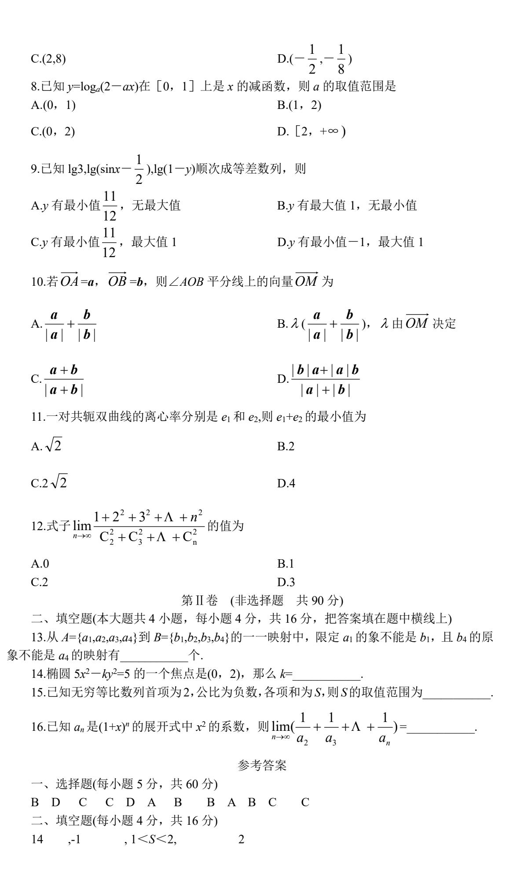

# 高考数学选择、填空题专项练习题二+

| <del>-</del> . | 选择题:  | 本大题共12小题, | 每小题5分, | 共60分. | 在每小题给出的四个选项中, | 有 |
|----------------|-------|-----------|--------|-------|---------------|---|
|                | 且只有一: | 项是符合题目要求的 | ].     |       |               |   |

| 1. | (理科) | 设 z = | $\frac{-1+\sqrt{3}i}{2},$ | 则 z 2 | 等于 | ( | ) |
|----|------|-------|---------------------------|------------------|----|---|---|
|----|------|-------|---------------------------|------------------|----|---|---|

(A) 
$$\frac{-1+\sqrt{3}i}{2}$$
. (B)  $\frac{-1-\sqrt{3}i}{2}$ . (C)  $\frac{1+\sqrt{3}i}{2}$ . (D)  $\frac{1-\sqrt{3}i}{2}$ .

(文科) sin600°=(

(A) 
$$-\frac{\sqrt{3}}{2}$$
 (B)  $-\frac{1}{2}$ . (C)  $\frac{\sqrt{3}}{2}$ . (D)  $\frac{1}{2}$ .

2.  $\ \ \mathcal{C} A = \{ x | x \ge 2 \}, B = \{ x | |x-1| < 3 \}, \ \ M A \cap B = ($ 

(B) 
$$(-\infty, -2]$$

$$(C)[-2, 4]$$

$$(D)[-2, +\infty)$$

3. 若|**a**|=2sin150, |**b**|=4cos150, **a** 与 **b** 的夹角为 300, 则 **a** • **b** 的值为 (

(A) 
$$\frac{\sqrt{3}}{2}$$
. (B)  $\sqrt{3}$ . (C)  $2\sqrt{3}$ . (D)  $\frac{1}{2}$ .

4. △ABC中, 角 A、B、C 所对的边分别为 a、b、c,则 acosC+ccosA 的值为 (

$$(B)\frac{b+c}{2}.$$
 (C)2cosB.

(D)2sinB.

5. 一个容量为20的样本数据,分组后,组距与频数如下:

| 组距 | (10, 20] | (20, 30] | (30, 40] | (40,50] | (50, 60] | (60, 70] |
|----|----------|----------|----------|---------|----------|----------|
| 频数 | 2        | 3        | 4        | 5       | 4        | 2        |

则样本在(10,50]上的频率为(

(A) 
$$\frac{1}{20}$$
. (B)  $\frac{1}{4}$ . (C)  $\frac{1}{2}$ . (D)  $\frac{7}{10}$ .

$$(B)\frac{1}{4}$$

$$(C)\frac{1}{2}$$

$$(D)\frac{7}{10}$$
.

6. 当  $x \in \mathbb{R}$  时,令 f(x)为 sinx 与 cosx 中的较大或相等者,设  $a \le f(x) \le b$ ,则 a + b 等于

(A)0 (B) 
$$1 + \frac{\sqrt{2}}{2}$$
. (C) $1 - \frac{\sqrt{2}}{2}$ . (D) $\frac{\sqrt{2}}{2} - 1$ .

7. (**理科**) 设 f(x) =  $ax^3 + bx^2 + cx + d$ , a, b, c, d  $\in$  **R**, 又 m, n  $\in$  **R**, m < n, 则下列正确的判 断是(

- (A) 若 f(m)f(n) < 0, 则 f(x) = 0 在 m, n 之间只有一个实根
- (B) 若 f(m)f(n) > 0, 则 f(x) = 0 在 m, n 之间至少有一个实根
- (C) 若 f(x) = 0 在 m, n 之间至少有一个实根,则 f(m) f(n) < 0
- (D) 若 f(m) f(n) > 0, 则 f(x) = 0 在 m, n 之间也可能有实根

(**文科**) 函数 
$$f(x) = \frac{2}{3}x^3 - 2x + 1$$
 在区间[0,1]上是(

(A) 单调递增的函数.

(B) 单调递减的函数.

| (C) 先减后增的函数 . (D) 先增后减的函数.                                                                                                                                                                |
|-------------------------------------------------------------------------------------------------------------------------------------------------------------------------------------------|
| 8. 有80个数,其中一半是奇数,一半是偶数,从中任取两数,则所取的两数和为偶数的概                                                                                                                                                |
| 率为( )                                                                                                                                                                                     |
| (A) $\frac{39}{79}$ . (B) $\frac{1}{80}$ . (C) $\frac{1}{2}$ . (D) $\frac{41}{81}$ .                                                                                                      |
| 9. 对于 x∈[0, 1]的一切值, a +2b > 0 是使 ax + b > 0 恒成立的 ( ) (A)充要条件 (B)充分不必要条件                                                                                                                   |
| (C)必要不充分条件 (D)既不充分也不必要条件                                                                                                                                                                  |
| 10. 设 $\{a_n\}$ 是等差数列,从 $\{a_1, a_2, a_3, \cdots, a_{20}\}$ 中任取 $3$ 个不同的数,使这三个数仍成等差数列,则这样不同的等差数列最多有(                                                                                      |
| (A)90 $\uparrow$ . (B)120 $\uparrow$ . (C)180 $\uparrow$ . (D)200 $\uparrow$ .                                                                                                            |
| 11. 已知函数 $y = f(x)$ ( $x \in \mathbb{R}$ ) 满足 $f(x+1) = f(x-1)$ , 且 $x \in [-1, 1]$ 时, $f(x) = x^2$ ,则 $y = f(x)$ 与 $y = \log_5 x$ 的图象的交点个数为 (                                            |
| (A)1. (B)2. (C)3. (D)4.                                                                                                                                                                   |
| 12. 给出下列命题:                                                                                                                                                                               |
| (1) 若 $0 < x < \frac{\pi}{2}$ ,则 $\sin x < x < \tan x$ .                                                                                                                                  |
| (2) 若 $-\frac{\pi}{2} < x < 0$ ,则 $\sin x < x < \tan x$ .                                                                                                                                 |
| <ul> <li>(3) 设 A, B, C 是△ABC 的三个内角, 若 A&gt;B&gt;C, 则 sinA&gt; sinB&gt; sinC.</li> <li>(4) 设 A, B 是钝角△ABC 的两个锐角, 若 sinA&gt; sinB&gt; sinC 则 A&gt;B&gt;C</li> <li>其中,正确命题的个数是( )</li> </ul> |
| (A) 4. (B) 3. (C) 2. (D) 1.                                                                                                                                                               |
| 二. 填空题: 本大题有 4 小题,每小题 4 分,共 16 分. 请将答案填写在题中的横线上.                                                                                                                                          |
| 13. $(1+2x)^{10}$ 的展开式的第 4 项是                                                                                                                                                             |
| 14. 某客运公司定客票的方法是:如果行程不超过 $100  \mathrm{km}$ ,票价是 $0.5$ 元/km,如果超过 $100  \mathrm{km}$ ,超过 $100  \mathrm{km}$ 部分按 $0.4$ 元/km 定价,则客运票价 y 元与行程公里数 x km 之间的函                                    |
| 数关系式是                                                                                                                                                                                     |
| 15. (理科) 在 ABC 中,若: $\frac{\overrightarrow{AB BC}}{3} = \frac{\overrightarrow{BC CA}}{2} = \frac{\overrightarrow{CA AB}}{2}$ ,则 COSA 等于                                                   |
| (文科)在边长为 4 的正三角形 ABC 中 AB BC =                                                                                                                                                 |
| 16.(理科)已知 $f(x)$ 是可导的偶函数,且 $x \to 0$ $\frac{f(1+x)-f(x)}{2x}$ =-2,则曲线 $f(x)$ 在(-1,2)处的切线方程是                                                                                               |
| ·                                                                                                                                                                                         |
| ( <b>文科</b> )设 P 是曲线 $y=x^2-1$ 上的动点,O 为坐标原点,当 $ \stackrel{\longrightarrow}{OP} ^2$ 取得最小值时,点 P 的 坐标为                                                                                       |
|                                                                                                                                                                                           |

## 高考数学选择、填空题专项练习题二十五

- 一、填空题(4'×12)
- 1. 函数  $y = f(x)(x \in R)$  图象恒过定点 (0,1) ,若 y = f(x) 存在反函数  $y = f^{-1}(x)$  ,则  $y = f^{-1}(x) + 1$  的图象必过定点 (1,1) 。
- 2. 已知集合  $A = \{y | y = 2^{|x|} 1, x \in R\}$ ,集合  $B = \{y | y = \sqrt{-x^2 + 2x + 3}, x \in R\}$ ,则集合  $\{x | x \in A \exists x \notin B\} = (2, +\infty)$  。
- 3. 若角 $\alpha$ 终边落在射线 $3x-4y=0(x\leq 0)$ 上,则 $\tan\left[\alpha+\arccos(-\frac{\sqrt{2}}{2})\right]=\frac{1}{7}$ 。
- 4. 关于 x 的方程  $x^2 (2+i)x + 1 + mi = 0 (m \in R)$  有一实根为 n ,则  $\frac{1}{m+ni} = \frac{1}{2} \frac{1}{2}i$  。
- 5. 数列  $\left\{a_{n}\right\}$  的首项为  $a_{1}=2$ ,且  $a_{n+1}=\frac{1}{2}(a_{1}+a_{2}+\Lambda+a_{n})(n\in N)$ ,记  $S_{n}$  为数列  $\left\{a_{n}\right\}$  前 n 项和,则  $S_{n}=2\cdot\left(\frac{3}{2}\right)^{n-1}$  。
- 6. 新教材同学做:

若 
$$x, y$$
 满足 
$$\begin{cases} x+y \leq 5 \\ x+y \geq 1 \\ x-y \leq 3 \\ x-y \geq -1 \end{cases}$$
 ,则目标函数  $s=3x-2y$  取最大值时  $x=\underline{4}$  。

老教材同学做:

若 $\left(\sqrt[3]{x} - \frac{1}{x}\right)^n (n \in N)$ 的展开式中第 3 项为常数项,则展开式中二项式系数最大的是第

5 项。

- 7. 已知函数  $f(x) = A\sin(2x + \varphi)(A > 0, 0 < \varphi < 2\pi)$ ,若对任意  $x \in R$  有  $f(x) \ge f(\frac{5}{12}\pi)$  成立,则方程 f(x) = 0 在  $[0, \pi]$ 上的解为  $\frac{\pi}{6} or \frac{2\pi}{3}$  。
- 8. 新教材同学做: 某校高二(8)班四位同学的数学期中、期末和平时成绩可分别用矩阵

$$X_1 = \begin{bmatrix} 95 \\ 90 \\ 80 \\ 75 \end{bmatrix}, X_2 = \begin{bmatrix} 88 \\ 85 \\ 76 \\ 83 \end{bmatrix}, X_3 = \begin{bmatrix} 90 \\ 92 \\ 78 \\ 60 \end{bmatrix}$$
表示,总评成绩分别按期中、期末和平时成绩的

30%、40%、30%的总和计算,则四位同学总评成绩的矩阵 X 可用  $X_1$  ,  $X_2$  ,  $X_3$  表示为  $\underline{X=0.3X_1+0.4X_2+0.3X_3} \quad .$ 

#### 老教材同学做:

某足球队共有 11 名主力队员和 3 名替补队员参加一场足球比赛,其中有 2 名主力和 1 名替补队员不慎误服违禁药物,依照比赛规定,比赛后必须随机抽取 2 名队员的尿样化

- 验,则能查到服用违禁药物的主力队员的概率为  $\frac{25}{91}$  。(结果用分数表示)
- 9. 将最小正周期为 $\frac{\pi}{2}$ 的函数 $g(x) = \cos(\omega x + \varphi) + \sin(\omega x + \varphi)(\omega > 0, |\varphi| < 2\pi)$ 的图象向 左平移 $\frac{\pi}{4}$ 个单位,得到偶函数图象,则满足题意的 $\varphi$ 的一个可能值为 $\frac{\pi}{4}$ 。
- 10. 据某报《自然健康状况》的调查报道,所测血压结果与相应年龄的统计数据如下表,观察表中数据规律,并将最适当的数据填入表中括号内。

| 年龄(岁)               | 30  | 35  | 40  | 45  | 50  | 55  | 60    | 65   | ••••• |
|---------------------|-----|-----|-----|-----|-----|-----|-------|------|-------|
| 收缩压 (水银柱/ 毫米) | 110 | 115 | 120 | 125 | 130 | 135 | (140) | 145  | ••••• |
| 舒张压 (水银柱/ 毫米) | 70  | 73  | 75  | 78  | 80  | 73  | 85    | (88) | ••••• |

11. 若函数  $f(x) = \min \left\{ 3 + \log_{\frac{1}{4}} x, \log_2 x \right\}$ , 其中  $\min \{ p, q \}$  表示 p, q 两者中的较小者,

则 f(x) < 2 的解为 X > 4or0 < x < 4。

12. 如图, $P_1$ 是一块半径为 1 的半圆形纸板,在  $P_1$  的左下端剪去一个半径 为  $\frac{1}{2}$  的半圆得到图形  $P_2$ ,然后依次剪去一个更小的半圆(其直径是前

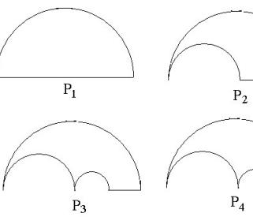

一个被剪掉半圆的半径)可得图形  $P_3, P_4, \Lambda$  ,  $P_n, \Lambda$  , 记纸板  $P_n$  的面积为  $S_n$  , 则

$$\lim_{n\to\infty} S_n = \frac{\pi}{3} \circ$$

- 二、选择题(4'×4)
- 13. 已知 a,b,c 满足 c < b < a且ac < 0,则下列选项中不一定能成立的是

( C )

- A, ab > ac B, c(b-a) > 0 C,  $cb^2 < ca^2$  D, ac(a-c) < 0
- 14 . 下 列 命 题 正 确 的 ( C )

- A、若  $\lim_{n\to\infty} a_n = A$ ,  $\lim_{n\to\infty} b_n = B$ , 则  $\lim_{n\to\infty} \frac{a_n}{b_n} = \frac{A}{B}(b_n \neq 0)$ 。
- B、函数  $y = \arccos x(-1 \le x \le 1)$  的反函数为  $y = \cos x, x \in R$ 。
- C、函数  $y = x^{m^2 + m 1} (m \in N)$  为奇函数。
- D、函数  $f(x) = \sin^2 x (\frac{2}{3})^{|x|} + \frac{1}{2}$ , 当 x > 2004 时,  $f(x) > \frac{1}{2}$  恒成立。
- 15 . 函数  $f(x) = \frac{\sqrt{a-x^2}}{|x+1|-1}$  为 奇 函数 的 充 要 条 件 是

(B)

- B,  $0 < a \le 1$  C, a > 1 D,  $a \ge 1$

- 16. 不等式  $\log_a x > \sin 2x (a > 0$ 且 $a \neq 1)$  对任意  $x \in (0, \frac{\pi}{4})$  都成立,则 a 的取值范围为

( B )

- A.  $(0, \frac{\pi}{4})$  B.  $(\frac{\pi}{4}, 1)$  C.  $(\frac{\pi}{4}, 1) \cup (1, \frac{\pi}{2})$  D. (0,1)

# 高考数学选择、填空题专项练习题二十四

| 一、选择题: (每题 5 分, 共 60 分)                                                                                                                                                                                           |
|-------------------------------------------------------------------------------------------------------------------------------------------------------------------------------------------------------------------|
| 1. 已知 $a$ 为不等于零的实数,那么集合 $M = \{x   x^2 - 2(a+1)x + 1 = 0, x \in R\}$ 的子集的个数                                                                                                                                       |
| 为 A. 1 个 B. 2 个 C. 4 个 D. 1 个或 2 个或 4 个 2. 函数 $y = \tan x - \cot x$ 的最小正周期是                                                                                                                                       |
| A. $\frac{\pi}{2}$ B. $\pi$ C. $2\pi$ D. $3\pi$                                                                                                                                                                   |
| 3. 已知关于 $x$ 的不等式 $\frac{x+a}{x} \ge b$ 的解集是[-1, 0)则 $a+b=$ A. $-2$ B. $-1$ C. 1 D. 3                                                                                                                              |
| A. $-2$ B. $-1$ C. 1 D. 3                                                                                                                                                                                         |
| 4. 过双曲线 $x^2 - \frac{y^2}{2} = 1$ 的右焦点作直线 $1$ 交双曲线于 A、B 两点,若 $ AB  = 4$ ,则满足条件                                                                                                                                    |
| 的直线1有 A. 2条 B. 3条 C. 4条 D. 无数条                                                                                                                                                                                 |
| 5. 若向量 $\vec{d} = (\vec{a} \cdot \vec{c}) \cdot \vec{b} - (\vec{a} \cdot \vec{b}) \cdot \vec{c}$ ,则 $\vec{a}$ 与 $\vec{d}$ 的夹角是                                                                                    |
| <ul> <li>A. 30° B. 60° C. 90° D. 120°</li> <li>6. 设 a、b 是两条异面直线, P 是 a、b 外的一点, 则下列结论正确的是</li> <li>A. 过 P 有一条直线和 a、b 都平行; B. 过 P 有一条直线和 a、b 都相交;</li> <li>C. 过 P 有一条直线和 a、b 都垂直; D. 过 P 有一个平面和 a、b 都垂直。</li> </ul> |
| 7. 互不相等的三个正数 $x_1, x_2, x_3$ 成等比数列,且点                                                                                                                                                                             |
| $P_1 (\log_a x_1, \log_b y_1)$ , $P_2 (\log_a x_2, \log_b y_2)$ , $P_3 (\log_a x_3, \log_b y_3)$ 共线                                                                                                               |
| $(a > 0$ 且 $a \neq 1, b > 0$ ,且 $b \neq 1$ )则 $y_1, y_2, y_3$ 成                                                                                                                                                   |
| A. 等差数列,但不等比数列; B. 等比数列而非等差数列 C. 等比数列,也可能成等差数列 D. 既不是等比数列,又不是等差数列                                                                                                                                              |
| 8. 若从集合 P 到集合 Q= $\{a,b,c\}$ 所有的不同映射共有 81 个,则从集合 Q 到集合 P 可作的                                                                                                                                                      |
| 不同映射共有 A. 32 个 B. 27 个 C. 81 个 D. 64 个                                                                                                                                                                         |
| 9. 对于函数 $f(x) = \begin{cases} \sin x & \exists \sin x \ge \cos x \text{时} \\ \cos x & \exists \sin x < \cos x \text{时} \end{cases}$ 给出下列四个命题:                                                                     |
| ①该函数的值域为[-1, 1]                                                                                                                                                                                                   |
| ②当且仅当 $x = 2k\pi + \frac{\pi}{2}(k \in z)$ 时,该函数取得最大值1;                                                                                                                                                           |

| ③该函数是以 π 为最小正周期的周期函数;                                                                                       |
|-------------------------------------------------------------------------------------------------------------|
| ④当且仅当 $2k\pi + \pi < x < 2k\pi + \frac{3\pi}{2}(k \in z)$ 时, $f(x) < 0$                                     |
| 上述命题中错误命题的个数为                                                                                               |
| A. 1 B. 2 C. 3 D. 4                                                                                         |
| 10. 已知球的表面积为 20 $\pi$ , 球面上有 A、B、C 三点,如果 AB=AC=2,BC=2 $\sqrt{3}$ ,则对                                        |
| 心到平面 ABC 的距离为                                                                                               |
| A. 1 B. $\sqrt{2}$ C. $\sqrt{3}$ D. 2                                                                       |
| 11. 设 $x$ 、 $y$ 满足约束条件: $\begin{cases} x+y \le 1 \\ y \le x \\ y \ge 0 \end{cases}$ 则 $z=2x+y$ 的最大值为        |
| A. 1 B. 2 C. 3 D. 4                                                                                         |
| 12. 已知等差数列 $\{a_n\}$ 和等比数列 $\{b_n\}$ 各项都是正数,且 $a_1 = b_1, a_{2n+1} = b_{2n+1}$ ,那么,一                        |
| 定有                                                                                                          |
| A. $a_{n+1} \le b_{n+1}$ B. $a_{n+1} \ge b_{n+1}$ C. $a_{n+1} > b_{n+1}$ D. $a_{n+1} > b_{n+1}$             |
| 二、填空题: (每題 4 分, 共 16 分)                                                                                     |
| 13. 椭圆 $\frac{x^2}{16} + \frac{y^2}{9} = 1$ 中,以点 M(一 1,2)为中点的弦所在直线方程是。                                      |
| 14. 在 $(x-\frac{1}{2x})$ 9的展开式中, $x^3$ 的系数是。                                                                |
| 15. 在 $\triangle$ ABC 中,边 AB 为最长边,且 $\sin$ A • $\sin$ B= $\frac{2-\sqrt{3}}{4}$ ,则 $\cos$ A • $\cos$ B 的最大值 |
| 是。 16. 一项"过关游戏"规则规定: 在第 n 关要抛掷一颗骰子 n 次,如果这 n 次抛掷所出现的点数之和大于 $n^2$ ,则算过关,那么,连过前二关的概率是。。                       |
| 一、选择题: (每题 5 分, 共 60 分)                                                                                     |
| 1. D 2. A 3.C 4.B 5.C 6.C 7.C 8.D 9.D 10.A 11.B 12.B                                                        |

二、填空题: (每题 4 分, 共 16 分)

13. 9x - 32y + 73 = 0 14.  $\frac{189}{4}$  15.  $\frac{2 + \sqrt{3}}{4}$  16.  $\frac{25}{36}$ 

## 高考数学选择、填空题专项练习题二十三

#### 一、选择题

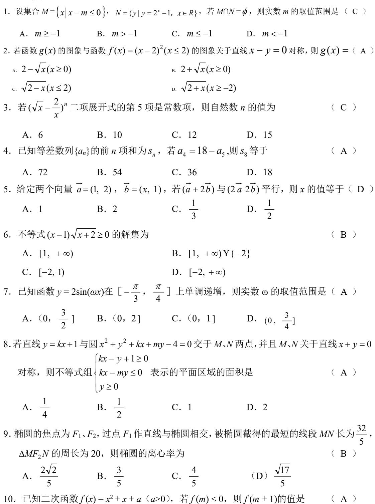

11. 已知函数f(x)( $0 \le x \le 1$ )的图象的一段圆弧(如图所示)若 $0 < x_1 < x_2 < 1$ ,则( C )

B. 负数 C. 零

A.  $\frac{f(x_1)}{x_1} < \frac{f(x_2)}{x_2}$ 

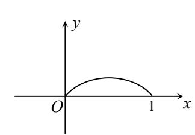

D. 符号与 a 有关

B. 
$$\frac{f(x_1)}{x_1} = \frac{f(x_2)}{x_2}$$

C. 
$$\frac{f(x_1)}{x_1} > \frac{f(x_2)}{x_2}$$

- D. 前三个判断都不正确
- 12. 点 P 在直径为  $\sqrt{6}$  的球面上,过 P 作两两垂直的 3 条弦,若其中一条弦长是另一条弦长 的 2 倍,则这 3 条弦长之和的最大值是 ( **D** )

C. 
$$\frac{4\sqrt{3}}{5}$$

C. 
$$\frac{4\sqrt{3}}{5}$$
 D.  $\frac{2\sqrt{21}}{5}$ 

#### 二、填空题

13. (自编)对甲乙两学生的成绩进行抽样分析,各抽取5门功课,得到的观测值如下:

那么,两人中各门功课发展较平稳的是 乙 .

解答:  $x_{\text{H}} = 74, x_{\text{Z}} = 74, \overline{S}_{\text{H}} = 104, \overline{S}_{\text{Z}} = 70.4$ , 故 $\overline{S}_{\text{H}} > \overline{S}_{\text{Z}}$ .

14. (自编) 当 $k \in (-\infty, -3]$ 时, $f(x) = x^3 + kx^2$ 在[0, 2]上是减函数.

解答:  $f'(x) = 3x^2 + kx^2 = x(3x + 2k)$ , 由题意知 $(0, -\frac{2k}{3})$ 是函数的单调减区间, 因此  $-\frac{2k}{3} \ge 2$ ,  $\mathbb{P} k \le -3$ .

- 15. (自编)"渐减数"是指每个数字比其左边数字小的正整数(如 98765),若把所有五位 渐减数按从小到大的顺序排列,则第55个数为76542.
- 解答: 4 在首位,有 1 个; 5 在首位,有  $C_5^4 = 5$  个; 6 在首位,有  $C_6^4 = 15$  个; 7 在首位, 有 $C_7^4 = 35$ 个.所以第55个数是76542.
- 16. (2004 浙江高三第二次教学质量检测) AB 垂直于 ΔBCD 所在的平面,  $AC = \sqrt{10}, AD = \sqrt{17}, BC: BD = 3:4$ , 当 $\Delta BCD$ 的面积最大时,点A到直线CD的 距离为 $\frac{13}{5}$ .

## 高考数学选择、填空题专项练习题二十七

一、选择题:本大题共 12 小题,每小题 5 分,共 60 分。在每小题给出的四个选项中,只有一项是符合题目要求的。

| 1. | 己知集合 $S = -$ | x  2x-1  < | : 1}, | 则使 $S \cap T = S \cup T$ 的集合 $T =$ |
|----|--------------|------------|-------|------------------------------------|
|    |              |            |       |                                    |

A. 
$$\{x \mid 0 < x < 1\}$$
 B.  $\{x \mid 0 < x < \frac{1}{2}\}$  C.  $\{x \mid x < \frac{1}{2}\}$  D.  $\{x \mid \frac{1}{2} < x < 1\}$ 

2. 已知抛物线  $y = \frac{1}{4}x^2$ ,则它的焦点坐标是( )

A. 
$$\left(0, \frac{1}{16}\right)$$
 B.  $\left(\frac{1}{16}, 0\right)$  C.  $\left(1, 0\right)$  D.  $\left(0, 1\right)$ 

3. 己知向量a = (1,-2), $b = (\cos \alpha, \sin \alpha)$ ,且a // b,则  $\tan \alpha =$ 

A. 
$$-2$$
 B.  $-\frac{1}{2}$  C. 2 D.  $\frac{1}{2}$ 

4. O是  $\Delta ABC$  所在的平面内的一点,且满足  $\binom{UAB}{OB} - \binom{UAB}{OC} \cdot \binom{UAB}{OC} - OA = 0$ ,则  $\Delta ABC$  的形状一定为

A. 正三角形 B. 等腰直角三角形 C. 直角三角形 D. 斜三角形

5. 为了得到函数  $y = \sin\left(2x - \frac{\pi}{6}\right)$  的图象,只须将函数  $y = \sin\left(x + \frac{\pi}{6}\right)$  的图象

A. 向右平移
$$\frac{\pi}{12}$$
个单位 B. 向左平移 $\frac{\pi}{12}$ 个单位

C. 向右平移 $\frac{\pi}{6}$ 个单位 D. 向左平移 $\frac{\pi}{6}$ 个单位

6. 若双曲线  $x^2 - my^2 = 1$  两渐近线的夹角为  $2\arccos \frac{\sqrt{6}}{3}$  ,则 m 的值为

A. 
$$\frac{1}{4}$$
 B.  $\frac{1}{2}$  C.  $4 \cdot \vec{y} \cdot \frac{1}{4}$  D.  $2 \cdot \vec{y} \cdot \frac{1}{2}$ 

7. 数列 $\{a_n\}$ 中, $a_3=2$ , $a_7=1$ ,且数列 $\{\frac{1}{a_n+1}\}$ 是等差数列,则 $a_{11}$ 等于

A. 
$$-\frac{2}{5}$$
 B.  $\frac{1}{2}$  C.  $\frac{2}{3}$  D. 5

8. 已知  $a_n = \frac{3}{2n-11} (n \in N^*)$ ,记数列  $\{a_n\}$  的前 n 项和为  $S_n$ ,则使  $S_n > 0$  的 n 的最小值为

A. 10 B. 11 C. 12 D. 13

- 9. 同时掷两颗骰子,则下列命题中正确的是
  - A. "两颗点数都是 5"的概率比"两颗点数都是 6"的概率小
  - B. "两颗点数相同"的概率是 $\frac{1}{6}$
  - C. "两颗点数之和为奇数"的概率小于"两颗点数之和为偶数"的概率
  - D. "两颗点数之和为 6"的概率不大于"两颗点数之和为 5"的概率
- 10. f(x) 是定义在区间[c,-c] 上的奇函数,其图象如图所示。令g(x)=af(x)+b,则 下列关于函数g(x)的叙述正确的是

- B. 若 $a \ge 1$ , b < 2, 则方程g(x) = 0必有三个实根
- C.

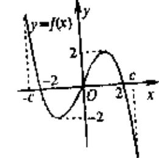

- D. 若 a = -1, -2 < b < 0, 则方程 g(x) = 0 必有大于 2 的实根
- 11. 若记地球的半径为 R,则赤道上两地 A、B 间的球面距离为 $\frac{\pi}{2}$  R,北半球的 C 地与 A、 B 两地的球面距离均为 $\frac{\pi}{3}R$ ,则 C 地的纬度为
  - A. 北纬 45°
- B. 北纬 60° C. 北纬 30° D. 北纬 75°
- 12. 设奇函数 f(x) 在区间 [-1,1] 上是增函数,且 f(-1) = -1。当  $x \in [-1,1]$  时,函数
- $f(x) \le t^2 2at + 1$ , 对一切 $a \in [-1,1]$ 恒成立,则实数t的取值范围为
  - A.  $-2 \le t \le 2$

B.  $t \le -2$  或  $t \ge 2$ 

C.  $t \le 0$  或  $t \ge 2$ 

- D.  $t \le -2$  或  $t \ge 2$  或 t = 0
- 二、填空题:本大题共有4个小题,每小题4分,共16分。把答案填在题中横线上。
- 13. 不等式 $x + \frac{4}{x-1} \ge 5$ 的解集为\_\_\_\_\_\_。
- 14. 在 $(1+x)^5 + (1+x)^6 + (1+x)^7$ 的展开式中,含 $x^4$ 项的系数为
- 15. 如图,在正方体  $ABCD A_iB_iC_iD_i$  中,  $B_iC$  是正方体的一条面对角线。现有下列命题:
  - ①过 $B_1C$ 且与BD平行的平面有且只有一个;
  - ②过 $B_1C$ 且与BD垂直的平面有且只有一个;
  - ③  $B_1C$  与平面  $A_1C_1CA$  所成的角等于 30°;
  - ④与B1C所成角为60°的面对角线共有8条。

| 上述命题中,正确的是 。(填上所有正确命题的序号)                                                                   |  |
|---------------------------------------------------------------------------------------------|--|
| 16. 密码的使用对现代社会是极其重要的。有一种密码其明文和密文的字母按 A、B、C…                                                 |  |
| 与 26 个自然数 1, 2, 3, ···依次对应。设明文的字母对应的自然数为 $x$ , 译为密文的字母对应的自然数为 $y$ 。例如,有一种译码方法是按照以下的对应法则实现的: |  |
| $x \rightarrow y$ , 其中 $y \in 3x + 2$ 被 26 除所得的余数与 1 之和 $(1 \le x \le 26)$ 。                |  |
| 按照此对应法则,明文 A 译为了密文 F,那么密文 UI 译成明文为 。                                                        |  |

# 高考数学选择、填空题专项练习题二十六

| 一、选择题:(本大题共 12 小题,每小题 5 有一个是符合题目要求的)                                                          |                                                                                                                                                                                                                                                                                                                                                                                                                                                                                                                                                                                                                                                                                                                                                                                                                                                                                                                                                                                                                                                                                                                                                                                                                                                                                                                                                                                                                                                                                                                                                                                                                                                                                                                                                                                                                                                                                                                                                                                                                                                                                                                                                                                                                                                                                                                                                                                                                                                                                                                                                                                     |                                                                    |
|--------------------------------------------------------------------------------------------------|-------------------------------------------------------------------------------------------------------------------------------------------------------------------------------------------------------------------------------------------------------------------------------------------------------------------------------------------------------------------------------------------------------------------------------------------------------------------------------------------------------------------------------------------------------------------------------------------------------------------------------------------------------------------------------------------------------------------------------------------------------------------------------------------------------------------------------------------------------------------------------------------------------------------------------------------------------------------------------------------------------------------------------------------------------------------------------------------------------------------------------------------------------------------------------------------------------------------------------------------------------------------------------------------------------------------------------------------------------------------------------------------------------------------------------------------------------------------------------------------------------------------------------------------------------------------------------------------------------------------------------------------------------------------------------------------------------------------------------------------------------------------------------------------------------------------------------------------------------------------------------------------------------------------------------------------------------------------------------------------------------------------------------------------------------------------------------------------------------------------------------------------------------------------------------------------------------------------------------------------------------------------------------------------------------------------------------------------------------------------------------------------------------------------------------------------------------------------------------------------------------------------------------------------------------------------------------------|--------------------------------------------------------------------|
| 1. 已知 $\theta$ 为三角形的一个内角,且 $\sin \theta$                                                         | $\theta + \cos \theta = \frac{1}{2}$ ,则方程                                                                                                                                                                                                                                                                                                                                                                                                                                                                                                                                                                                                                                                                                                                                                                                                                                                                                                                                                                                                                                                                                                                                                                                                                                                                                                                                                                                                                                                                                                                                                                                                                                                                                                                                                                                                                                                                                                                                                                                                                                                                                                                                                                                                                                                                                                                                                                                                                                                                                                                                           | $x^2 \sin \theta - y^2 \cos \theta = \overline{\xi}  \overline{x}$ |
| ( ) A. 焦点在 <i>x</i> 轴上的椭圆                                                                     |                                                                                                                                                                                                                                                                                                                                                                                                                                                                                                                                                                                                                                                                                                                                                                                                                                                                                                                                                                                                                                                                                                                                                                                                                                                                                                                                                                                                                                                                                                                                                                                                                                                                                                                                                                                                                                                                                                                                                                                                                                                                                                                                                                                                                                                                                                                                                                                                                                                                                                                                                                                     | 加椭圆                                                                |
| 2. 双曲线 $\frac{x^2}{9} - \frac{y^2}{16} = 1$ 两焦点为 $F_1$ , $F_2$ , 点                               | (P在双曲线上,直线F                                                                                                                                                                                                                                                                                                                                                                                                                                                                                                                                                                                                                                                                                                                                                                                                                                                                                                                                                                                                                                                                                                                                                                                                                                                                                                                                                                                                                                                                                                                                                                                                                                                                                                                                                                                                                                                                                                                                                                                                                                                                                                                                                                                                                                                                                                                                                                                                                                                                                                                                                                         | $F_1$ , $PF_2$ 倾斜角之差为 $\frac{\pi}{3}$ ,                            |
| 则△PF 1 F 2 面积为                                                             |                                                                                                                                                                                                                                                                                                                                                                                                                                                                                                                                                                                                                                                                                                                                                                                                                                                                                                                                                                                                                                                                                                                                                                                                                                                                                                                                                                                                                                                                                                                                                                                                                                                                                                                                                                                                                                                                                                                                                                                                                                                                                                                                                                                                                                                                                                                                                                                                                                                                                                                                                                                     | ( )                                                                |
| A. $16\sqrt{3}$ B. $32\sqrt{3}$                                                                  | C. 32                                                                                                                                                                                                                                                                                                                                                                                                                                                                                                                                                                                                                                                                                                                                                                                                                                                                                                                                                                                                                                                                                                                                                                                                                                                                                                                                                                                                                                                                                                                                                                                                                                                                                                                                                                                                                                                                                                                                                                                                                                                                                                                                                                                                                                                                                                                                                                                                                                                                                                                                                                               | D. 42                                                              |
| 3. 要使直线 $y = kx + 1(k \in R)$ 与焦点在 $x$                                                           | 轴上的椭圆 $\frac{x^2}{7} + \frac{y^2}{a} =$                                                                                                                                                                                                                                                                                                                                                                                                                                                                                                                                                                                                                                                                                                                                                                                                                                                                                                                                                                                                                                                                                                                                                                                                                                                                                                                                                                                                                                                                                                                                                                                                                                                                                                                                                                                                                                                                                                                                                                                                                                                                                                                                                                                                                                                                                                                                                                                                                                                                                                                                             | :1总有公共点,实数 $a$ 的                                                   |
| 取                                                                                                |                                                                                                                                                                                                                                                                                                                                                                                                                                                                                                                                                                                                                                                                                                                                                                                                                                                                                                                                                                                                                                                                                                                                                                                                                                                                                                                                                                                                                                                                                                                                                                                                                                                                                                                                                                                                                                                                                                                                                                                                                                                                                                                                                                                                                                                                                                                                                                                                                                                                                                                                                                                     |                                                                    |
| 值范围是 A. $0 < a \le 1$ B. $0 < a < 7$                                                             | C. $1 \le a < 7$                                                                                                                                                                                                                                                                                                                                                                                                                                                                                                                                                                                                                                                                                                                                                                                                                                                                                                                                                                                                                                                                                                                                                                                                                                                                                                                                                                                                                                                                                                                                                                                                                                                                                                                                                                                                                                                                                                                                                                                                                                                                                                                                                                                                                                                                                                                                                                                                                                                                                                                                                                    | D. $1 < a \le 7$                                                   |
| 4. 与双曲线 $\frac{x^2}{9} - \frac{y^2}{16} = 1$ 有共同渐近线,」                                            | 且过 $A(-3,3\sqrt{2})$ 的双曲                                                                                                                                                                                                                                                                                                                                                                                                                                                                                                                                                                                                                                                                                                                                                                                                                                                                                                                                                                                                                                                                                                                                                                                                                                                                                                                                                                                                                                                                                                                                                                                                                                                                                                                                                                                                                                                                                                                                                                                                                                                                                                                                                                                                                                                                                                                                                                                                                                                                                                                                                            | 线的一个焦点到一条渐近                                                        |
| 线的距离是                                                                                            |                                                                                                                                                                                                                                                                                                                                                                                                                                                                                                                                                                                                                                                                                                                                                                                                                                                                                                                                                                                                                                                                                                                                                                                                                                                                                                                                                                                                                                                                                                                                                                                                                                                                                                                                                                                                                                                                                                                                                                                                                                                                                                                                                                                                                                                                                                                                                                                                                                                                                                                                                                                     | ( )                                                                |
| A. $\frac{\sqrt{2}}{4}$ B. $2\sqrt{2}$                                                           | C. $\frac{3\sqrt{2}}{4}$                                                                                                                                                                                                                                                                                                                                                                                                                                                                                                                                                                                                                                                                                                                                                                                                                                                                                                                                                                                                                                                                                                                                                                                                                                                                                                                                                                                                                                                                                                                                                                                                                                                                                                                                                                                                                                                                                                                                                                                                                                                                                                                                                                                                                                                                                                                                                                                                                                                                                                                                                            | D. $\sqrt{2}$                                                      |
| 5. 过点 M (-2, 0) 的直线 m 与椭圆 $\frac{x^2}{2}$ +                                                      | $y^2 = 1$ 交于 $P_1$ , $P_2$ , 线段                                                                                                                                                                                                                                                                                                                                                                                                                                                                                                                                                                                                                                                                                                                                                                                                                                                                                                                                                                                                                                                                                                                                                                                                                                                                                                                                                                                                                                                                                                                                                                                                                                                                                                                                                                                                                                                                                                                                                                                                                                                                                                                                                                                                                                                                                                                                                                                                                                                                                                                                                     | P 1 P 2 的中点为 P,设直线                           |
| m 的斜率为 $k_1$ ( $k_1 \neq 0$ ), 直线 OP 的                                                           | 斜率为 $k_2$ ,则 $k_1k_2$ 的值                                                                                                                                                                                                                                                                                                                                                                                                                                                                                                                                                                                                                                                                                                                                                                                                                                                                                                                                                                                                                                                                                                                                                                                                                                                                                                                                                                                                                                                                                                                                                                                                                                                                                                                                                                                                                                                                                                                                                                                                                                                                                                                                                                                                                                                                                                                                                                                                                                                                                                                                                            | ( )                                                                |
| A. 2 B2                                                                                          | C. $\frac{1}{2}$                                                                                                                                                                                                                                                                                                                                                                                                                                                                                                                                                                                                                                                                                                                                                                                                                                                                                                                                                                                                                                                                                                                                                                                                                                                                                                                                                                                                                                                                                                                                                                                                                                                                                                                                                                                                                                                                                                                                                                                                                                                                                                                                                                                                                                                                                                                                                                                                                                                                                                                                                                    | D. $-\frac{1}{2}$                                                  |
| 6. $\forall x, y \in R, $ $∉$ $⊕$ $A = {(x, y)   x^2 - y^2 = }$                                  | $=1$ , $B = \{(x, y) \mid y = t(x, y) \mid y = t(x, y) \mid y = t(x, y) \mid y = t(x, y) \mid y = t(x, y) \mid y = t(x, y) \mid y = t(x, y) \mid y = t(x, y) \mid y = t(x, y) \mid y = t(x, y) \mid y = t(x, y) \mid y = t(x, y) \mid y = t(x, y) \mid y = t(x, y) \mid y = t(x, y) \mid y = t(x, y) \mid y = t(x, y) \mid y = t(x, y) \mid y = t(x, y) \mid y = t(x, y) \mid y = t(x, y) \mid y = t(x, y) \mid y = t(x, y) \mid y = t(x, y) \mid y = t(x, y) \mid y = t(x, y) \mid y = t(x, y) \mid y = t(x, y) \mid y = t(x, y) \mid y = t(x, y) \mid y = t(x, y) \mid y = t(x, y) \mid y = t(x, y) \mid y = t(x, y) \mid y = t(x, y) \mid y = t(x, y) \mid y = t(x, y) \mid y = t(x, y) \mid y = t(x, y) \mid y = t(x, y) \mid y = t(x, y) \mid y = t(x, y) \mid y = t(x, y) \mid y = t(x, y) \mid y = t(x, y) \mid y = t(x, y) \mid y = t(x, y) \mid y = t(x, y) \mid y = t(x, y) \mid y = t(x, y) \mid y = t(x, y) \mid y = t(x, y) \mid y = t(x, y) \mid y = t(x, y) \mid y = t(x, y) \mid y = t(x, y) \mid y = t(x, y) \mid y = t(x, y) \mid y = t(x, y) \mid y = t(x, y) \mid y = t(x, y) \mid y = t(x, y) \mid y = t(x, y) \mid y = t(x, y) \mid y = t(x, y) \mid y = t(x, y) \mid y = t(x, y) \mid y = t(x, y) \mid y = t(x, y) \mid y = t(x, y) \mid y = t(x, y) \mid y = t(x, y) \mid y = t(x, y) \mid y = t(x, y) \mid y = t(x, y) \mid y = t(x, y) \mid y = t(x, y) \mid y = t(x, y) \mid y = t(x, y) \mid y = t(x, y) \mid y = t(x, y) \mid y = t(x, y) \mid y = t(x, y) \mid y = t(x, y) \mid y = t(x, y) \mid y = t(x, y) \mid y = t(x, y) \mid y = t(x, y) \mid y = t(x, y) \mid y = t(x, y) \mid y = t(x, y) \mid y = t(x, y) \mid y = t(x, y) \mid y = t(x, y) \mid y = t(x, y) \mid y = t(x, y) \mid y = t(x, y) \mid y = t(x, y) \mid y = t(x, y) \mid y = t(x, y) \mid y = t(x, y) \mid y = t(x, y) \mid y = t(x, y) \mid y = t(x, y) \mid y = t(x, y) \mid y = t(x, y) \mid y = t(x, y) \mid y = t(x, y) \mid y = t(x, y) \mid y = t(x, y) \mid y = t(x, y) \mid y = t(x, y) \mid y = t(x, y) \mid y = t(x, y) \mid y = t(x, y) \mid y = t(x, y) \mid y = t(x, y) \mid y = t(x, y) \mid y = t(x, y) \mid y = t(x, y) \mid y = t(x, y) \mid y = t(x, y) \mid y = t(x, y) \mid y = t(x, y) \mid y = t(x, y) \mid y = t(x, y) \mid y = t(x, y) \mid y = t(x, y) \mid y = t(x, y) \mid y = t(x, y) \mid y = t(x, y) \mid y = t(x, y) \mid y = t(x, y) \mid y = t(x, y) \mid y = t(x, y) \mid y = t(x, y) \mid y = t(x, y) \mid y = t(x, y) \mid y = t(x, y) \mid y = t(x, y) \mid y = t(x, y) \mid y = t(x, y) \mid y = t(x, y) \mid y = t(x, y) \mid y = t(x,$ | $(x+2)+3$ },若 $AIB$ 为单                                             |
| 元素集,则t值的个数是                                                                                      |                                                                                                                                                                                                                                                                                                                                                                                                                                                                                                                                                                                                                                                                                                                                                                                                                                                                                                                                                                                                                                                                                                                                                                                                                                                                                                                                                                                                                                                                                                                                                                                                                                                                                                                                                                                                                                                                                                                                                                                                                                                                                                                                                                                                                                                                                                                                                                                                                                                                                                                                                                                     | ( )                                                                |
| A. 1 B. 2 7. <i>a</i> 、b是两条异面直线,下列结论正确的                                                          | _                                                                                                                                                                                                                                                                                                                                                                                                                                                                                                                                                                                                                                                                                                                                                                                                                                                                                                                                                                                                                                                                                                                                                                                                                                                                                                                                                                                                                                                                                                                                                                                                                                                                                                                                                                                                                                                                                                                                                                                                                                                                                                                                                                                                                                                                                                                                                                                                                                                                                                                                                                                   | D. 4                                                               |
| A. 过不在 a、b 上的任一点,可作一分 B. 过不在 a、b 上的任一点,可作一分 C. 过不在 a、b 上的任一点,可作一分 D. 过 a 可以且只可以作一个平面与 b | 个平面与 a、b 都平行 条直线与 a、b 都相交 条直线与 a、b 都平行                                                                                                                                                                                                                                                                                                                                                                                                                                                                                                                                                                                                                                                                                                                                                                                                                                                                                                                                                                                                                                                                                                                                                                                                                                                                                                                                                                                                                                                                                                                                                                                                                                                                                                                                                                                                                                                                                                                                                                                                                                                                                                                                                                                                                                                                                                                                                                                                                                                                                                                                        |                                                                    |

| 8. 已知         | 和点 F 1 . | 、F 2 分               | 別是双日                  | 曲线 $\frac{x^2}{a^2}$            | $-\frac{y^2}{h^2}$ | =1的左                            | 、右焦                            | 点,过                   | F 1 且垂  | 直于 x ?                  | 铀的直线                 | 线与双                                           |
|---------------|---------------------|---------------------------------|-----------------------|---------------------------------|--------------------|---------------------------------|--------------------------------|-----------------------|--------------------|-------------------------|----------------------|-----------------------------------------------|
|               |                     |                                 |                       | а                               | U                  |                                 |                                |                       | 的离心                |                         |                      |                                               |
| A             | . (1,+0             | $\infty$ )                      | В.                    | (1,1+                           | $\sqrt{2}$ )       | C.                              | $(1,\sqrt{3})$                 | )                     | D.                 | $(1-\sqrt{2})$          | $(2,1+\sqrt{2})$     | $\overline{2}$ )                              |
| 9. 过排         | <b>地</b> 物线 :       | $y^2 = x$                       | 的焦点                   | F 的直:                           | 线m的                | 倾斜角                             | $\theta \geq \frac{\pi}{1}$ ,  | <i>m</i> 交抛           | !物线于               | A, B                    | 两点,上                 | l A 点                                         |
|               |                     |                                 |                       | <b>仅</b> 值范围                    |                    |                                 | 4                              |                       |                    |                         | (                    |                                               |
| Α.            | $(\frac{1}{4},1)$   | $+\frac{\sqrt{2}}{2}$ ]         | В.                    | $[\frac{1}{4},1)$               |                    | C.                              | $(\frac{1}{4},1]$              |                       | D.                 | $(\frac{1}{2},+\infty)$ | <b>)</b>             |                                               |
| 10. 在〕        | 正方体                 | ABCD-                           | $-A_1B_1$             | C 1 D 1 中 | ,0为A               | AC、BD                           | 的交点                            | ,则 C 1 C   | D与A 1 ] | D 所成的                   | 的角为(                 | )                                             |
| A             | . 60°               |                                 | В.                    | 90°                             |                    | C.                              | arcco                          | $s\frac{\sqrt{3}}{3}$ | D.                 | arccos                  | $\frac{\sqrt{3}}{6}$ |                                               |
| 11. 直         | 平行六                 | :面体 <b>A</b>                    | BCD—                  | $A_1B_1C_1$                     | D 1 的棱  | 长均为                             | 2, ∠ <i>I</i>                  | BAD =                 | 60°, J             | 則对角纟                    | 桟 A₁C -              | 与侧面                                           |
| Do            | $CC_1D_1$           | 所成角                             | 的正弦                   | 直为                              |                    |                                 |                                |                       |                    |                         | (                    | )                                             |
| Α.            | $\frac{1}{2}$       |                                 | В                     | $\frac{\sqrt{3}}{2}$            |                    | C.                              | $\frac{\sqrt{2}}{2}$           |                       | D.                 | $\frac{\sqrt{3}}{4}$    |                      |                                               |
|               |                     | BCD— 的轨边                     |                       | D 1 中,               | P在侧                | 面 BCC                           | 1 B 1 及其 | <b>达</b> 界上           | :运动,               | 且总保                     | 持 AP」                | $_{\rm BD_1}$                                 |
|               | · 线段                |                                 | 泛                     |                                 |                    | В.                              | 线段 B                           | $SC_1$                |                    |                         |                      | . )                                           |
|               |                     |                                 |                       |                                 |                    | D. 分,共                       |                                | 点与 Bı                 | C 1 中点  | 连成的                     | 线段                   |                                               |
| 13. 在         | 棱长为                 | 71的正                            | E方体 A                 | ABCD-                           | $-A_1B_1C_1$       | •                               | O为正                            | 方形 A                  | BCD 的              | 5中心,                    | E、F ź                | 分别为                                           |
|               |                     |                                 | _                     |                                 |                    |                                 |                                | ) 关于                  | · 直线 <i>y</i>   | y = x +                 | m 对称                 | к. 目                                          |
|               |                     |                                 |                       |                                 |                    |                                 |                                | , , , ,               | 11 A )             |                         | // //J               | , <u>, , , , , , , , , , , , , , , , , , </u> |
| $x_1$         | $x_{1} = -$         | -一, 别                           | \$公 m ⊞               | 刘恒万_                            |                    |                                 | ·                              |                       |                    |                         |                      |                                               |
| 15. 从         | 双曲线                 | $\frac{x^2}{a^2} - \frac{y}{a}$ | $\frac{v^2}{b^2} = 1$ | 上任意-                            | 一点 P 🥫             | 引实轴平                            | 产行线交                           | 两渐近                   | 线于Q                | 、R 两                    | 点,则 F                | PQ  PR                                        |
| 之             | .值为_                |                                 |                       | <u>·</u>                        |                    |                                 |                                |                       |                    |                         |                      |                                               |
| 16. 过         | 抛物线                 | $x^2 = 2$                       | 2px(p                 | > 0) 焦                          | 点F的                | 直线与                             | 抛物线                            | 交于 Ρ、                 | Q,由                | P. Q                    | 分别引                  | 其准线                                           |
| 的             | Ⅰ垂线 P               | $H_1$ , $QI$                    | H 2 垂足     | 分别为                             | $H_1$ , $H_2$      | , H 1 H 2 | 的中点                            | 为 M,                  | 记 PF =             | a,  QF                  | =b,则                 | MF =                                          |
| $\overline{}$ |                     |                                 |                       |                                 |                    | 5 分,                            |                                |                       |                    |                         |                      |                                               |
| 题号 答案      | 1 B              | 2 A                          | 3 C                | 4 C                          | 5 D             | 6 D                          | 7 D                         | 8 B                | 9 A             | 10 D                 | 11 D              | 12 A                                       |

二、填空题(本大题共12小题,每小题5分,共60分)

- 13.  $\frac{\sqrt{2}}{4}$  14.  $\frac{3}{2}$  15.  $a^2$  16.  $\sqrt{ab}$

## 高考数学选择、填空题专项练习题二十九

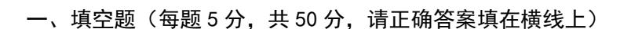

1. 已知
$$\vec{a} = (2,1), \vec{b} = (k,3)$$
,若 $(\vec{a} + 2\vec{b})/((2\vec{a} - \vec{b}))$ ,则k 的值是\_\_\_\_\_\_.

2. 
$$\pm (x^3 + \frac{2}{x^2})^5$$
 的展开式中, $x^5$ 的系数是\_\_\_\_\_。

4. 若 
$$\arccos x > \frac{\pi}{3}$$
, 则 x 的 取 值 范 围 是

**6.** 在 Δ*ABC* 中,三边之比为 
$$a:b:c=2:3:\sqrt{19}$$
 ,则 Δ*ABC* 最大角的大小是

7. 若函数 
$$f(x)$$
的图象与  $g(x)=2^x-1$  的图象关于直线  $y=x$  对称,则函数  $f(x)$ 的解析式为  $f(x)=$ 

**9.** 已知 
$$x, y \in \mathbb{R}^+$$
 且  $x+y=4$ ,求  $\frac{1}{x} + \frac{2}{y}$  的最小值。某学生给出如下解法: 由  $x+y=4$  得, $4 \ge 2\sqrt{xy}$ 

①,即 
$$\frac{1}{\sqrt{xy}} \ge \frac{1}{2}$$
 ②,又因为  $\frac{1}{x} + \frac{2}{y} \ge 2\sqrt{\frac{2}{xy}}$  ③,由②③得  $\frac{1}{x} + \frac{2}{y} \ge \sqrt{2}$  ④,即所求最小值为  $\sqrt{2}$ 

10、若定义在区间[3-a,5]上的函数 
$$f(x) = ax^3 - b\cos x - 3x$$
 是奇函数,则  $a+b=$ \_\_\_\_\_.

**11、**设 a,b 是两条不重合的直线, 
$$\alpha,\beta,\gamma$$
 是三个不重合的平面, 那么  $\alpha/\!/\beta$  的一个充分条件是( )

A. 
$$a \perp \alpha, a \perp \beta$$
 B.  $\alpha \perp \gamma, \beta \perp \gamma$  C.  $\alpha//a, \beta//a$  D.  $a \subset \alpha, b \subset \beta, a//\beta, b//\alpha$ 

**12.** 直线 
$$(x+1)$$
 a +  $(y+1)$  b = 0 与圆  $x^2 + y^2 = 2$  的位置关系是......( ) A.相交 B.相离 C.相切或相离 D.相切或相交

13. 已知等差数列 
$$\{a_n\}$$
 的公差为  $2$ ,若  $a_1$ , $a_3$ , $a_4$ 成等比数列,则  $a_2$ 等于 (A)  $-4$  (B)  $-6$  (C)  $-8$  (D)  $-10$ 

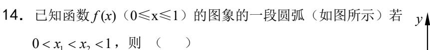

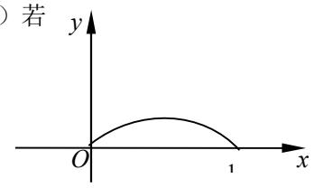

(A) 
$$\frac{f(x_1)}{x_1} < \frac{f(x_2)}{x_2}$$
 (B)  $\frac{f(x_1)}{x_1} = \frac{f(x_2)}{x_2}$ 

(C) 
$$\frac{f(x_1)}{x_1} > \frac{f(x_2)}{x_2}$$
 (D) 前三个判断都不正确

一、

1, 6 2, 40 3, 3 4,  $[-1,\frac{1}{2})$  5, 1-2i 6,  $120^{\circ}$  7,  $y = \log_2(x+1)$  (x > -1)

8、(4,3) 9、①③两式的等号不能同时成立。 10、8

\_,

| 题号 | 11 | 12 | 13 | 14 |
|----|----|----|----|----|
| 答案 | A  | D  | В  | С  |

# 高考数学选择、填空题专项练习题二十二

| <b>—.</b> | 选择题:   | 本大题共12小题, | 每小题5分, | 共60分. | 在每小题给出的四个选项中, | 有 |
|-----------|--------|-----------|--------|-------|---------------|---|
|           | 1.只有一: | 项是符合题目要求的 | j .    |       |               |   |

| 1. | (理科) | 设 z = | $\frac{-1+\sqrt{3}i}{2},$ | 则 z 2 | 等于 | ( | ) |
|----|------|-------|---------------------------|------------------|----|---|---|
|----|------|-------|---------------------------|------------------|----|---|---|

(A) 
$$\frac{-1+\sqrt{3}i}{2}$$
. (B)  $\frac{-1-\sqrt{3}i}{2}$ . (C)  $\frac{1+\sqrt{3}i}{2}$ . (D)  $\frac{1-\sqrt{3}i}{2}$ .

(文科) sin600°=(

(A) 
$$-\frac{\sqrt{3}}{2}$$
 (B)  $-\frac{1}{2}$ . (C)  $\frac{\sqrt{3}}{2}$ . (D)  $\frac{1}{2}$ .

2.  $\ \ \mathcal{C} A = \{ x | x \ge 2 \}, B = \{ x | |x-1| < 3 \}, \ \ \mathcal{M} A \cap B = \{ x | |x-1| < 3 \}, \ \ \mathcal{M} A \cap B = \{ x | |x-1| < 3 \}, \ \ \mathcal{M} A \cap B = \{ x | |x-1| < 3 \}, \ \ \mathcal{M} A \cap B = \{ x | |x-1| < 3 \}, \ \ \mathcal{M} A \cap B = \{ x | |x-1| < 3 \}, \ \ \mathcal{M} A \cap B = \{ x | |x-1| < 3 \}, \ \ \mathcal{M} A \cap B = \{ x | |x-1| < 3 \}, \ \ \mathcal{M} A \cap B = \{ x | |x-1| < 3 \}, \ \ \mathcal{M} A \cap B = \{ x | |x-1| < 3 \}, \ \ \mathcal{M} A \cap B = \{ x | |x-1| < 3 \}, \ \ \mathcal{M} A \cap B = \{ x | |x-1| < 3 \}, \ \ \mathcal{M} A \cap B = \{ x | |x-1| < 3 \}, \ \ \mathcal{M} A \cap B = \{ x | |x-1| < 3 \}, \ \ \mathcal{M} A \cap B = \{ x | |x-1| < 3 \}, \ \ \mathcal{M} A \cap B = \{ x | |x-1| < 3 \}, \ \ \mathcal{M} A \cap B = \{ x | |x-1| < 3 \}, \ \ \mathcal{M} A \cap B = \{ x | |x-1| < 3 \}, \ \ \mathcal{M} A \cap B = \{ x | |x-1| < 3 \}, \ \ \mathcal{M} A \cap B = \{ x | |x-1| < 3 \}, \ \ \mathcal{M} A \cap B = \{ x | |x-1| < 3 \}, \ \ \mathcal{M} A \cap B = \{ x | |x-1| < 3 \}, \ \ \mathcal{M} A \cap B = \{ x | |x-1| < 3 \}, \ \ \mathcal{M} A \cap B = \{ x | |x-1| < 3 \}, \ \ \mathcal{M} A \cap B = \{ x | |x-1| < 3 \}, \ \ \mathcal{M} A \cap B = \{ x | |x-1| < 3 \}, \ \ \mathcal{M} A \cap B = \{ x | |x-1| < 3 \}, \ \ \mathcal{M} A \cap B = \{ x | |x-1| < 3 \}, \ \ \mathcal{M} A \cap B = \{ x | |x-1| < 3 \}, \ \ \mathcal{M} A \cap B = \{ x | |x-1| < 3 \}, \ \ \mathcal{M} A \cap B = \{ x | |x-1| < 3 \}, \ \ \mathcal{M} A \cap B = \{ x | |x-1| < 3 \}, \ \ \mathcal{M} A \cap B = \{ x | |x-1| < 3 \}, \ \ \mathcal{M} A \cap B = \{ x | |x-1| < 3 \}, \ \ \mathcal{M} A \cap B = \{ x | |x-1| < 3 \}, \ \ \mathcal{M} A \cap B = \{ x | |x-1| < 3 \}, \ \ \mathcal{M} A \cap B = \{ x | |x-1| < 3 \}, \ \ \mathcal{M} A \cap B = \{ x | |x-1| < 3 \}, \ \ \mathcal{M} A \cap B = \{ x | |x-1| < 3 \}, \ \ \mathcal{M} A \cap B = \{ x | |x-1| < 3 \}, \ \ \mathcal{M} A \cap B = \{ x | |x-1| < 3 \}, \ \ \mathcal{M} A \cap B = \{ x | |x-1| < 3 \}, \ \ \mathcal{M} A \cap B = \{ x | |x-1| < 3 \}, \ \ \mathcal{M} A \cap B = \{ x | |x-1| < 3 \}, \ \ \mathcal{M} A \cap B = \{ x | |x-1| < 3 \}, \ \ \mathcal{M} A \cap B = \{ x | |x-1| < 3 \}, \ \ \mathcal{M} A \cap B = \{ x | |x-1| < 3 \}, \ \ \mathcal{M} A \cap B = \{ x | |x-1| < 3 \}, \ \ \mathcal{M} A \cap B = \{ x | |x-1| < 3 \}, \ \ \mathcal{M} A \cap B = \{ x | |x-1| < 3 \}, \ \ \mathcal{M} A \cap B = \{ x | |x-1| < 3 \}, \ \ \mathcal{M} A \cap B = \{ x | |x-1| < 3 \}, \ \ \mathcal{M} A \cap B = \{ x | |x-1| < 3 \}, \ \ \mathcal{M} A \cap B = \{ x | |x-1| < 3 \}, \ \ \mathcal{M} A \cap B = \{ x | |x-1| < 3 \}, \ \ \mathcal{M} A \cap B = \{ x | |x-1| < 3 \}, \ \ \mathcal{M} A$ 

(B) 
$$(-\infty, -2]$$

$$(C)[-2, 4]$$

$$(D)[-2, +\infty)$$

3. 若|**a**|=2sin150, |**b**|=4cos150, **a** 与 **b** 的夹角为 300, 则 **a · b** 的值为 (

(A) 
$$\frac{\sqrt{3}}{2}$$
. (B)  $\sqrt{3}$ . (C)  $2\sqrt{3}$ . (D)  $\frac{1}{2}$ .

4. △ABC中, 角 A、B、C 所对的边分别为 a、b、c,则 acosC+ccosA 的值为 (

$$(B)\frac{b+c}{2}.$$
 (C)2cosB.

5. 一个容量为20的样本数据,分组后,组距与频数如下:

| 组距 | (10, 20) | (20, 30] | (30, 40] | (40, 50] | (50, 60] | (60, 70] |
|----|----------|----------|----------|----------|----------|----------|
| 频数 | 2        | 3        | 4        | 5        | 4        | 2        |

则样本在(10,50]上的频率为(

(A) 
$$\frac{1}{20}$$
. (B)  $\frac{1}{4}$ . (C)  $\frac{1}{2}$ . (D)  $\frac{7}{10}$ .

$$(B)\frac{1}{4}$$
.

$$(C)\frac{1}{2}$$

(D)
$$\frac{7}{10}$$
.

6. 当  $x \in \mathbb{R}$  时,令 f(x)为 sinx 与 cosx 中的较大或相等者,设  $a \le f(x) \le b$ ,则 a + b 等于

(A)0 (B) 
$$1 + \frac{\sqrt{2}}{2}$$
. (C) $1 - \frac{\sqrt{2}}{2}$ . (D) $\frac{\sqrt{2}}{2} - 1$ .

7. (**理科**) 设 f(x) =  $ax^3 + bx^2 + cx + d$ , a, b, c, d  $\in$  **R**, 又 m, n  $\in$  **R**, m < n, 则下列正确的判 断是(

- (A) 若 f(m)f(n) < 0, 则 f(x) = 0 在 m, n 之间只有一个实根
- (B) 若 f(m)f(n) > 0, 则 f(x) = 0 在 m, n 之间至少有一个实根
- (C) 若 f(x) = 0 在 m, n 之间至少有一个实根,则 f(m) f(n) < 0
- (D) 若 f(m) f(n) > 0, 则 f(x) = 0 在 m, n 之间也可能有实根

(**文科**) 函数 
$$f(x) = \frac{2}{3}x^3 - 2x + 1$$
 在区间[0,1]上是(

(A) 单调递增的函数.

(B) 单调递减的函数.

| 8. 有80个数,其中一半是奇数,一半是偶数,从中任取两数,则所取的两数和为偶数的概率为()                                                                                                                                                                                                |
|-----------------------------------------------------------------------------------------------------------------------------------------------------------------------------------------------------------------------------------------------|
| (A) $\frac{39}{79}$ . (B) $\frac{1}{80}$ . (C) $\frac{1}{2}$ . (D) $\frac{41}{81}$ .                                                                                                                                                          |
| 9. 对于 x∈[0, 1]的一切值, a +2b > 0 是使 ax + b > 0 恒成立的( (A)充要条件 (B)充分不必要条件 (C)必要不充分条件 (D)既不充分也不必要条件  10. 设{a n }是等差数列,从{a 1 , a 2 , a 3 , ··· , a 20 }中任取 3 个不同的数,使这三个数仍成等差数列,则这样不同的等差数列最多有( |
| (A)90 $\uparrow$ . (B)120 $\uparrow$ . (C)180 $\uparrow$ . (D)200 $\uparrow$ .                                                                                                                                                                |
| 11. 己知函数 $y = f(x)$ ( $x \in \mathbf{R}$ ) 满足 $f(x+1) = f(x-1)$ , 且 $x \in [-1, 1]$ 时, $f(x) = x^2$ ,则 $y = f(x)$ 与 $y = \log_5 x$ 的图象的交点个数为 ( ) (A)1. (B)2. (C)3. (D)4. 12. 给出下列命题:                                                          |
| (1) 若 $0 < x < \frac{\pi}{2}$ , 则 $\sin x < x < \tan x$ .                                                                                                                                                                                     |
| (2) 若 $-\frac{\pi}{2}$ < x< 0, 则 sin x < x < tanx.                                                                                                                                                                                            |
| (3) 设 A, B, C 是△ABC 的三个内角, 若 A>B>C, 则 sinA> sinB> sinC. (4) 设 A, B 是钝角△ABC 的两个锐角, 若 sinA> sinB> sinC 则 A>B>C 其中, 正确命题的个数是 ( ) (A) 4. (B) 3. (C) 2. (D) 1.                                                                                     |
| 二. 填空题: 本大题有 4 小题, 每小题 4 分, 共 16 分. 请将答案填写在题中的横线上.                                                                                                                                                                                            |
| 13. $(1+2x)^{10}$ 的展开式的第 4 项是                                                                                                                                                                                                                 |
| 14. 某客运公司定客票的方法是:如果行程不超过 $100  \mathrm{km}$ ,票价是 $0.5$ 元/km,如果超过 $100  \mathrm{km}$ ,超过 $100  \mathrm{km}$ 部分按 $0.4$ 元/km 定价,则客运票价 y 元与行程公里数 x km 之间的函数关系式是                                                                                   |
| 15. (理科) 在 $\triangle$ ABC 中,若 $\frac{\overrightarrow{AB} \cdot \overrightarrow{BC}}{3} = \frac{\overrightarrow{BC} \cdot \overrightarrow{CA}}{2} = \frac{\overrightarrow{CA} \cdot \overrightarrow{AB}}{1}$ , 则 cosA 等于                      |
|                                                                                                                                                                                                                                               |
| 16. ( <b>理科</b> ) 已知 $f(x)$ 是可导的偶函数,且 $\lim_{x\to 0} \frac{f(1+x)-f(1)}{2x} = -2$ ,则曲线 $y=f(x)$ 在 $(-1,2)$ 处的切线方程是                                                                                                                            |
| ( <b>文科</b> )设 P 是曲线 $y = x^2 - 1$ 上的动点,O 为坐标原点,当 $ OP ^2$ 取得最小值时,点 P 的                                                                                                                                                                       |

(C) 先减后增的函数 . (D) 先增后减的函数.

坐标为 \_\_\_\_\_.

**一. 选择题**: 本大题共 12 小题, 每小题 5 分, 共 60 分.).

| 题号 | 1          | 2 | 3 | 4 | 5 | 6 | 7          | 8 | 9 | 10 | 11 | 12 |
|----|------------|---|---|---|---|---|------------|---|---|----|----|----|
| 答案 | 理 B 文 A | В | В | A | D | В | 理 D 文 B | A | С | С  | D  | В  |

二. 填空题: 本大题有 4 小题,每小题 4 分,共 16 分.

13. 
$$960x^3$$

13. 960
$$x^3$$
 . 15. (理科)  $\frac{\sqrt{3}}{6}$  文科  $)$  -8

16. (理科) 
$$y = 4x + 6$$
. (文科)  $\left(-\frac{\sqrt{2}}{2}, -\frac{1}{2}\right)$ 或  $\left(\frac{\sqrt{2}}{2}, -\frac{1}{2}\right)$ 

# 高考数学选择、填空题专项练习题二十八

| 一、选择题:本大题共8 有一项是符合题目要                                   |                                                                          | 分,共 40 分。在4                                                               | <b></b>                                                   | ]个选项中,只                     |
|------------------------------------------------------------|--------------------------------------------------------------------------|---------------------------------------------------------------------------|-----------------------------------------------------------|-----------------------------|
| (1) 设全集 $U=R$ , $A=$                                       | $\left\{x \middle  \frac{1}{x} < 0\right\},  \text{in } \mathbb{C}_{UA}$ | =                                                                         | (                                                         | )                           |
| $(A) \left\{ x \middle  \frac{1}{x} > 0 \right\} \qquad ($ | B) $\{x \mid x > 0\}$                                                    | (C) $\{x \mid x \geq 0\}$                                                 | $(D) \left\{ x \middle  \frac{1}{x} \geqslant 0 \right\}$ | )                           |
| (2) 在等差数列 $\{a_n\}$                                        | $\oplus$ , $a_2 = -5$ , $a_6 =$                                          | $= a_4 + 6$ ,则 $a_1$ 等                                                    | 于 (                                                       | )                           |
| (A) -4                                                     |                                                                          |                                                                           | (D) -8                                                    |                             |
| (3) 函数 $y = -\frac{1}{x+1}$ (2)                            |                                                                          |                                                                           | ·                                                         | )                           |
| (A) $y = -\frac{1}{x} - 1$ ( $x \neq -1$                   | 0)                                                                       | (B) $y=-\frac{1}{x}$                                                      | $+1 (x \neq 0)$                                           |                             |
| (C) $y = -x + 1 \ (x \in I)$                               | ₹)                                                                       | (D) $y=-$                                                                 | $x$ -1 ( $x$ $\in$ $R$ )                                  |                             |
| (4) 若 $ \vec{a}  = \sqrt{2}$ , $ \vec{b}  = 2$             | $\mathbb{E}(\vec{a}-\vec{b})\perp\vec{a}$                                | ,则 $\vec{a}$ 与 $\vec{b}$ 的夹                                               | 角是(                                                       | )                           |
| (A) $\frac{\pi}{6}$                                        | (B) $\frac{\pi}{4}$                                                      | (C) $\frac{\pi}{3}$                                                       | (D) $\frac{5}{12}\pi$                                     |                             |
| (5) 已知 <i>m、n</i> 为两条不                                     |                                                                          | ,为 两个不同的                                                                  | 平面, $m \perp \alpha$ ,                                    |                             |
| 列命题中的假命题是 $(A)$ 若 $\alpha$ $//n$ ,则                        |                                                                          | (B) 若 6                                                        | $\alpha\perp$ $\beta$ .则 $m\perp$                         | ( ) n                    |
| $(C)$ 若 $\alpha$ 、 $\beta$ 相交                              | •                                                                        |                                                                           | •                                                         |                             |
| (6)箱子里有5个黑球 新取球;若取出白                                    |                                                                          |                                                                           |                                                           |                             |
|                                                            | <b>场,</b> 例 厅 正 <del>以</del> 场                                           | , 加 A 任 为 +                                                               | 扒圾场之用下                                                    | ナ 11.10 100 14.79           |
| (A) $\frac{C_5^3 \cdot C_4^1}{C_5^4}$                      |                                                                          | $(\mathbf{B}) \left(\frac{5}{9}\right)^3 \times \left(\frac{4}{9}\right)$ |                                                           |                             |
| $(C) \frac{3}{5} \times \frac{1}{4}$                       |                                                                          | (D) $C_4^1 \times \left(\frac{5}{9}\right)^3 \times$                      | $\left(\frac{4}{9}\right)$                                |                             |
| (7)如果三位数的十位数                                               |                                                                          |                                                                           |                                                           |                             |
| (A) 240 个 (8) 以正方形 <i>ABCD</i> 的 圆的离心率为              |                                                                          | (C)231 焦点的椭圆,恰好证                                                       |                                                           | (D) 243 个 的中点,则该椭 ( ) |
| $(A) \ \frac{\sqrt{10} - \sqrt{2}}{3}$                     | (B) $\frac{\sqrt{5}-1}{2}$                                               | (C) $\frac{\sqrt{5}-1}{5}$                                                | (D) -                                                     |                             |
| 3 二、 <b>填空题:</b> 本大题共 6                                 |                                                                          |                                                                           |                                                           |                             |
|                                                            |                                                                          |                                                                           |                                                           |                             |

- (9) 把 $y = \sin x$  的图象向左平移 $\frac{\pi}{3}$ 个单位,得到函数\_\_\_\_\_\_\_\_\_\_\_\_\_\_\_\_\_\_\_\_\_\_\_\_\_\_\_\_\_\_\_\_\_\_\_\_ 再把所得图象上的所有点的横坐标伸长到原来的2倍,而纵坐标保持不变,得到函数
- (10) 已知直线  $l_1: x-2y+3=0$  , 那么直线  $l_1$  的方向向量  $\overrightarrow{a_1}$  为\_\_\_\_\_(注: 只 需写出一个正确答案即可);  $l_2$ 过点 (1,1), 并且 $l_2$ 的方向向量 $\vec{a}_2$ 与 $\vec{a}_1$ 满足 $\vec{d}_1$ · $\vec{a}_2$ = 0,则*l*,的方程为\_\_\_\_\_\_
- (11) 设实数 x、y 满足  $\begin{cases} x \ge 0, \\ x y + 2 \le 0, \\ 2x + y 5 \le 0 \end{cases}$ .
- (12) 若地球半径为 R, 地面上两点 A、B 的纬度均为北纬  $45^{\circ}$ , 又 A、B 两点的球面距离 为 $\frac{\pi}{3}R$ ,则A、B两点的经度差为\_\_\_\_\_。
- (13) 定义"符号函数"  $f(x) = \operatorname{sgn} x = \begin{cases} 1, & x > 0, \\ 0, & x = 0, 则不等式 <math>x + 2 > (x 2)^{\operatorname{sgn} x}$  的解集是  $-1, & x < 0. \end{cases}$
- (14) 某网络公司, 1996 年的市场占有率为 A,根据市场分析和预测,该公司自 1996 年起 市场占有率逐年增加,其规律如图所示:

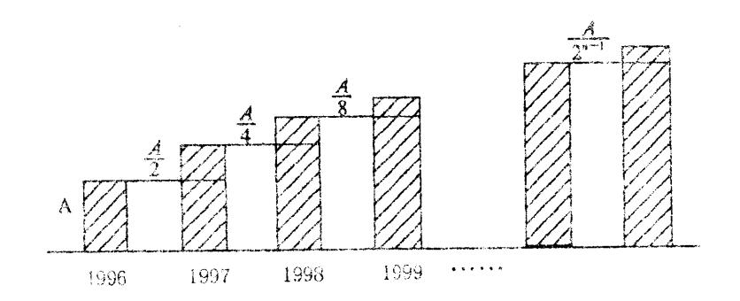

则该公司 1998 年的市场占有率为 ,如果把 1996 年作为第一年,那么第 n年的市场占有率为

- 一、选择题
- (1) C (2) D (3) A (4) B (5) C (6) B (7) A (8) D

二、填空题

(9) 
$$y = \sin\left(x + \frac{\pi}{3}\right), \quad y = \sin\left(\frac{1}{2}x + \frac{\pi}{3}\right);$$

(9) 
$$y = \sin\left(x + \frac{\pi}{3}\right)$$
,  $y = \sin\left(\frac{1}{2}x + \frac{\pi}{3}\right)$ ; (10) (2, 1)  $\vec{x} = (1, \frac{1}{2})$   $\vec{x} = (1, \frac{1}{2})$ 

(11) 5; (12) 90°; (13)  $(-\sqrt{5}, +\infty)$ ; (14)  $\frac{7A}{4}, (2-2^{1-n})A$ .

注: (9)、(10)、(14) 小题第一个空 2 分, 第二个空 3 分.

# 高考数学选择、填空题专项练习题二十

| <b>–</b> , |                    | 择题:本大题共 12 一项是符合题目要求                                                                                                                                                                                                                                                                                                                                                                                                                                                                                                                                                                                                                                                                                                                                                                                                                                                                                                                                                                                                                                                                                                                                                                                                                                                                                                                                                                                                                                                                                                                                                                                                                                                                                                                                                                                                                                                                                                                                                                                                                                                                                                                                                                                                                                                                                                                                                                                                                                                                                                                                                                                                                                                                                                                                                                                                                 |            | ,每小题5分,共                            | 60 <i>5</i> | 分。在每小题给出的                             | り四~      | 个选项中,只                         |
|------------|--------------------|-----------------------------------------------------------------------------------------------------------------------------------------------------------------------------------------------------------------------------------------------------------------------------------------------------------------------------------------------------------------------------------------------------------------------------------------------------------------------------------------------------------------------------------------------------------------------------------------------------------------------------------------------------------------------------------------------------------------------------------------------------------------------------------------------------------------------------------------------------------------------------------------------------------------------------------------------------------------------------------------------------------------------------------------------------------------------------------------------------------------------------------------------------------------------------------------------------------------------------------------------------------------------------------------------------------------------------------------------------------------------------------------------------------------------------------------------------------------------------------------------------------------------------------------------------------------------------------------------------------------------------------------------------------------------------------------------------------------------------------------------------------------------------------------------------------------------------------------------------------------------------------------------------------------------------------------------------------------------------------------------------------------------------------------------------------------------------------------------------------------------------------------------------------------------------------------------------------------------------------------------------------------------------------------------------------------------------------------------------------------------------------------------------------------------------------------------------------------------------------------------------------------------------------------------------------------------------------------------------------------------------------------------------------------------------------------------------------------------------------------------------------------------------------------------------------------------------------------|------------|-------------------------------------|-------------|---------------------------------------|----------|--------------------------------|
| 1.         | 若し                 | $J = \{1, 2, 3, 4, 5\},$                                                                                                                                                                                                                                                                                                                                                                                                                                                                                                                                                                                                                                                                                                                                                                                                                                                                                                                                                                                                                                                                                                                                                                                                                                                                                                                                                                                                                                                                                                                                                                                                                                                                                                                                                                                                                                                                                                                                                                                                                                                                                                                                                                                                                                                                                                                                                                                                                                                                                                                                                                                                                                                                                                                                                                                                                | <i>M</i> : | $= \{1, 2, 4\}, N = \{3\}$          | ,4,         | 5},则 <b>ǎ</b> _(MIN)                  | = (      | )                              |
|            | A.                 | {4}                                                                                                                                                                                                                                                                                                                                                                                                                                                                                                                                                                                                                                                                                                                                                                                                                                                                                                                                                                                                                                                                                                                                                                                                                                                                                                                                                                                                                                                                                                                                                                                                                                                                                                                                                                                                                                                                                                                                                                                                                                                                                                                                                                                                                                                                                                                                                                                                                                                                                                                                                                                                                                                                                                                                                                                                                                     | В.         | {1,2,3}                             | C.          | {1,3,4}                               | D.       | {1,2,3,5}                      |
| 2.         | $\lim_{x\to 1}$    | $\frac{x^2 - 1}{2x^2 - x - 1} = $                                                                                                                                                                                                                                                                                                                                                                                                                                                                                                                                                                                                                                                                                                                                                                                                                                                                                                                                                                                                                                                                                                                                                                                                                                                                                                                                                                                                                                                                                                                                                                                                                                                                                                                                                                                                                                                                                                                                                                                                                                                                                                                                                                                                                                                                                                                                                                                                                                                                                                                                                                                                                                                                                                                                                                                                       | )          |                                     |             |                                       |          |                                |
|            | A.                 | $\frac{1}{2}$                                                                                                                                                                                                                                                                                                                                                                                                                                                                                                                                                                                                                                                                                                                                                                                                                                                                                                                                                                                                                                                                                                                                                                                                                                                                                                                                                                                                                                                                                                                                                                                                                                                                                                                                                                                                                                                                                                                                                                                                                                                                                                                                                                                                                                                                                                                                                                                                                                                                                                                                                                                                                                                                                                                                                                                                                           | В.         | $\frac{2}{3}$                       | C.          | 0                                     | D.       | 2                              |
| 3.         | 不等                 | - <del>2</del> 穿式 x ≤ x+2 的解                                                                                                                                                                                                                                                                                                                                                                                                                                                                                                                                                                                                                                                                                                                                                                                                                                                                                                                                                                                                                                                                                                                                                                                                                                                                                                                                                                                                                                                                                                                                                                                                                                                                                                                                                                                                                                                                                                                                                                                                                                                                                                                                                                                                                                                                                                                                                                                                                                                                                                                                                                                                                                                                                                                                                                                                         | 集是         | <u> </u>                            |             |                                       |          |                                |
|            | A.                 | $\{x \mid x \ge -1\}$                                                                                                                                                                                                                                                                                                                                                                                                                                                                                                                                                                                                                                                                                                                                                                                                                                                                                                                                                                                                                                                                                                                                                                                                                                                                                                                                                                                                                                                                                                                                                                                                                                                                                                                                                                                                                                                                                                                                                                                                                                                                                                                                                                                                                                                                                                                                                                                                                                                                                                                                                                                                                                                                                                                                                                                                                   | В.         | $\{x \mid x \le -1\}$               | C.          | $\{x \mid -1 \le x < 1\}$             | D.       | $\{x \mid x \ge 1\}$           |
| 4.         | 直线                 | $ \xi y = m 与圆 x^2 + (y) $                                                                                                                                                                                                                                                                                                                                                                                                                                                                                                                                                                                                                                                                                                                                                                                                                                                                                                                                                                                                                                                                                                                                                                                                                                                                                                                                                                                                                                                                                                                                                                                                                                                                                                                                                                                                                                                                                                                                                                                                                                                                                                                                                                                                                                                                                                                                                                                                                                                                                                                                                                                                                                                                                                                                                                                                              | y - 2      | ) 2 =1相切,则常数             | m ii        | 的值是 ( )                               |          |                                |
|            | A.                 |                                                                                                                                                                                                                                                                                                                                                                                                                                                                                                                                                                                                                                                                                                                                                                                                                                                                                                                                                                                                                                                                                                                                                                                                                                                                                                                                                                                                                                                                                                                                                                                                                                                                                                                                                                                                                                                                                                                                                                                                                                                                                                                                                                                                                                                                                                                                                                                                                                                                                                                                                                                                                                                                                                                                                                                                                                         | В.         |                                     |             | 1或3                                   | D.       | 2或4                            |
| 5.         | 在△                 | $ABC + \alpha A = \frac{\pi}{3}$                                                                                                                                                                                                                                                                                                                                                                                                                                                                                                                                                                                                                                                                                                                                                                                                                                                                                                                                                                                                                                                                                                                                                                                                                                                                                                                                                                                                                                                                                                                                                                                                                                                                                                                                                                                                                                                                                                                                                                                                                                                                                                                                                                                                                                                                                                                                                                                                                                                                                                                                                                                                                                                                                                                                                                                                        | '是"        | $\sin A = \frac{\sqrt{3}}{2}$ "的(   | )           |                                       |          |                                |
|            |                    | 充分而不必要条件                                                                                                                                                                                                                                                                                                                                                                                                                                                                                                                                                                                                                                                                                                                                                                                                                                                                                                                                                                                                                                                                                                                                                                                                                                                                                                                                                                                                                                                                                                                                                                                                                                                                                                                                                                                                                                                                                                                                                                                                                                                                                                                                                                                                                                                                                                                                                                                                                                                                                                                                                                                                                                                                                                                                                                                                                                |            | 2                                   |             | 充要条件                                  |          |                                |
|            | C.                 | 必要而不充分条件                                                                                                                                                                                                                                                                                                                                                                                                                                                                                                                                                                                                                                                                                                                                                                                                                                                                                                                                                                                                                                                                                                                                                                                                                                                                                                                                                                                                                                                                                                                                                                                                                                                                                                                                                                                                                                                                                                                                                                                                                                                                                                                                                                                                                                                                                                                                                                                                                                                                                                                                                                                                                                                                                                                                                                                                                                |            |                                     | D.          | 既不充分也不必要                              | 条件       | <u>:</u>                       |
| 6.         | 在等                 | 等差数列 $\{a_n\}$ 中, $a$                                                                                                                                                                                                                                                                                                                                                                                                                                                                                                                                                                                                                                                                                                                                                                                                                                                                                                                                                                                                                                                                                                                                                                                                                                                                                                                                                                                                                                                                                                                                                                                                                                                                                                                                                                                                                                                                                                                                                                                                                                                                                                                                                                                                                                                                                                                                                                                                                                                                                                                                                                                                                                                                                                                                                                                                                   | a + a      | $a_2 + a_3 = 3$ , $a_{28} + a_{29}$ | $+a_{1}$    | 30 =165,则此数列               | 前 30     | 0项的和等于:                        |
|            | A.                 | 810                                                                                                                                                                                                                                                                                                                                                                                                                                                                                                                                                                                                                                                                                                                                                                                                                                                                                                                                                                                                                                                                                                                                                                                                                                                                                                                                                                                                                                                                                                                                                                                                                                                                                                                                                                                                                                                                                                                                                                                                                                                                                                                                                                                                                                                                                                                                                                                                                                                                                                                                                                                                                                                                                                                                                                                                                                     | В.         | 840                                 | C.          | 870                                   | D.       | 900                            |
| 7.         | 椭圆                 |                                                                                                                                                                                                                                                                                                                                                                                                                                                                                                                                                                                                                                                                                                                                                                                                                                                                                                                                                                                                                                                                                                                                                                                                                                                                                                                                                                                                                                                                                                                                                                                                                                                                                                                                                                                                                                                                                                                                                                                                                                                                                                                                                                                                                                                                                                                                                                                                                                                                                                                                                                                                                                                                                                                                                                                                                                         | 焦点         | 840 $5$ 为 $F_1$ 、 $F_2$ ,且椭 $1$  | 圆上          | 的点 <i>P</i> 满足 <i>PF</i> 1 | $F_1F_2$ | ,则  <i>PF</i> 2  =: |
|            | Α.                 | $\frac{17}{2}$                                                                                                                                                                                                                                                                                                                                                                                                                                                                                                                                                                                                                                                                                                                                                                                                                                                                                                                                                                                                                                                                                                                                                                                                                                                                                                                                                                                                                                                                                                                                                                                                                                                                                                                                                                                                                                                                                                                                                                                                                                                                                                                                                                                                                                                                                                                                                                                                                                                                                                                                                                                                                                                                                                                                                                                                                          | В.         | $\frac{5}{3}$                       | C.          | $\frac{1}{2}$                         | D.       | $\frac{8}{3}$                  |
|            |                    | J                                                                                                                                                                                                                                                                                                                                                                                                                                                                                                                                                                                                                                                                                                                                                                                                                                                                                                                                                                                                                                                                                                                                                                                                                                                                                                                                                                                                                                                                                                                                                                                                                                                                                                                                                                                                                                                                                                                                                                                                                                                                                                                                                                                                                                                                                                                                                                                                                                                                                                                                                                                                                                                                                                                                                                                                                                       |            | 3                                   |             | 3                                     |          | 3                              |
| 8.         | $\left(x^3\right)$ | $-\frac{1}{x\sqrt{x}}\Big)^9$ 的展开式                                                                                                                                                                                                                                                                                                                                                                                                                                                                                                                                                                                                                                                                                                                                                                                                                                                                                                                                                                                                                                                                                                                                                                                                                                                                                                                                                                                                                                                                                                                                                                                                                                                                                                                                                                                                                                                                                                                                                                                                                                                                                                                                                                                                                                                                                                                                                                                                                                                                                                                                                                                                                                                                                                                                                                                                      | 中的         | ]常数项是(  )                           |             |                                       |          |                                |
|            | A.                 | 84                                                                                                                                                                                                                                                                                                                                                                                                                                                                                                                                                                                                                                                                                                                                                                                                                                                                                                                                                                                                                                                                                                                                                                                                                                                                                                                                                                                                                                                                                                                                                                                                                                                                                                                                                                                                                                                                                                                                                                                                                                                                                                                                                                                                                                                                                                                                                                                                                                                                                                                                                                                                                                                                                                                                                                                                                                      | В.         | -84                                 | C.          | 36                                    | D.       | -36                            |
| 9.         | 已知                 | □球的表面积为4π,                                                                                                                                                                                                                                                                                                                                                                                                                                                                                                                                                                                                                                                                                                                                                                                                                                                                                                                                                                                                                                                                                                                                                                                                                                                                                                                                                                                                                                                                                                                                                                                                                                                                                                                                                                                                                                                                                                                                                                                                                                                                                                                                                                                                                                                                                                                                                                                                                                                                                                                                                                                                                                                                                                                                                                                                                              | . A        | 、 $B$ 、 $C$ 三点都在                    | 球面          | <b>آ</b> 上,且每两点间的                     | 球面       | 距离均为 $\frac{\pi}{2}$ ,         |
|            |                    | ド心 O 到平面 ABC                                                                                                                                                                                                                                                                                                                                                                                                                                                                                                                                                                                                                                                                                                                                                                                                                                                                                                                                                                                                                                                                                                                                                                                                                                                                                                                                                                                                                                                                                                                                                                                                                                                                                                                                                                                                                                                                                                                                                                                                                                                                                                                                                                                                                                                                                                                                                                                                                                                                                                                                                                                                                                                                                                                                                                                                                 |            |                                     |             |                                       |          | _                              |
|            | Α.                 | $\frac{\sqrt{6}}{3}$                                                                                                                                                                                                                                                                                                                                                                                                                                                                                                                                                                                                                                                                                                                                                                                                                                                                                                                                                                                                                                                                                                                                                                                                                                                                                                                                                                                                                                                                                                                                                                                                                                                                                                                                                                                                                                                                                                                                                                                                                                                                                                                                                                                                                                                                                                                                                                                                                                                                                                                                                                                                                                                                                                                                                                                                                    | В.         | $\frac{\sqrt{3}}{6}$                | C.          | $\sqrt{3}$                            | D.       | $\frac{\sqrt{3}}{3}$           |
| 10.        | 函数                 | $f(x) = \sin^2 x + 3\cos^2 x + 3\cos^2 x + 3\cos^2 x + 3\cos^2 x + 3\cos^2 x + 3\cos^2 x + 3\cos^2 x + 3\cos^2 x + 3\cos^2 x + 3\cos^2 x + 3\cos^2 x + 3\cos^2 x + 3\cos^2 x + 3\cos^2 x + 3\cos^2 x + 3\cos^2 x + 3\cos^2 x + 3\cos^2 x + 3\cos^2 x + 3\cos^2 x + 3\cos^2 x + 3\cos^2 x + 3\cos^2 x + 3\cos^2 x + 3\cos^2 x + 3\cos^2 x + 3\cos^2 x + 3\cos^2 x + 3\cos^2 x + 3\cos^2 x + 3\cos^2 x + 3\cos^2 x + 3\cos^2 x + 3\cos^2 x + 3\cos^2 x + 3\cos^2 x + 3\cos^2 x + 3\cos^2 x + 3\cos^2 x + 3\cos^2 x + 3\cos^2 x + 3\cos^2 x + 3\cos^2 x + 3\cos^2 x + 3\cos^2 x + 3\cos^2 x + 3\cos^2 x + 3\cos^2 x + 3\cos^2 x + 3\cos^2 x + 3\cos^2 x + 3\cos^2 x + 3\cos^2 x + 3\cos^2 x + 3\cos^2 x + 3\cos^2 x + 3\cos^2 x + 3\cos^2 x + 3\cos^2 x + 3\cos^2 x + 3\cos^2 x + 3\cos^2 x + 3\cos^2 x + 3\cos^2 x + 3\cos^2 x + 3\cos^2 x + 3\cos^2 x + 3\cos^2 x + 3\cos^2 x + 3\cos^2 x + 3\cos^2 x + 3\cos^2 x + 3\cos^2 x + 3\cos^2 x + 3\cos^2 x + 3\cos^2 x + 3\cos^2 x + 3\cos^2 x + 3\cos^2 x + 3\cos^2 x + 3\cos^2 x + 3\cos^2 x + 3\cos^2 x + 3\cos^2 x + 3\cos^2 x + 3\cos^2 x + 3\cos^2 x + 3\cos^2 x + 3\cos^2 x + 3\cos^2 x + 3\cos^2 x + 3\cos^2 x + 3\cos^2 x + 3\cos^2 x + 3\cos^2 x + 3\cos^2 x + 3\cos^2 x + 3\cos^2 x + 3\cos^2 x + 3\cos^2 x + 3\cos^2 x + 3\cos^2 x + 3\cos^2 x + 3\cos^2 x + 3\cos^2 x + 3\cos^2 x + 3\cos^2 x + 3\cos^2 x + 3\cos^2 x + 3\cos^2 x + 3\cos^2 x + 3\cos^2 x + 3\cos^2 x + 3\cos^2 x + 3\cos^2 x + 3\cos^2 x + 3\cos^2 x + 3\cos^2 x + 3\cos^2 x + 3\cos^2 x + 3\cos^2 x + 3\cos^2 x + 3\cos^2 x + 3\cos^2 x + 3\cos^2 x + 3\cos^2 x + 3\cos^2 x + 3\cos^2 x + 3\cos^2 x + 3\cos^2 x + 3\cos^2 x + 3\cos^2 x + 3\cos^2 x + 3\cos^2 x + 3\cos^2 x + 3\cos^2 x + 3\cos^2 x + 3\cos^2 x + 3\cos^2 x + 3\cos^2 x + 3\cos^2 x + 3\cos^2 x + 3\cos^2 x + 3\cos^2 x + 3\cos^2 x + 3\cos^2 x + 3\cos^2 x + 3\cos^2 x + 3\cos^2 x + 3\cos^2 x + 3\cos^2 x + 3\cos^2 x + 3\cos^2 x + 3\cos^2 x + 3\cos^2 x + 3\cos^2 x + 3\cos^2 x + 3\cos^2 x + 3\cos^2 x + 3\cos^2 x + 3\cos^2 x + 3\cos^2 x + 3\cos^2 x + 3\cos^2 x + 3\cos^2 x + 3\cos^2 x + 3\cos^2 x + 3\cos^2 x + 3\cos^2 x + 3\cos^2 x + 3\cos^2 x + 3\cos^2 x + 3\cos^2 x + 3\cos^2 x + 3\cos^2 x + 3\cos^2 x + 3\cos^2 x + 3\cos^2 x + 3\cos^2 x + 3\cos^2 x + 3\cos^2 x + 3\cos^2 x + 3\cos^2 x + 3\cos^2 x + 3\cos^2 x + 3\cos^2 x + 3\cos^2 x + 3\cos^2 x + 3\cos^2 x + 3\cos^2 x + 3\cos^2 x + 3\cos^2 x + 3\cos^2 x + 3\cos^2 x + 3\cos^2 x + 3\cos^2 x + 3\cos^2 x + 3\cos^2 x + 3\cos^2 x + 3\cos^2 x + 3\cos^2 x + 3\cos^2 x + 3\cos^2 x + 3\cos^2 x + 3\cos^2 x + 3\cos^2 x + 3\cos^2 x + 3\cos^2 x + 3\cos^2 x + 3\cos^2 x + 3\cos^2 x + 3\cos^2 x + 3\cos^2 x + 3\cos^2 x + 3\cos^2 x + 3\cos^2 x + 3\cos^2 x + 3\cos^2 x + 3\cos^2 x + 3\cos^2 x + 3\cos^2 x + 3\cos^2 x + 3\cos^2 x + 3\cos^2 x + 3\cos^2 x + 3\cos^2$ | $os^2 x$   | 的最小正周期是(                            |             | )                                     |          |                                |
|            | A.                 | $\frac{\pi}{4}$                                                                                                                                                                                                                                                                                                                                                                                                                                                                                                                                                                                                                                                                                                                                                                                                                                                                                                                                                                                                                                                                                                                                                                                                                                                                                                                                                                                                                                                                                                                                                                                                                                                                                                                                                                                                                                                                                                                                                                                                                                                                                                                                                                                                                                                                                                                                                                                                                                                                                                                                                                                                                                                                                                                                                                                                                         | В.         | $\frac{\pi}{2}$                     | C.          | π                                     | D.       | $2\pi$                         |
| 11.        |                    |                                                                                                                                                                                                                                                                                                                                                                                                                                                                                                                                                                                                                                                                                                                                                                                                                                                                                                                                                                                                                                                                                                                                                                                                                                                                                                                                                                                                                                                                                                                                                                                                                                                                                                                                                                                                                                                                                                                                                                                                                                                                                                                                                                                                                                                                                                                                                                                                                                                                                                                                                                                                                                                                                                                                                                                                                                         |            | E,每间医院至少12                          |             |                                       |          |                                |
|            | Α.                 | 48 种                                                                                                                                                                                                                                                                                                                                                                                                                                                                                                                                                                                                                                                                                                                                                                                                                                                                                                                                                                                                                                                                                                                                                                                                                                                                                                                                                                                                                                                                                                                                                                                                                                                                                                                                                                                                                                                                                                                                                                                                                                                                                                                                                                                                                                                                                                                                                                                                                                                                                                                                                                                                                                                                                                                                                                                                                                    | В.         | 12 种                                | C.          | 24 种                                  | D.       | 36种                            |

12. 如图,正方体 $ABCD - A_iB_iC_iD_i$ 的棱长为1,点M在棱AB上, 且  $AM = \frac{1}{3}$ , 点 P 是平面 ABCD 上的动点,且动点 P 到直线 AD, 的距离与点 P 到点 M 的距离的平方差为1,则动点 P 的

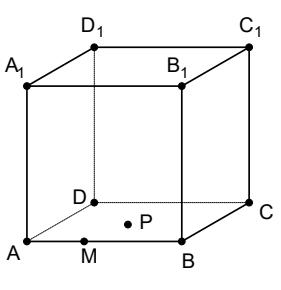

轨迹是(

A. 圆

B. 抛物线

C. 双曲线

D. 直线

### 二、填空题:本大题共4小题,每小题4分,共16分。把答案填在题中横线上。

13. 设复数 
$$z = -\frac{1}{2} + \frac{\sqrt{3}}{2}i$$
, 则  $z + z^2 = \underline{\hspace{1cm}}$ .

- 14. 某单位业务人员、管理人员、后勤服务人员人数之比依次为15:3:2。为了了解该单位 职员的某种情况,采用分层抽样方法抽出一个容量为n的样本,样本中业务人员人数为 30,则此样本的容量n=\_\_\_\_。
- $\int x + y \le 1$ 15. 设 x 、 v 满足约束条件:  $\{y \le x$  ,则 z = 3x + y 的最大值是\_\_\_\_\_\_。  $v \ge 0$
- 16. 已知a、b为不垂直的异面直线, $\alpha$ 是一个平面,则a、b在 $\alpha$ 上的射影有可能是: ① 两条平行直线;②两条互相垂直的直线;③同一条直线;④一条直线及其外一点。在上 面的结论中,正确结论的编号是\_\_\_\_。(写出所有正确结论的序号)

### 一、选择题:

| 题号 | 1 | 2 | 3 | 4 | 5 | 6 | 7 | 8 | 9 | 10 | 11 | 12 |
|----|---|---|---|---|---|---|---|---|---|----|----|----|
| 答案 | D | В | A | С | A | В | A | A | D | С  | D  | В  |

- 二、填空题:
  - 13. -1

- 14. 40 15. 3 16. ①②④

# 高考数学选择、填空题专项练习题二

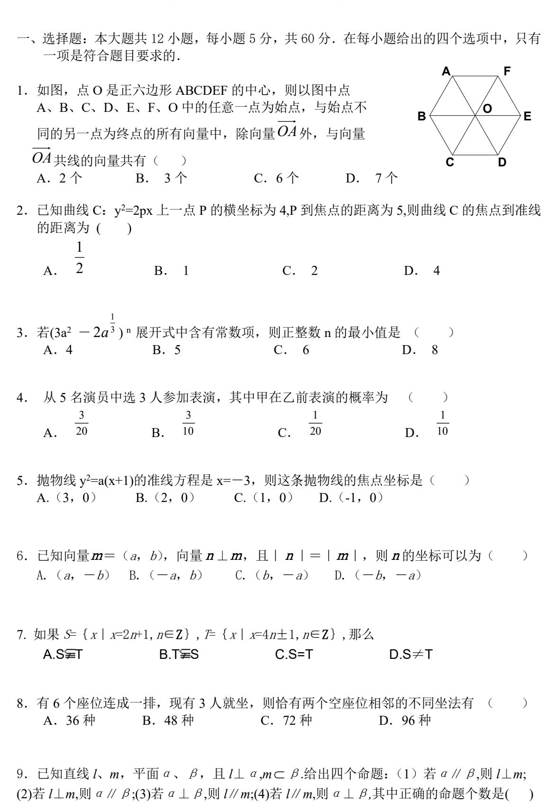

C. 3

D. 2

A. 4

B. 1

- 10. 已知函数  $f(x) = \log_2(x^2 ax + 3a)$ 在区间[2,  $+\infty$ )上递增,则实数 a 的取值范围是( ) A. $(-\infty, 4)$  B.(-4, 4] C. $(-\infty, -4) \cup [2, +\infty)$  D.[-4, 2)
- 11. 4 只笔与 5 本书的价格之和小于 22 元, 而 6 只笔与 3 本书的价格之和大于 24 元, 则 2 只笔与3本书的价格比较() B. 3 本书贵 C. 二者相同 D. 无法确定
  - A. 2 只笔贵

- 12. 若  $\alpha$  是锐角,  $\sin(\alpha \frac{\pi}{6}) = \frac{1}{3}$ ,则  $\cos \alpha$  的值等于
- A.  $\frac{2\sqrt{6}-1}{6}$  B.  $\frac{2\sqrt{6}+1}{6}$  C.  $\frac{2\sqrt{3}+1}{4}$  D.  $\frac{2\sqrt{3}-1}{3}$
- 二、填空题:本大题共4小题,每小题4分,共16分.答案填在题中横线上.
- 13. 在等差数列  $\{a_n\}$  中, $a_1=\frac{1}{25}$ ,第 10 项开始比 1 大,则公差 d 的取值范围是\_\_\_\_\_\_.
- 14. 已知正三棱柱  $ABC-A_1B_1C_1$ ,底面边长与侧棱长的比为 $\sqrt{2}$ :1,则直线  $AB_1$ 与  $CA_1$ 所成的角为\_\_\_\_。
- 15. 若  $\sin 2 \alpha < 0$ ,  $\sin \alpha \cos \alpha < 0$ , 化简  $\cos \alpha \sqrt{\frac{1-\sin \alpha}{1+\sin \alpha}} + \sin \alpha \sqrt{\frac{1-\cos \alpha}{1+\cos \alpha}} = \underline{\hspace{1cm}}$
- 16. 己知函数 f(x)满足: f(p+q)=f(p)f(q),f(1)=3,则

$$\frac{f^2(1) + f(2)}{f(1)} + \frac{f^2(2) + f(4)}{f(3)} + \frac{f^2(3) + f(6)}{f(5)} + \frac{f^2(4) + f(8)}{f(7)} = \underline{\hspace{2cm}}.$$

答案:

- 1 D; 2 A; 3 B; 4 A; 5 C; 6 C; 7 C; 8 C; 9 D; 10 B; 11 A; 12 A.

- 13.  $\frac{8}{75} < d < \frac{3}{25}$ ; 14. 90°; 15  $\sqrt{2} \sin(\alpha \frac{\pi}{4})$ ; 16 24.

# 高考数学选择、填空题专项练习题八

- 一、选择题(本大题共12小题,每小题5分,共60分,在每小题所给出的四个选项中,只 有一项是符合题目要求的)
  - 1. 直线  $x\cos\alpha v + 1 = 0$  的倾斜角的取值范围是 ( )

A. 
$$\left[0, \frac{\pi}{2}\right]$$
 B.  $\left[0, \pi\right)$  C.  $\left[\frac{\pi}{4}, \frac{3\pi}{4}\right]$  D.  $\left[0, \frac{\pi}{4}\right] \cup \left[\frac{3\pi}{4}, \pi\right)$ 

2. 设方程  $x + \lg x = 3$  的根为  $\alpha$  ,  $\lceil \alpha \rceil$ 表示不超过  $\alpha$  的最大整数,则  $\lceil \alpha \rceil$ 是 ( )

A. 1

B. 2

C. 3

D. 4

- 3. 若 " $p \perp q$ " 与 " $p \neq q$ " 均为假命题,则( )
  - A. 命题"非p"与"非q"的真值不同 B. 命题"非p"与"非q"至少有一个是假命题

  - C. 命题"非p"与"q"的真值相同 D. 命题"非p"与"非q"都是真命题
- 4. 设 1!, 2!, 3!, ······, n! 的和为 Sn,则 Sn的个位数是 ( )

A. 1

B. 3

C. 5

D. 7

5. 有下列命题① $\overrightarrow{AB} + \overrightarrow{BC} + \overrightarrow{AC} = \vec{0}$ ; ② $(\overrightarrow{a} + \overrightarrow{b} + \overrightarrow{c}) = \overrightarrow{a} \cdot \overrightarrow{c} + \overrightarrow{b} \cdot \overrightarrow{c}$ ; ③若 $\overrightarrow{a} = (m, 4)$ ,则  $|\vec{a}| = \sqrt{23}$  的充要条件是  $m = \sqrt{7}$ : ④若  $\overrightarrow{AB}$  的起点为 A(2,1), 终点为 B(-2,4), 则  $\overrightarrow{BA}$  与 x轴正向所夹角的余弦值是 $\frac{4}{5}$ ,其中正确命题的序号是 ( )

A. (1)(2) B. (2)(3) C. (2)(4) D. (3)(4)

6. 右图中, 阴影部分的面积是

( )

A. 16

B. 18

C. 20

D. 22

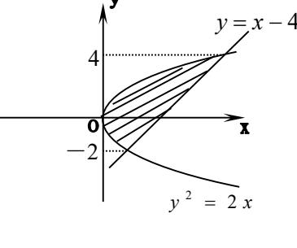

7. 如图, 正四棱柱 ABCD - A1B1C1D1中, AB=3, BB1=4. 长为 1 的线段 PO 在棱 AA1 上移动, 长为3的线段MN在棱CC1上移动,点R在棱BB1上移动,则四棱锥R-PQMN的体积 是()

A. 6

B. 10 C. 12 D. 不确定

8. 用 1, 2, 3, 4 这四个数字可排成必须含有重复数字的四位数有 ( )

A. 265 个 B. 232 个 C. 128 个

D. 24 个

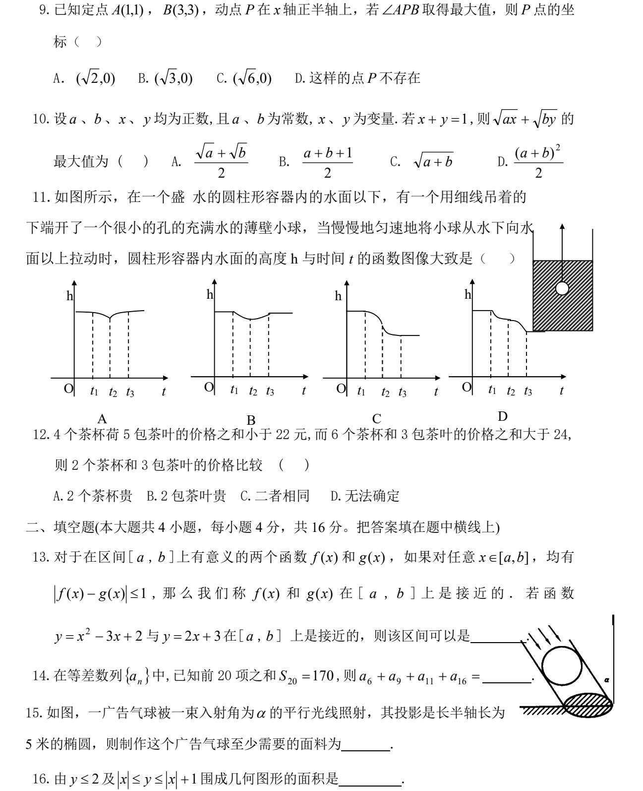

16. \_\_3\_\_

答案:一、选择题

二、填空题:

DBDBC,BABCC,CA

13.  $[1,2] \cup [3,4]$  14. 34 15.  $100\pi \cos^2 \alpha$ 

# 高考数学选择、填空题专项练习题一

一、选择题(本大题共12小题,每小题5分,共60分.在每小题给出的四个选项中, 只有一项是符合题目要求的)

 $2.\triangle ABC$ 中, $\cos A = \frac{5}{13}$ , $\sin B = \frac{3}{5}$ ,则  $\cos C$  的值为

A. 
$$\frac{56}{65}$$

A. 
$$\frac{56}{65}$$
 B.  $-\frac{56}{65}$  C.  $-\frac{16}{65}$  D.  $\frac{16}{65}$ 

$$C.-\frac{16}{65}$$

D. 
$$\frac{16}{65}$$

3.过点(1,3)作直线 l,若 l 经过点(a,0)和(0,b),且  $a,b \in \mathbb{N}^*$ ,则可作出的 l 的条数为(

4.函数  $f(x) = \log_a x(a > 0$  且  $a \neq 1$ )对任意正实数 x,y 都有 ( )

$$A.f(x \cdot y) = f(x) \cdot f(y)$$

B.
$$f(x \cdot v) = f(x) + f(v)$$

$$C.f(x+y)=f(x) \cdot f(y)$$

$$D.f(x+y)=f(x)+f(y)$$

5.已知二面角  $\alpha$ —l— $\beta$ 的大小为  $60^{\circ}$ ,b 和 c 是两条异面直线,则在下列四个条件中,能使 *b* 和 *c* 所成的角为 60° 的是(

$$A.b// a.c// \beta$$

B.b// 
$$a$$
, $c \perp \beta$ 

$$C.b \perp a, c \perp \beta$$

$$D.b \perp a,c // \beta$$

6.一个等差数列共 n 项, 其和为 90, 这个数列的前 10 项的和为 25, 后 10 项的和为 75, 则 项数n为 ( )

D 20

7.某城市的街道如图,某人要从A地前往B地,则路程最短的走法有(

A.8 种

B.10 种

C.12 种

D.32 种

8.若 a,b 是异面直线,  $a \subset \alpha, b \subset \beta, \alpha \cap \beta = l$ , 则下列命题中是真 命题的为()

A.l 与 a、b 分别相交

B.l与a、b都不相交

C.l 至多与 a、b 中的一条相交 D.l 至少与 a、b 中的一条相交

9.设  $F_1$ ,  $F_2$  是双曲线  $\frac{x^2}{4}$  — $y^2$ =1 的两个焦点,点 P 在双曲线上,且 $\overrightarrow{PF_1}$  •  $\overrightarrow{PF_2}$  =0,则

 $|\overrightarrow{PF_1}| \cdot |\overrightarrow{PF_2}|$  的值等于 ( )

 $B 2 \sqrt{2}$ A.2 C 4 D 8

 $10.f(x)=(1+2x)^m+(1+3x)^n(m,n∈N^*)$ 的展开式中x的系数为 13,则 $x^2$ 的系数为(

A.31 B.40 C.31 或 40

D.71 或 80

11.从装有4粒大小、形状相同,颜色不同的玻璃球的瓶中,随意一次倒出若干粒玻璃球(至 少一粒),则倒出奇数粒玻璃球的概率比倒出偶数粒玻璃球的概率(

A.小 B.大 C.相等 D.大小不能确定

12.如右图, $A \times B \times C \times D$ 是某煤矿的四个采煤点,l是公路,图中所标线段为道路, $ABQP \times D$ BCRO、CDSR 近似于正方形.已知 A、B、C、D 四个采煤点每天的 采煤量之比约为5:1:2:3,运煤的费用与运煤的路程、所运煤的 重量都成正比.现要从P、O、R、S 中选出一处设立一个运煤中转站, 使四个采煤点的煤运到中转站的费用最少,则地点应选在(

A.P 点 B.O 点

C.R 点

D.S 点

二、填空题(本大题共4小题,每小题4分,共16分.把答案填在题中横线上) 13.抛物线  $v^2=2x$  上到直线 x-v+3=0 距离最短的点的坐标为 . .

14.一个长方体共一顶点的三个面的面积分别是 $\sqrt{2}$ ,  $\sqrt{3}$ ,  $\sqrt{6}$ , 这个长方体对角线的 长是 \_\_\_\_.

15.设定义在 **R** 上的偶函数 f(x)满足 f(x+1)+f(x)=1,且当  $x \in [1,2]$  时,f(x)=2-x,则 f(8.5) = .

16.某校要从甲、乙两名优秀短跑选手中选一名选手参加全市中学生田径百米比赛,该 校预先对这两名选手测试了8次,测试成绩如下:

|      |     | 第1次  | 第2次  | 第3次  | 第4次  | 第5次  | 第6次  | 第7次  | 第8次  |
|------|-----|------|------|------|------|------|------|------|------|
| 甲成绩( | (秒) | 12.1 | 12.2 | 13   | 12.5 | 13.1 | 12.5 | 12.4 | 12.2 |
| 乙成绩( | (秒) | 12   | 12.4 | 12.8 | 13   | 12.2 | 12.8 | 12.3 | 12.5 |

根据测试成绩,派 (填甲或乙)选手参赛更好,理由是 .

#### 答案:

-, 1.A 2.D 3.B 4.B 5.C 6.C 7.B 8.D 9.A 10.C 11.B 12.B

$$\equiv$$
, 13.  $(\frac{1}{2}, 1)$  14.  $\sqrt{6}$  15.  $\frac{1}{2}$ 

# 高考数学选择、填空题专项练习题五

一、选择题本大题共12小题,每小题5分,共60分,在每小题给出的四个选项中,有且只

|    | 有-       | 一项是符合题目9                                                                                                                                                                                                                                                                                                                                                                                                                                                                                                                                                                                                                                                                                                                                                                                                                                                                                                                                                                                                                                                                                                                                                                                                                                                                                                                                                                                                                                                                                                                                                                                                                                                                                                                                                                                                                                                                                                                                                                                                                                                                                                                                                                                                                                                                                                                                                                                                                                                                                                                                                                                                                                                                                                                                                                                                                                                                                                                    | 要求的.                                        |                               |                              |                         |
|----|----------|-----------------------------------------------------------------------------------------------------------------------------------------------------------------------------------------------------------------------------------------------------------------------------------------------------------------------------------------------------------------------------------------------------------------------------------------------------------------------------------------------------------------------------------------------------------------------------------------------------------------------------------------------------------------------------------------------------------------------------------------------------------------------------------------------------------------------------------------------------------------------------------------------------------------------------------------------------------------------------------------------------------------------------------------------------------------------------------------------------------------------------------------------------------------------------------------------------------------------------------------------------------------------------------------------------------------------------------------------------------------------------------------------------------------------------------------------------------------------------------------------------------------------------------------------------------------------------------------------------------------------------------------------------------------------------------------------------------------------------------------------------------------------------------------------------------------------------------------------------------------------------------------------------------------------------------------------------------------------------------------------------------------------------------------------------------------------------------------------------------------------------------------------------------------------------------------------------------------------------------------------------------------------------------------------------------------------------------------------------------------------------------------------------------------------------------------------------------------------------------------------------------------------------------------------------------------------------------------------------------------------------------------------------------------------------------------------------------------------------------------------------------------------------------------------------------------------------------------------------------------------------------------------------------------------------|---------------------------------------------|-------------------------------|------------------------------|-------------------------|
| 1. | 在数       | 類 $\{a_n\}$ 中 $,a_1=1$                                                                                                                                                                                                                                                                                                                                                                                                                                                                                                                                                                                                                                                                                                                                                                                                                                                                                                                                                                                                                                                                                                                                                                                                                                                                                                                                                                                                                                                                                                                                                                                                                                                                                                                                                                                                                                                                                                                                                                                                                                                                                                                                                                                                                                                                                                                                                                                                                                                                                                                                                                                                                                                                                                                                                                                                                                                                                                      | $a_{n+1} = a_n^2 - 1$ 则此                    | 数列的前4项之和为                     |                              | ( )                     |
|    | Α.       | 0                                                                                                                                                                                                                                                                                                                                                                                                                                                                                                                                                                                                                                                                                                                                                                                                                                                                                                                                                                                                                                                                                                                                                                                                                                                                                                                                                                                                                                                                                                                                                                                                                                                                                                                                                                                                                                                                                                                                                                                                                                                                                                                                                                                                                                                                                                                                                                                                                                                                                                                                                                                                                                                                                                                                                                                                                                                                                                                           | B. 1                                        | C. 2                          | D2                           |                         |
| 2. | 函数       | $y = \log_2 x + \log_2 x + \log_2 x + \log_2 x + \log_2 x + \log_2 x + \log_2 x + \log_2 x + \log_2 x + \log_2 x + \log_2 x + \log_2 x + \log_2 x + \log_2 x + \log_2 x + \log_2 x + \log_2 x + \log_2 x + \log_2 x + \log_2 x + \log_2 x + \log_2 x + \log_2 x + \log_2 x + \log_2 x + \log_2 x + \log_2 x + \log_2 x + \log_2 x + \log_2 x + \log_2 x + \log_2 x + \log_2 x + \log_2 x + \log_2 x + \log_2 x + \log_2 x + \log_2 x + \log_2 x + \log_2 x + \log_2 x + \log_2 x + \log_2 x + \log_2 x + \log_2 x + \log_2 x + \log_2 x + \log_2 x + \log_2 x + \log_2 x + \log_2 x + \log_2 x + \log_2 x + \log_2 x + \log_2 x + \log_2 x + \log_2 x + \log_2 x + \log_2 x + \log_2 x + \log_2 x + \log_2 x + \log_2 x + \log_2 x + \log_2 x + \log_2 x + \log_2 x + \log_2 x + \log_2 x + \log_2 x + \log_2 x + \log_2 x + \log_2 x + \log_2 x + \log_2 x + \log_2 x + \log_2 x + \log_2 x + \log_2 x + \log_2 x + \log_2 x + \log_2 x + \log_2 x + \log_2 x + \log_2 x + \log_2 x + \log_2 x + \log_2 x + \log_2 x + \log_2 x + \log_2 x + \log_2 x + \log_2 x + \log_2 x + \log_2 x + \log_2 x + \log_2 x + \log_2 x + \log_2 x + \log_2 x + \log_2 x + \log_2 x + \log_2 x + \log_2 x + \log_2 x + \log_2 x + \log_2 x + \log_2 x + \log_2 x + \log_2 x + \log_2 x + \log_2 x + \log_2 x + \log_2 x + \log_2 x + \log_2 x + \log_2 x + \log_2 x + \log_2 x + \log_2 x + \log_2 x + \log_2 x + \log_2 x + \log_2 x + \log_2 x + \log_2 x + \log_2 x + \log_2 x + \log_2 x + \log_2 x + \log_2 x + \log_2 x + \log_2 x + \log_2 x + \log_2 x + \log_2 x + \log_2 x + \log_2 x + \log_2 x + \log_2 x + \log_2 x + \log_2 x + \log_2 x + \log_2 x + \log_2 x + \log_2 x + \log_2 x + \log_2 x + \log_2 x + \log_2 x + \log_2 x + \log_2 x + \log_2 x + \log_2 x + \log_2 x + \log_2 x + \log_2 x + \log_2 x + \log_2 x + \log_2 x + \log_2 x + \log_2 x + \log_2 x + \log_2 x + \log_2 x + \log_2 x + \log_2 x + \log_2 x + \log_2 x + \log_2 x + \log_2 x + \log_2 x + \log_2 x + \log_2 x + \log_2 x + \log_2 x + \log_2 x + \log_2 x + \log_2 x + \log_2 x + \log_2 x + \log_2 x + \log_2 x + \log_2 x + \log_2 x + \log_2 x + \log_2 x + \log_2 x + \log_2 x + \log_2 x + \log_2 x + \log_2 x + \log_2 x + \log_2 x + \log_2 x + \log_2 x + \log_2 x + \log_2 x + \log_2 x + \log_2 x + \log_2 x + \log_2 x + \log_2 x + \log_2 x + \log_2 x + \log_2 x + \log_2 x + \log_2 x + \log_2 x + \log_2 x + \log_2 x + \log_2 x + \log_2 x + \log_2 x + \log_2 x + \log_2 x + \log_2 x + \log_2 x + \log_2 x + \log_2 x + \log_2 x + \log_2 x + \log_2 x + \log_2 x + \log_2 x + \log_2 x + \log_2 x + \log_2 x + \log_2 x + \log_2 x + \log_2 x + \log_2 x + \log_2 x + \log_2 x + \log_2 x + \log_2 x + \log_2 x + \log_2 x + \log_2 x + \log_2 x + \log_2 x + \log_2 x + \log_2 x + \log_2 x + \log_2 x + \log_2 x + \log_2 x + \log_2 x + \log_2 x + \log_2 x + \log_2 x + \log_2 x + \log_2 x + \log_2 x + \log_2 x + $ | $g_x(2x)$ 的值域是                              |                               |                              | ( )                     |
|    | Α.       | (-∞,-1]                                                                                                                                                                                                                                                                                                                                                                                                                                                                                                                                                                                                                                                                                                                                                                                                                                                                                                                                                                                                                                                                                                                                                                                                                                                                                                                                                                                                                                                                                                                                                                                                                                                                                                                                                                                                                                                                                                                                                                                                                                                                                                                                                                                                                                                                                                                                                                                                                                                                                                                                                                                                                                                                                                                                                                                                                                                                                                                     | B. [3,+∞)                                   | C. [-1,3]                     | D. $(-\infty,-1]$            | [3,+∞)                  |
| 3. |          | 数为 N 的一批零 的值(  )                                                                                                                                                                                                                                                                                                                                                                                                                                                                                                                                                                                                                                                                                                                                                                                                                                                                                                                                                                                                                                                                                                                                                                                                                                                                                                                                                                                                                                                                                                                                                                                                                                                                                                                                                                                                                                                                                                                                                                                                                                                                                                                                                                                                                                                                                                                                                                                                                                                                                                                                                                                                                                                                                                                                                                                                                                                                                                         | 《件抽取一个容量为 3                                 | 30 的样本,若每个零                   | 件被抽取的概率                      | 为 $\frac{1}{4}$ ,则      |
|    |          |                                                                                                                                                                                                                                                                                                                                                                                                                                                                                                                                                                                                                                                                                                                                                                                                                                                                                                                                                                                                                                                                                                                                                                                                                                                                                                                                                                                                                                                                                                                                                                                                                                                                                                                                                                                                                                                                                                                                                                                                                                                                                                                                                                                                                                                                                                                                                                                                                                                                                                                                                                                                                                                                                                                                                                                                                                                                                                                             | B. 200                                      | C. 150                        | D. 100                       |                         |
| 4. | 是        | ( )                                                                                                                                                                                                                                                                                                                                                                                                                                                                                                                                                                                                                                                                                                                                                                                                                                                                                                                                                                                                                                                                                                                                                                                                                                                                                                                                                                                                                                                                                                                                                                                                                                                                                                                                                                                                                                                                                                                                                                                                                                                                                                                                                                                                                                                                                                                                                                                                                                                                                                                                                                                                                                                                                                                                                                                                                                                                                                                         |                                             | ·                             |                              |                         |
|    | Α.       | $\cos(x+\frac{\pi}{4})$                                                                                                                                                                                                                                                                                                                                                                                                                                                                                                                                                                                                                                                                                                                                                                                                                                                                                                                                                                                                                                                                                                                                                                                                                                                                                                                                                                                                                                                                                                                                                                                                                                                                                                                                                                                                                                                                                                                                                                                                                                                                                                                                                                                                                                                                                                                                                                                                                                                                                                                                                                                                                                                                                                                                                                                                                                                                                                     | $B\cos(x-\frac{\pi}{4})$                    | $C\cos(x + \frac{\pi}{4})$    | -) D. cos(x                  | $(-\frac{\pi}{4})$      |
| 5. | 设(a      | -b)"的展开式中                                                                                                                                                                                                                                                                                                                                                                                                                                                                                                                                                                                                                                                                                                                                                                                                                                                                                                                                                                                                                                                                                                                                                                                                                                                                                                                                                                                                                                                                                                                                                                                                                                                                                                                                                                                                                                                                                                                                                                                                                                                                                                                                                                                                                                                                                                                                                                                                                                                                                                                                                                                                                                                                                                                                                                                                                                                                                                                   | 中,二项式系数的和为                                  | 256,则此二项展开式                   | 中系数最小的项                      | 是( )                    |
|    | A.       | 第5项                                                                                                                                                                                                                                                                                                                                                                                                                                                                                                                                                                                                                                                                                                                                                                                                                                                                                                                                                                                                                                                                                                                                                                                                                                                                                                                                                                                                                                                                                                                                                                                                                                                                                                                                                                                                                                                                                                                                                                                                                                                                                                                                                                                                                                                                                                                                                                                                                                                                                                                                                                                                                                                                                                                                                                                                                                                                                                                         | B. 第4、5两项                                   | C. 第5、6两项                     | D. 第4、6两项                    | 页                       |
| 6. | 己知       | <b>i</b> , <b>j</b> 为互相垂直的                                                                                                                                                                                                                                                                                                                                                                                                                                                                                                                                                                                                                                                                                                                                                                                                                                                                                                                                                                                                                                                                                                                                                                                                                                                                                                                                                                                                                                                                                                                                                                                                                                                                                                                                                                                                                                                                                                                                                                                                                                                                                                                                                                                                                                                                                                                                                                                                                                                                                                                                                                                                                                                                                                                                                                                                                                                                                                  | 的单位向量, $a = i - 2$                          | 2j,b=i+j,且a与b                 | 的夹角为锐角,                      | 则实数え                    |
|    |          | 权值范围是 1                                                                                                                                                                                                                                                                                                                                                                                                                                                                                                                                                                                                                                                                                                                                                                                                                                                                                                                                                                                                                                                                                                                                                                                                                                                                                                                                                                                                                                                                                                                                                                                                                                                                                                                                                                                                                                                                                                                                                                                                                                                                                                                                                                                                                                                                                                                                                                                                                                                                                                                                                                                                                                                                                                                                                                                                                                                                                                                  |                                             | 1                             | 2                            | 2                       |
|    |          | 1                                                                                                                                                                                                                                                                                                                                                                                                                                                                                                                                                                                                                                                                                                                                                                                                                                                                                                                                                                                                                                                                                                                                                                                                                                                                                                                                                                                                                                                                                                                                                                                                                                                                                                                                                                                                                                                                                                                                                                                                                                                                                                                                                                                                                                                                                                                                                                                                                                                                                                                                                                                                                                                                                                                                                                                                                                                                                                                           | В . (-∞,-2) ∪                               | $(-2,\frac{1}{2})$            | $(-2,\frac{2}{3})$           | $(\frac{2}{3},+\infty)$ |
|    | υ.       | $(-\infty,\frac{1}{2})$                                                                                                                                                                                                                                                                                                                                                                                                                                                                                                                                                                                                                                                                                                                                                                                                                                                                                                                                                                                                                                                                                                                                                                                                                                                                                                                                                                                                                                                                                                                                                                                                                                                                                                                                                                                                                                                                                                                                                                                                                                                                                                                                                                                                                                                                                                                                                                                                                                                                                                                                                                                                                                                                                                                                                                                                                                                                                                     |                                             |                               |                              |                         |
| 7. | 己知       | <i>a&gt;b&gt;0</i> ,全集                                                                                                                                                                                                                                                                                                                                                                                                                                                                                                                                                                                                                                                                                                                                                                                                                                                                                                                                                                                                                                                                                                                                                                                                                                                                                                                                                                                                                                                                                                                                                                                                                                                                                                                                                                                                                                                                                                                                                                                                                                                                                                                                                                                                                                                                                                                                                                                                                                                                                                                                                                                                                                                                                                                                                                                                                                                                                                      | $U=R, \text{$\sharp$ } \text{$\cap$} M=\{x$ | $ b < x < \frac{a+b}{2}\}, N$ | $= \{x \mid \sqrt{ab} < x <$ | $a$ },                  |
|    | $P = \{$ | $\{x \mid b < x \le \sqrt{ab}\}$                                                                                                                                                                                                                                                                                                                                                                                                                                                                                                                                                                                                                                                                                                                                                                                                                                                                                                                                                                                                                                                                                                                                                                                                                                                                                                                                                                                                                                                                                                                                                                                                                                                                                                                                                                                                                                                                                                                                                                                                                                                                                                                                                                                                                                                                                                                                                                                                                                                                                                                                                                                                                                                                                                                                                                                                                                                                                            | },则 <i>P,M</i> , <i>N</i> 满足的               | 关系是                           |                              | ( )                     |
|    | Α.       | $P = M \cup N$                                                                                                                                                                                                                                                                                                                                                                                                                                                                                                                                                                                                                                                                                                                                                                                                                                                                                                                                                                                                                                                                                                                                                                                                                                                                                                                                                                                                                                                                                                                                                                                                                                                                                                                                                                                                                                                                                                                                                                                                                                                                                                                                                                                                                                                                                                                                                                                                                                                                                                                                                                                                                                                                                                                                                                                                                                                                                                              | B . $P = M c$                               | $\cap N$ C                    | $. \qquad P = M \subset$     | $(C_U N)$               |
|    |          |                                                                                                                                                                                                                                                                                                                                                                                                                                                                                                                                                                                                                                                                                                                                                                                                                                                                                                                                                                                                                                                                                                                                                                                                                                                                                                                                                                                                                                                                                                                                                                                                                                                                                                                                                                                                                                                                                                                                                                                                                                                                                                                                                                                                                                                                                                                                                                                                                                                                                                                                                                                                                                                                                                                                                                                                                                                                                                                             | D. $P = (C_U M) \cap$                       | N                             |                              |                         |

| 有 $k$ 条有记号,则                               | 共 M 条,做上记号 能估计湖中有鱼                                            |                                                                                                                                                                                                                                                                                                                                                                                                                                                                                                                                                                                                                                                                                                                                                                                                                                                                                                                                                                                                                                                                                                                                                                                                                                                                                                                                                                                                                                                                                                                                                                                                                                                                                                                                                                                                                                                                                                                                                                                                                                                                                                                                |                         |                         | ·条, (     | 其中 ) |
|--------------------------------------------|------------------------------------------------------------------|--------------------------------------------------------------------------------------------------------------------------------------------------------------------------------------------------------------------------------------------------------------------------------------------------------------------------------------------------------------------------------------------------------------------------------------------------------------------------------------------------------------------------------------------------------------------------------------------------------------------------------------------------------------------------------------------------------------------------------------------------------------------------------------------------------------------------------------------------------------------------------------------------------------------------------------------------------------------------------------------------------------------------------------------------------------------------------------------------------------------------------------------------------------------------------------------------------------------------------------------------------------------------------------------------------------------------------------------------------------------------------------------------------------------------------------------------------------------------------------------------------------------------------------------------------------------------------------------------------------------------------------------------------------------------------------------------------------------------------------------------------------------------------------------------------------------------------------------------------------------------------------------------------------------------------------------------------------------------------------------------------------------------------------------------------------------------------------------------------------------------------|-------------------------|-------------------------|--------------|---------|
| A. $M \cdot \frac{n}{k}$ \( \frac{n}{k} \) | B. $M \cdot \frac{k}{n}$ $\Re$                                   | C. $n \cdot \frac{M}{k}$ $\Re$                                                                                                                                                                                                                                                                                                                                                                                                                                                                                                                                                                                                                                                                                                                                                                                                                                                                                                                                                                                                                                                                                                                                                                                                                                                                                                                                                                                                                                                                                                                                                                                                                                                                                                                                                                                                                                                                                                                                                                                                                                                                                                 | D.                      | $n \cdot \frac{k}{M}$ 条 |              |         |
| 9. 函数 $f(x) =  x $ , 如                     | 果方程 $f(x) = a$ 有且                                                | 1.只有一个实根,                                                                                                                                                                                                                                                                                                                                                                                                                                                                                                                                                                                                                                                                                                                                                                                                                                                                                                                                                                                                                                                                                                                                                                                                                                                                                                                                                                                                                                                                                                                                                                                                                                                                                                                                                                                                                                                                                                                                                                                                                                                                                                                      | 那么实数 a                  | 应满足(                    | )            | )       |
| A. <i>a</i> <0                             | B. 0< <i>a</i> <1                                                | C. <i>a</i> =0                                                                                                                                                                                                                                                                                                                                                                                                                                                                                                                                                                                                                                                                                                                                                                                                                                                                                                                                                                                                                                                                                                                                                                                                                                                                                                                                                                                                                                                                                                                                                                                                                                                                                                                                                                                                                                                                                                                                                                                                                                                                                                                 | D. 6                    | <i>a</i> >1             |              |         |
| 10. 设 $M(\cos \frac{\pi x}{3} + \cos x)$   | $s\frac{\pi x}{5}$ , $\sin\frac{\pi x}{3} + \sin\frac{\pi x}{5}$ | )( <i>x</i> ∈ <i>R</i> ) 为坐标 □                                                                                                                                                                                                                                                                                                                                                                                                                                                                                                                                                                                                                                                                                                                                                                                                                                                                                                                                                                                                                                                                                                                                                                                                                                                                                                                                                                                                                                                                                                                                                                                                                                                                                                                                                                                                                                                                                                                                                                                                                                                                                      | 严面内一点,                  | ,O 为坐标                  | 示原点          | ,记      |
| f(x)= OM ,当 $x$ 变                          | 化时,函数 $f(x)$ 的最                                                  | 小正周期是                                                                                                                                                                                                                                                                                                                                                                                                                                                                                                                                                                                                                                                                                                                                                                                                                                                                                                                                                                                                                                                                                                                                                                                                                                                                                                                                                                                                                                                                                                                                                                                                                                                                                                                                                                                                                                                                                                                                                                                                                                                                                                                          |                         |                         | (            | )       |
| Α. 30 π                                    | В. 15 π                                                          | C. 30                                                                                                                                                                                                                                                                                                                                                                                                                                                                                                                                                                                                                                                                                                                                                                                                                                                                                                                                                                                                                                                                                                                                                                                                                                                                                                                                                                                                                                                                                                                                                                                                                                                                                                                                                                                                                                                                                                                                                                                                                                                                                                                          | D. 1                    | 15                      |              |         |
| 11. 若函数 $f(x) = x^3 +$                     | $ax^2 + bx - 7$ 在 R 上单                                           | 揭递增,则实数                                                                                                                                                                                                                                                                                                                                                                                                                                                                                                                                                                                                                                                                                                                                                                                                                                                                                                                                                                                                                                                                                                                                                                                                                                                                                                                                                                                                                                                                                                                                                                                                                                                                                                                                                                                                                                                                                                                                                                                                                                                                                                                        | <i>a</i> , <i>b</i> 一定满 | 足的条件                    | 是(           | )       |
| A. $a^2 - 3b < 0$                          | B. $a^2 - 3b > 0$                                                | C. $a^2 - 3b =$                                                                                                                                                                                                                                                                                                                                                                                                                                                                                                                                                                                                                                                                                                                                                                                                                                                                                                                                                                                                                                                                                                                                                                                                                                                                                                                                                                                                                                                                                                                                                                                                                                                                                                                                                                                                                                                                                                                                                                                                                                                                                                                | 0 D.                    | $a^2 - 3b <$            | 1            |         |
| 12. 已知函数图象 <i>C'</i> 1          | $\exists C: y(x+a+1) = a$                                        | $ax + a^2 + 1$ 关于直                                                                                                                                                                                                                                                                                                                                                                                                                                                                                                                                                                                                                                                                                                                                                                                                                                                                                                                                                                                                                                                                                                                                                                                                                                                                                                                                                                                                                                                                                                                                                                                                                                                                                                                                                                                                                                                                                                                                                                                                                                                                                                             | 直线 $y = x$ 太            | 才称,且图                   | 象 <i>C</i> ′ | 关于      |
| 点(2, -3)对称                                 |                                                                  |                                                                                                                                                                                                                                                                                                                                                                                                                                                                                                                                                                                                                                                                                                                                                                                                                                                                                                                                                                                                                                                                                                                                                                                                                                                                                                                                                                                                                                                                                                                                                                                                                                                                                                                                                                                                                                                                                                                                                                                                                                                                                                                                |                         |                         | (            | )       |
| A. 3                                       | B2                                                               | C. 2                                                                                                                                                                                                                                                                                                                                                                                                                                                                                                                                                                                                                                                                                                                                                                                                                                                                                                                                                                                                                                                                                                                                                                                                                                                                                                                                                                                                                                                                                                                                                                                                                                                                                                                                                                                                                                                                                                                                                                                                                                                                                                                           | D.                      | <del>-3</del>           |              |         |
| 二、 <b>填空题</b> :本大题有 13."面积相等的三角形        |                                                                  |                                                                                                                                                                                                                                                                                                                                                                                                                                                                                                                                                                                                                                                                                                                                                                                                                                                                                                                                                                                                                                                                                                                                                                                                                                                                                                                                                                                                                                                                                                                                                                                                                                                                                                                                                                                                                                                                                                                                                                                                                                                                                                                                |                         |                         |              |         |
| 14. 已知 $\tan \alpha = \sqrt{3}(1-1)$       | $+m$ ) $\pm\sqrt{3}$ (tan·tan $\beta$                            | $(\beta + m) + \tan \beta = 0$                                                                                                                                                                                                                                                                                                                                                                                                                                                                                                                                                                                                                                                                                                                                                                                                                                                                                                                                                                                                                                                                                                                                                                                                                                                                                                                                                                                                                                                                                                                                                                                                                                                                                                                                                                                                                                                                                                                                                                                                                                                                                                 | $0, \alpha, \beta$ 为锐   | 原,则α+                   | β的           | 值为      |
| 15. 某乡镇现有人口1                               | 万. 经长期贯彻国家                                                       | 计划生育政策, 目                                                                                                                                                                                                                                                                                                                                                                                                                                                                                                                                                                                                                                                                                                                                                                                                                                                                                                                                                                                                                                                                                                                                                                                                                                                                                                                                                                                                                                                                                                                                                                                                                                                                                                                                                                                                                                                                                                                                                                                                                                                                                                                      | 目前每年出生                  | 生人数与观                   | 5广人          | 数分      |
|                                            | .8%和 1.2%,则经过                                                    |                                                                                                                                                                                                                                                                                                                                                                                                                                                                                                                                                                                                                                                                                                                                                                                                                                                                                                                                                                                                                                                                                                                                                                                                                                                                                                                                                                                                                                                                                                                                                                                                                                                                                                                                                                                                                                                                                                                                                                                                                                                                                                                                |                         |                         |              |         |
| 精确到 0.01)                                  |                                                                  |                                                                                                                                                                                                                                                                                                                                                                                                                                                                                                                                                                                                                                                                                                                                                                                                                                                                                                                                                                                                                                                                                                                                                                                                                                                                                                                                                                                                                                                                                                                                                                                                                                                                                                                                                                                                                                                                                                                                                                                                                                                                                                                                |                         | _                       |              |         |
| 16. "渐升数"是指每个                              | 个数字比其左边的数字                                                       | 字大的正整数(如                                                                                                                                                                                                                                                                                                                                                                                                                                                                                                                                                                                                                                                                                                                                                                                                                                                                                                                                                                                                                                                                                                                                                                                                                                                                                                                                                                                                                                                                                                                                                                                                                                                                                                                                                                                                                                                                                                                                                                                                                                                                                                                       | 1 34689) .J             | 则五位"海                   | 折升数          | " 共     |
| 有个,                                        | 若把这些数按从小                                                         | 到大的顺序排列,                                                                                                                                                                                                                                                                                                                                                                                                                                                                                                                                                                                                                                                                                                                                                                                                                                                                                                                                                                                                                                                                                                                                                                                                                                                                                                                                                                                                                                                                                                                                                                                                                                                                                                                                                                                                                                                                                                                                                                                                                                                                                                                       | 则第 100~                 | 个数为                     |              | _ ·     |
|                                            | 10 小師 - 包小師 5 /                                                  | \( \dagger \dagger \dagger \dagger \dagger \dagger \dagger \dagger \dagger \dagger \dagger \dagger \dagger \dagger \dagger \dagger \dagger \dagger \dagger \dagger \dagger \dagger \dagger \dagger \dagger \dagger \dagger \dagger \dagger \dagger \dagger \dagger \dagger \dagger \dagger \dagger \dagger \dagger \dagger \dagger \dagger \dagger \dagger \dagger \dagger \dagger \dagger \dagger \dagger \dagger \dagger \dagger \dagger \dagger \dagger \dagger \dagger \dagger \dagger \dagger \dagger \dagger \dagger \dagger \dagger \dagger \dagger \dagger \dagger \dagger \dagger \dagger \dagger \dagger \dagger \dagger \dagger \dagger \dagger \dagger \dagger \dagger \dagger \dagger \dagger \dagger \dagger \dagger \dagger \dagger \dagger \dagger \dagger \dagger \dagger \dagger \dagger \dagger \dagger \dagger \dagger \dagger \dagger \dagger \dagger \dagger \dagger \dagger \dagger \dagger \dagger \dagger \dagger \dagger \dagger \dagger \dagger \dagger \dagger \dagger \dagger \dagger \dagger \dagger \dagger \dagger \dagger \dagger \dagger \dagger \dagger \dagger \dagger \dagger \dagger \dagger \dagger \dagger \dagger \dagger \dagger \dagger \dagger \dagger \dagger \dagger \dagger \dagger \dagger \dagger \dagger \dagger \dagger \dagger \dagger \dagger \dagger \dagger \dagger \dagger \dagger \dagger \dagger \dagger \dagger \dagger \dagger \dagger \dagger \dagger \dagger \dagger \dagger \dagger \dagger \dagger \dagger \dagger \dagger \dagger \dagger \dagger \dagger \dagger \dagger \dagger \dagger \dagger \dagger \dagger \dagger \dagger \dagger \dagger \dagger \dagger \dagger \dagger \dagger \dagger \dagger \dagger \dagger \dagger \dagger \dagger \dagger \dagger \dagger \dagger \dagger \dagger \dagger \dagger \dagger \dagger \dagger \dagger \dagger \dagger \dagger \dagger \dagger \dagger \dagger \dagger \dagger \dagger \dagger \dagger \dagger \dagger \dagger \dagger \dagger \dagger \dagger \dagger \dagger \dagger \dagger \dagger \dagger \dagger \dagger \dagger \dagger \dagger \dagger \dagger \dagger \dagger \dagger \dagger \dagger \da |                         |                         |              |         |
| 一、选择题: 本大题共                                |                                                                  |                                                                                                                                                                                                                                                                                                                                                                                                                                                                                                                                                                                                                                                                                                                                                                                                                                                                                                                                                                                                                                                                                                                                                                                                                                                                                                                                                                                                                                                                                                                                                                                                                                                                                                                                                                                                                                                                                                                                                                                                                                                                                                                                |                         |                         |              | 10      |
| 禊 写       /                                | 3   4   5                                                        | 6   7   8                                                                                                                                                                                                                                                                                                                                                                                                                                                                                                                                                                                                                                                                                                                                                                                                                                                                                                                                                                                                                                                                                                                                                                                                                                                                                                                                                                                                                                                                                                                                                                                                                                                                                                                                                                                                                                                                                                                                                                                                                                                                                                                      | (                       | ]()   1                 | 1 1          | 13 1    |
| 题号 1 2 答案 A D                              | 3 4 5 A B D                                                   | 6 7 8 B C A                                                                                                                                                                                                                                                                                                                                                                                                                                                                                                                                                                                                                                                                                                                                                                                                                                                                                                                                                                                                                                                                                                                                                                                                                                                                                                                                                                                                                                                                                                                                                                                                                                                                                                                                                                                                                                                                                                                                                                                                                                                                                                                 |                         |                         | A            | 13 C |
|                                            | A B D                                                            | B C A                                                                                                                                                                                                                                                                                                                                                                                                                                                                                                                                                                                                                                                                                                                                                                                                                                                                                                                                                                                                                                                                                                                                                                                                                                                                                                                                                                                                                                                                                                                                                                                                                                                                                                                                                                                                                                                                                                                                                                                                                                                                                                                          |                         |                         |              |         |

# 高考数学选择、填空题专项练习题四十

- 一、选择题(本大题共12小题,每小题5分,共60分)
- 1、满足条件 Φ ⊊ M ⊊ {0, 1, 2} 的集合 M 共有
- B、6个
- C、7 个
- 2、设集合 M=  $\{x \mid x = \frac{k\pi}{2} + \frac{\pi}{4}, k \in z\}$ , N=  $\{x \mid x = k\pi \pm \frac{\pi}{4}, k \in z\}$ , 则 M 与 N 之间的 关系是
- A、M⊆N
- B,  $M \supseteq N$  C, M = N
- D、M≠N
- 3、下列四组函数中,表示同一个函数的是
- A,  $f(x) = |x| + g(x) = \sqrt{x^2}$
- $B, y = x^{\circ} = y = 1$
- C,  $y = x+1 = y = \frac{x^2-1}{x-1}$ 
  - D,  $y = x 1 = y = \sqrt{x^2 2x + 1}$
- 4、设函数  $f(x) = \begin{cases} 2^{-x} 1 & x \le 0 \text{ 若 } f(x_0) > 1, \text{ 则 } x_0 \text{ 的取值范围是} \\ x^{\frac{1}{2}} & x > 0 \end{cases}$
- $A_{s}(-1, 1)$

- $B_{\bullet}(-1, +\infty)$
- $C, (-\infty, -2) \cup (0, +\infty)$   $D, (-\infty, -1) \cup (1, +\infty)$
- 5、函数  $y = \ln \frac{x+1}{x-1}$   $x \in (1, +\infty)$  的反函数为
- A,  $y = \frac{e^x 1}{e^x + 1}$   $x \in (0, +\infty)$  B,  $y = \frac{e^x + 1}{e^x 1}$   $x \in (0, +\infty)$
- C,  $y = \frac{e^{x} 1}{e^{x} + 1}$   $x \in (-\infty, 0)$
- 6、函数  $f(x) = x \mid x+a \mid +b$  是奇函数的充要条件是
- B, a+b=0
- $C_{\lambda} a = b$
- $D_{x} a^{2}+b^{2}=0$

- 7、函数  $y = 1 \frac{1}{x-1}$
- A、在(-1, +∞)内单调递增
- B、在 (-1, +∞) 内单调递减 D
- C、在(1,+∞)内单调递减
- D、在(1, +∞)内单调递增
- 8、不等式(1+x)(1-|x|)>0的解集是
- A,  $\{x \mid 0 \le x \le 1\}$

B,  $\{x \mid x < 0 \, \exists \, x \neq -1\}$ 

 $C, \{x \mid -1 < x < 1\}$ 

- D,  $\{x \mid x < 1 \perp x \neq -1\}$
- 9、当 x∈R 时, f(x)满足 f(x+2) = f(-x+2), 如果方程 f(x) = 0, 恰好有 4 个不同的实根, 这四个根的和为
- A, 0
- B, 2
- C, 4
- 10、设  $y = \frac{1}{3} x + m$  和 y = nx 6 互为反函数,则 m , n 值分别为
- A, 2, 3 B, 3, 2
- $C_{5} 6, 3$   $D_{5} 3, -6$
- 11、若函数  $f(x) = \frac{x-4}{mx^2+4mx+3}$  的定义域为 R,则实数 m 的取值范围是
- A,  $(-\infty, +\infty)$  B,  $[0, \frac{3}{4})$  C,  $(\frac{3}{4}, +\infty)$  D,  $[0, \frac{3}{4}]$

- 12、设 f(a), g(x)都是单调函数, 有如下四个命题
- ①若 f(x)单调递增,g(x)单调递增,则 f(x)-g(x)单调递增
- ②若 f(x)单调递增,g(x)单调递减,则 f(x)-g(x)单调递增
- ③若 f(x)单调递减,g(x)单调递增,则 f(x)+g(x)单调递减
- ④若 f(x)单调递减,g(x)单调递减,则 f(x)+g(x)单调递减 其中正确的是命题是
- A, 12 B, 14
- C、23
- D, (2)(4)

### 选择题答题卡

| 题号 | 1 | 2 | 3 | 4 | 5 | 6 | 7 | 8 | 9 | 10 | 11 | 12 |
|----|---|---|---|---|---|---|---|---|---|----|----|----|
| 答案 |   |   |   |   |   |   |   |   |   |    |    |    |

- 二、填空题(本题共4小题,每小题4分,共16分)
- 13、函数  $y = \frac{1}{4x^{-5} 4}$  的定义域是\_\_\_\_\_。
- 14、己知全集  $U = \{1, 2, 3, 4, 5\}$ ,  $A \cap B = \{2\}$ , $(C_U A) \cap B = \{1, 4\}$ ,则  $C_U B = \{1, 4\}$ ,则  $C_U B = \{1, 4\}$ ,则  $C_U B = \{1, 4\}$ ,则  $C_U B = \{1, 4\}$ ,则  $C_U B = \{1, 4\}$ ,则  $C_U B = \{1, 4\}$ ,则  $C_U B = \{1, 4\}$ ,则  $C_U B = \{1, 4\}$ ,则  $C_U B = \{1, 4\}$ ,则  $C_U B = \{1, 4\}$ ,则  $C_U B = \{1, 4\}$ ,则  $C_U B = \{1, 4\}$ ,则  $C_U B = \{1, 4\}$ ,则  $C_U B = \{1, 4\}$ ,则  $C_U B = \{1, 4\}$ ,则  $C_U B = \{1, 4\}$ ,则  $C_U B = \{1, 4\}$ ,则  $C_U B = \{1, 4\}$ ,则  $C_U B = \{1, 4\}$ ,则  $C_U B = \{1, 4\}$ ,则  $C_U B = \{1, 4\}$ ,则  $C_U B = \{1, 4\}$ ,则  $C_U B = \{1, 4\}$ ,则  $C_U B = \{1, 4\}$ ,则  $C_U B = \{1, 4\}$ ,则  $C_U B = \{1, 4\}$ ,则  $C_U B = \{1, 4\}$ ,则  $C_U B = \{1, 4\}$ ,则  $C_U B = \{1, 4\}$ ,则  $C_U B = \{1, 4\}$ ,则  $C_U B = \{1, 4\}$ ,则  $C_U B = \{1, 4\}$ ,则  $C_U B = \{1, 4\}$ ,则  $C_U B = \{1, 4\}$ ,则  $C_U B = \{1, 4\}$ ,则  $C_U B = \{1, 4\}$ ,则  $C_U B = \{1, 4\}$ ,则  $C_U B = \{1, 4\}$ ,则  $C_U B = \{1, 4\}$ ,则  $C_U B = \{1, 4\}$ ,则  $C_U B = \{1, 4\}$ ,则  $C_U B = \{1, 4\}$ ,则  $C_U B = \{1, 4\}$ ,则  $C_U B = \{1, 4\}$ ,则  $C_U B = \{1, 4\}$ ,则  $C_U B = \{1, 4\}$ ,则  $C_U B = \{1, 4\}$ ,则  $C_U B = \{1, 4\}$ ,则  $C_U B = \{1, 4\}$ ,则  $C_U B = \{1, 4\}$ ,则  $C_U B = \{1, 4\}$ ,则  $C_U B = \{1, 4\}$ ,则  $C_U B = \{1, 4\}$ ,则  $C_U B = \{1, 4\}$ ,则  $C_U B = \{1, 4\}$ ,则  $C_U B = \{1, 4\}$ ,则  $C_U B = \{1, 4\}$ ,则  $C_U B = \{1, 4\}$ ,则  $C_U B = \{1, 4\}$ ,则  $C_U B = \{1, 4\}$ ,则  $C_U B = \{1, 4\}$ ,则  $C_U B = \{1, 4\}$ ,则  $C_U B = \{1, 4\}$ ,则  $C_U B = \{1, 4\}$ ,则  $C_U B = \{1, 4\}$ ,则  $C_U B = \{1, 4\}$ ,则  $C_U B = \{1, 4\}$ ,则  $C_U B = \{1, 4\}$ ,则  $C_U B = \{1, 4\}$ ,则  $C_U B = \{1, 4\}$ ,则  $C_U B = \{1, 4\}$ ,则  $C_U B = \{1, 4\}$ ,则  $C_U B = \{1, 4\}$ ,则  $C_U B = \{1, 4\}$ ,则  $C_U B = \{1, 4\}$ ,则  $C_U B = \{1, 4\}$ ,则  $C_U B = \{1, 4\}$ ,则  $C_U B = \{1, 4\}$ ,则  $C_U B = \{1, 4\}$ ,则  $C_U B = \{1, 4\}$ ,则  $C_U B = \{1, 4\}$ ,则  $C_U B = \{1, 4\}$ ,则  $C_U B = \{1, 4\}$ ,则  $C_U B = \{1, 4\}$ ,则  $C_U B = \{1, 4\}$ ,则  $C_U B = \{1, 4\}$ ,则  $C_U B = \{1, 4\}$ ,则  $C_U B = \{1, 4\}$ ,则  $C_U B = \{1, 4\}$ ,则  $C_U B = \{1, 4\}$ ,则  $C_U B = \{1, 4\}$ ,则  $C_U B = \{1, 4\}$ ,则  $C_U B = \{1, 4\}$ ,则  $C_U B = \{1, 4\}$ ,则  $C_U B = \{1, 4\}$ ,则  $C_U B = \{1, 4\}$ ,则  $C_U B = \{1, 4\}$ ,则  $C_U B = \{1, 4\}$ ,则  $C_U B = \{1, 4\}$ ,则  $C_U B = \{1, 4\}$ ,则  $C_U B = \{1, 4\}$ ,则  $C_U B = \{1, 4\}$   $C_U B = \{1, 4\}$   $C_U B = \{1, 4\}$   $C_U$
- $\overline{15}$ 、已知  $f(x) = (1-\sqrt{x}) = x$ ,则  $f(x) = \underline{ }$  。 
   16、  $f(x) = \frac{1}{1+x^2}$  ,则  $f(1) + f(2) + f(\frac{1}{2}) + f(3) + f(\frac{1}{3}) \cdots + f(100) + f(\frac{1}{100}) =$

# 高考数学选择、填空题专项练习题四

| 只有一项是符合题                                        |                                                                | <b>亙 5 分,共 60 分.</b> 在                                                       | E每小题给出的四个选项中,                                              |
|-------------------------------------------------|----------------------------------------------------------------|------------------------------------------------------------------------------|------------------------------------------------------------|
| A.1                                             | $B.\sqrt{2}$                                                   | C.2                                                                          | D.4                                                        |
| 2.不等式 x+log                                     | g 3 x < x + log 3 x 的解集为                 |                                                                              |                                                            |
| A.(0, 1) 3.已知双曲线的 心率 <i>e</i> 的值为         | · · · · · ·                                                    |                                                                              | D.(一∞,+∞) 的距离的 2 倍,则双曲线的离                               |
| A. $\sqrt{2}$                                   | $B.\frac{5}{3}$                                                | $C.\sqrt{3}$                                                                 | D.2                                                        |
| 4.一个等差数数 平均值是 4,则抽                           |                                                                | 11 项的平均值是 5,                                                                 | 若从中抽取一项,余下项的                                               |
| A.a 11 5.设函数 f(x)=                | $B.a_{10}$ $\log_a x(a>0, 且 a \neq 1)$ 满足 $f(9)$               | C.a 9 )=2,则 f -1 (log 9 2)等于             | D.a 8                                           |
| A.2                                             | $B.\sqrt{2}$                                                   | $C.\frac{1}{2}$                                                              | $D.\pm\sqrt{2}$                                            |
| 6.将边长为 <i>a</i> 自 为                          | 的正方形 ABCD 沿对角线。                                                | AC 折起,使得 BD:                                                                 | =a,则三棱锥 D─ABC 的体积                                          |
| A. $\frac{a^3}{6}$                              | B. $\frac{a^3}{12}$                                            | $C.\frac{\sqrt{3}}{12}a^3$                                                   | $D.\frac{\sqrt{2}}{12}a^3$                                 |
| 7.设 O、A、B                                       | 、 $C$ 为平面上四个点, $\overline{O}$                                  | $\overrightarrow{A} = a$ , $\overrightarrow{OB} = b$ , $\overrightarrow{OC}$ | $c = c$ , $\perp a + b + c = 0$ ,                          |
| $a \cdot b = b \cdot c = c$                     | • <b>a</b> =-1,则  <b>a</b>  +  <b>b</b>  +  <b>c</b>  等于       |                                                                              |                                                            |
| $A.2\sqrt{2}$                                   | $B.2\sqrt{3}$                                                  | $C.3\sqrt{2}$                                                                | $D.3\sqrt{3}$                                              |
| 8.将函数 <i>y=f(x</i>                              | ) $\sin x$ 的图象向右平移 $\frac{\pi}{4}$ 个                           | 、单位,再作关于 x                                                                   | 轴的对称曲线,得到函数 y=1                                            |
| $-2\sin^2 x$ 的图象,                               | 则 <i>f</i> (x)是                                                |                                                                              |                                                            |
| $A.\cos x$                                      | $B.2\cos x$                                                    | C.sinx                                                                       | D.2sinx                                                    |
| 9.椭圆 $\frac{x^2}{25} + \frac{y}{9}$             | , 2 —=1 上一点 <i>P</i> 到两焦点的 <b>)</b>           | 的距离之积为 <i>m</i> ,当                                                           | m 取最大值时, P 点坐标为                                            |
| A. (5,                                          | 0), (-5, 0)                                                    | B. $(\frac{2}{5})$                                                           | $(\frac{3\sqrt{2}}{2})(\frac{5}{2}, -\frac{3\sqrt{2}}{2})$ |
| C. $(\frac{5\sqrt{2}}{2}, \frac{5\sqrt{2}}{2})$ | $(\frac{3}{2}) \left(-\frac{5\sqrt{2}}{2}, \frac{3}{2}\right)$ | D. (0, -3)                                                                   | 0 (0, 3)                                                   |

10.已知 P 箱中有红球 1 个,白球 9 个,Q 箱中有白球 7 个,(P、Q 箱中所有的球除颜色外完全相同).现随意从 P 箱中取出 3 个球放入 Q 箱,将 Q 箱中的球充分搅匀后,再从 Q 箱中随意取出 3 个球放入 P 箱,则红球从 P 箱移到 Q 箱,再从 Q 箱返回 P 箱中的概率等于

A. 
$$\frac{1}{5}$$
 B.  $\frac{9}{100}$  C.  $\frac{1}{100}$  D.  $\frac{3}{5}$ 

11.一个容量为20的样本数据,分组后,组距与频数如下:

(10, 20], 2; (20, 30], 3; (30, 40], 4; (40, 50], 5; (50, 60], 4; (60, 70), 2, 则样本在  $(-\infty, 50)$  上的频率为

$$B.\frac{1}{4}$$

 $C.\frac{1}{2}$ 

20 4 2 12.如图,正方体 ABCD— $A_1B_1C_1D_1$  中,点 P 在侧面  $BCC_1B_1$  及其边界上运动,并且总是保持  $AP \perp BD_1$ ,则动点 P 的轨迹是

- A .线段 B1C
- B. 线段 BC1
- C .BB1 中点与  $CC_1$  中点连成的线段
- D. BC 中点与  $B_1C_1$  中点连成的线段
- 二、填空题(本大题共 4 小题,每小题 4 分,共 16 分.把答案填在题中横线上)

13.已知(
$$\frac{2}{x^2} - \frac{x}{p}$$
)6的展开式中,不含  $x$  的项是  $\frac{20}{27}$  ,则  $p$  的值是\_\_\_\_\_.

14.点 P 在曲线  $y=x^3-x+\frac{2}{3}$  上移动,设过点 P 的切线的倾斜角为  $\alpha$ ,则  $\alpha$  的取值范围是

15.在如图的 1×6 矩形长条中涂上红、黄、蓝三种颜色,每种颜 色限涂两格,且相邻两格不同色,则不同的涂色方案有 种.

16.同一个与正方体各面都不平行的平面去截正方体,截得的截面是四边形的图形可能是①矩形;②直角梯形;③菱形;④正方形中的\_\_\_\_\_(写出所有可能图形的序号).

#### 答案:

- -, 1.C 2.A 3.B 4.A 5.B 6.D 7.C 8.B 9.D 10.B 11.D 12.A
- $\equiv$  13.3 14.  $\left[0, \frac{\pi}{2}\right) \cup \left[\frac{3\pi}{4}, \pi\right)$  15.30 16.①③④

## 高考数学选择、填空题专项练习题十一

### 一、本题共 12 小题,每小题 5 分,共 60 分,在每小题给出的四个选项中只有一个选项是 符合题目要求的.

1. 已知 a > b > 0,全集为 R,集合  $E = \{x \mid b < x < \frac{a+b}{2}\}$ ,  $F = \{x \mid \sqrt{ab} < x < a\}$ ,

 $M = \{x \mid b < x \le \sqrt{ab}\}$ ,则有( )

- A.  $M = EI (C_R F)$  B.  $M = (C_R E) I F$  C. M = EYF

D. M = E I F

2. 已知实数 a, b 均不为零,  $\frac{a\sin\alpha + b\cos\alpha}{a\cos\alpha - b\sin\alpha} = \tan\beta$ ,且  $\beta - \alpha = \frac{\pi}{6}$ ,则  $\frac{b}{a}$  等于 ( )

- A.  $\sqrt{3}$  B.  $\frac{\sqrt{3}}{2}$  C.  $-\sqrt{3}$  D.  $-\frac{\sqrt{3}}{2}$

3. 已知函数 y = f(x) 的图像关于点 (-1, 0) 对称,且当  $x \in (0, +\infty)$  时,  $f(x) = \frac{1}{x}$ 

则当 $x \in (-\infty, -2)$  时 f(x) 的解析式为 ( )

- A.  $-\frac{1}{x}$  B.  $\frac{1}{x+2}$  C.  $-\frac{1}{x+2}$  D.  $\frac{1}{2-x}$

4. 已知 $\theta$ 是第三象限角, $|\cos\theta|=m$ ,且 $\sin\frac{\theta}{2}+\cos\frac{\theta}{2}>0$ ,则 $\cos\frac{\theta}{2}$ 等于())

- A.  $\sqrt{\frac{1+m}{2}}$  B.  $-\sqrt{\frac{1+m}{2}}$  C.  $\sqrt{\frac{1-m}{2}}$  D.  $-\sqrt{\frac{1-m}{2}}$

5. (理)已知抛物线  $y^2 = 4x$ 上两个动点  $B \setminus C$  和点 A (1, 2)且 $\angle BAC = 90^\circ$ ,则动 直线 BC 必过定点( )

- A. (2, 5) B. (-2, 5) C. (5, -2) D. (5, 2)

(文) 过抛物线  $y^2 = 2px(p > 0)$  的焦点作直线交抛物线于  $P(x_1, y_1), Q(x_2, y_2)$  两

点, 若 $x_1 + x_2 = 3p$ , 则|PQ|等于( )

- A. 4*p* B. 5*p* C. 6*p* D. 8*p*

6. 设 a, b, c 是空间三条直线, $\alpha$ , $\beta$  是空间两个平面,则下列命题中,逆命题不成 立的是()

- A. 当 $c \perp \alpha$  时,若 $c \perp \beta$ ,则 $\alpha // \beta$
- B. 当 $b \subset \alpha$ 时,若 $b \perp \beta$ ,则 $\alpha \perp \beta$

C. 当 $b \subset \alpha$ , 且 $c \in a$  在 $\alpha$  内的射影时, 若 $b \perp c$ , 则 $a \perp b$ D. 当 $b \subset \alpha$ , 且 $c \not\subset \alpha$ 时, 若 $c // \alpha$ , 则b // c7. 两个非零向量 a, b 互相垂直, 给出下列各式: ① $a \cdot b = 0$ ; ②a + b = a - b; ③|a + b| = |a - b|; ④ $|a|^2 + |b|^2 = (a + b)^2$ ; ⑤ (a + b = 0)  $b) \cdot (a-b) = 0.$ 其中正确的式子有() C. 4 个 D. 5 个 A. 2 个 B. 3 个 8. 已知数列  $\{a_n\}$  的前 n 项和为  $S_n = \frac{1}{2}n(5n-1)$  ,  $n \in \mathbb{N}_+$  , 现从前 m 项:  $a_1$  ,  $a_2$  , …,  $a_m$ 中抽出一项(不是 $a_1$ ,也不是 $a_m$ ),余下各项的算术平均数为 37,则抽出的是( ) B. 第8项 C. 第 12 项 9. 己知双曲线  $\frac{x^2}{a^2} - \frac{y^2}{b^2} = 1$  (a > 0, b > 0) 的两个焦点为 $F_1$ 、 $F_2$ ,点 A 在双曲线第一 象限的图象上,若 $\triangle AF_1F_2$ 的面积为 1,且  $\tan \angle AF_1F_2 = \frac{1}{2}$ ,  $\tan \angle AF_2F_1 = -2$ ,则双曲 线方程为() A.  $\frac{12x^2}{5} - 3y^2 = 1$  B.  $\frac{5x^2}{12} - \frac{y^2}{3} = 1$  C.  $3x^2 - \frac{12y^2}{5} = 1$ D.  $\frac{x^2}{3} - \frac{5y^2}{12} = 1$ 10. 在正三棱锥 A-BCD 中,E, F 分别是 AB, BC 的中点, $EF \bot DE$ ,且 BC=1,则正 三棱锥 A-BCD 的体积等于 ( ) A.  $\frac{\sqrt{12}}{12}$  B.  $\frac{\sqrt{2}}{24}$  C.  $\frac{\sqrt{3}}{12}$  D.  $\frac{\sqrt{3}}{24}$ 11. (理) 某城市新修建的一条道路上有 12 盏路灯, 为了节省用电而又不能影响正常的 照明,可以熄灭其中的3盏灯,但两端的灯不能熄灭,也不能熄灭相邻的两盏灯,则熄灯的 方法有() A.  $C_8^3 \neq D$ .  $C_8^3 \neq D$ .  $C_{11}^3 \neq D$ (文)某师范大学的2名男生和4名女生被分配到两所中学作实习教师,每所中学分配 1 名男生和 2 名女生,则不同的分配方法有() A. 6种 B. 8种 C. 12 种 D. 16种 12. 己知 f(x) 是定义在 R 上的偶函数,且对任意  $x \in \mathbb{R}$  ,都有 f(x-1) = f(x+3) , 当  $x \in [4, 6]$ 时, $f(x) = 2^x + 1$ ,则函数 f(x) 在区间[-2, 0]上的反函数  $f^{-1}(x)$  的值  $f^{-1}(19)$ 为() B.  $3-2\log_2 3$ A.  $\log_2 15$  $C \cdot 5 + \log_2 3$ 

### D. $-1-2\log_2 3$

| 题号 | 1 | 2 | 3 | 4 | 5 | 6 | 7 | 8 | 9 | 10 | 11 | 12 | 得分 |
|----|---|---|---|---|---|---|---|---|---|----|----|----|----|
| 答案 |   |   |   |   |   |   |   |   |   |    |    |    |    |

### 二、填空题: 本题共 4 小题, 共 16 分, 把答案填在题中的横线上

13. (理)已知复数 
$$z_1 = 3 - i$$
,  $z_2 = 2i - 1$ ,则复数  $\frac{i}{z_1} - \frac{\overline{z_2}}{4}$  的虚部等于\_\_\_\_\_\_.

(文) 从某社区 150 户高收入家庭,360 户中等收入家庭,90 户低收入家庭中,用分层抽样法选出 100 户调查社会购买力的某项指标,则三种家庭应分别抽取的户数依次为

14. 若实数 a, b 均不为零,且 $x^{2a} = \frac{1}{x^b}(x>0)$ ,则 $(x^a-2x^b)^9$ 展开式中的常数项等于 .

15. 代号为"狂飙"的台风于某日晚 8 点在距港口的 A 码头南偏东 60°的 400 千米的海面上形成,预计台风中心将以 40 千米 / 时的速度向正北方向移动,离台风中心 350 千米的范围都会受到台风影响,则 A 码头从受到台风影响到影响结束,将持续多少小时

- 16. 给出下列 4 个命题:
- ①函数 f(x) = x |x| + ax + m 是奇函数的充要条件是 m = 0:
- ②若函数  $f(x) = \lg(ax+1)$  的定义域是  $\{x \mid x < 1\}$  ,则 a < -1 ;

③若 
$$\log_a 2 < \log_b 2$$
,则  $\lim_{n \to \infty} \frac{a^n - b^n}{a^n + b^n} = 1$ (其中  $n \in \mathbb{N}_+$ );

④圆:  $x^2 + y^2 - 10x + 4y - 5 = 0$  上任意点 M 关于直线 ax - y - 5a = 2 的对称点, M' 也在该圆上.

填上所有正确命题的序号是\_\_\_\_\_.

答室

1. A 2. B 3. B 4. D 5. (理) C (文) A 6. B 7. A 8. B 9. A

10. B 11. (理) A (文) C 12. B 13. (理) 
$$\frac{4}{5}$$
 (文) 25, 60, 15

14. -672 15. 2.5 小时 16. ①, ④

## 高考数学选择、填空题专项练习题十五

### 一、本题共 12 小题,每小题 5 分,共 60 分,在每小题给出的四个选项中只有一个选 项是符合题目要求的.

| 1  | (文) | 已知命题甲为 $x>0$ ; | 命题Z.为 x >0 | . 那么  | ( | ) |
|----|-----|----------------|------------|-------|---|---|
| 1. |     |                |            | , M A |   |   |

- A. 甲是乙的充分非必要条件
- B. 甲是乙的必要非充分条件
- C. 甲是乙的充要条件
- D. 甲既不是乙的充分条件,也不是乙的必要条件

(理)已知两条直线  $l_1$ : ax+by+c=0, 直线  $l_2$ : mx+ny+p=0, 则 an=bm 是直线  $l_1$  //  $l_2$ 的()

- A. 充分不必要条件 B. 必要不充分条件

C. 充要条件

- D. 既不充分也不必要条件
- 2. (文)下列函数中,周期为π的奇函数是()
- A.  $y = \sin x \cos x$  B.  $y = \sin^2 x$
- C.  $y = \tan 2x$
- D.  $y = \sin 2x + \cos 2x$

(理)方程 
$$\begin{cases} x = t + \frac{\pi}{6} \\ (t \text{ 是参数}, t \in R) \text{ 表示的曲线的对称轴的方程是} \end{cases}$$
 ( ) 
$$y = \sin t$$

A. 
$$x = 2k\pi + \frac{\pi}{3}(k \in \mathbb{Z})$$
 B.  $x = k\pi + \frac{2\pi}{3}(k \in \mathbb{Z})$ 

$$B. \quad x = k\pi + \frac{2\pi}{3} (k \in \mathbb{Z})$$

C. 
$$x = 2k\pi - \frac{\pi}{6}(k \in \mathbb{Z})$$
 D.  $x = k\pi + \frac{\pi}{6}(k \in \mathbb{Z})$ 

$$D. \quad x = k\pi + \frac{\pi}{6} (k \in \mathbb{Z})$$

- 3. 在复平面中, 已知点 A(2, 1), B(0, 2), C(-2, 1), O(0, 0). 给出下面的结 论:
  - ①直线 OC 与直线 BA 平行; ②  $\overrightarrow{AB} + \overrightarrow{BC} = \overrightarrow{CA}$ .

(2) 
$$\overrightarrow{AB} + \overrightarrow{BC} = \overrightarrow{CA}$$
:

$$\overrightarrow{OA} + \overrightarrow{OC} = \overrightarrow{OB}$$
;

$$\overrightarrow{AC} = \overrightarrow{OB} - 2\overrightarrow{OA}$$

其中正确结论的个数是()

- B. 2 个 C. 3 个 D. 4 个
- 4. (文) 在一个锥体中, 作平行于底面的截面, 若这个截面面积与底面面积之比为 1:3,则锥体被截面所分成的两部分的体积之比为()

- A. 1:  $\sqrt{3}$  B. 1:9 C. 1:  $3\sqrt{3}$  D. 1:  $(3\sqrt{3}-1)$
- (理)已知数列 $\{a_n\}$ 的通项公式是 $a_n = \frac{an}{hn+1}$ ,其中 $a \cdot b$ 均为正常数,那么 $a_n = a_{n+1}$ 的大小关系是()

- A.  $a_n > a_{n+1}$
- B.  $a_n < a_{n+1}$
- C.  $a_n = a_{n+1}$
- D. 与 n 的取值相关

5. (文)将4张互不相同的彩色照片与3张互不相同的黑白照片排成一排,任何两张黑 白照片都不相邻的不同排法的种数是()

- A.  $A_4^4 A_4^3$  B.  $A_4^4 A_3^3$  C.  $A_4^4 C_5^3$  D.  $A_4^4 A_5^3$

(理) 某农贸市场出售西红柿, 当价格上涨时, 供给量相应增加, 而需求量相应减少, 具体调查结果如下表:

表 1 市场供给量

| 单价 (元/kg)    | 2  | 2.4 | 2.8 | 3.2 | 3.6 | 4  |
|-----------------|----|-----|-----|-----|-----|----|
| 供给量 (1000kg) | 50 | 60  | 70  | 75  | 80  | 90 |

表 2 市场需求量

| 单价 (元/kg)    | 4  | 3.4 | 2.9 | 2.6 | 2.3 | 2  |
|-----------------|----|-----|-----|-----|-----|----|
| 需求量 (1000kg) | 50 | 60  | 65  | 70  | 75  | 80 |

根据以上提供的信息,市场供需平衡点(即供给量和需求量相等时的单价)应在区间(

- A. (2.3, 2.6) 内
- B. (2.4, 2.6) 内 D. (2.8, 2.9) 内
- C. (2.6, 2.8) 内
- D. (2.8, 2.9) 内

6. 椭圆 $x^2 + my^2 = 1$ 的焦点在y轴上,长轴长是短轴长的两倍,则m的值为( )

- A.  $\frac{1}{4}$  B.  $\frac{1}{2}$  C. 2

7. 若曲线  $f(x) = x^4 - x$  在点 P 处的切线平行于直线 3x-y=0,则点 P 的坐标为())

A. (1, 3)

B. (-1, 3)

C. (1, 0)

则实数 a 的取值范围是 ( )

D. (-1, 0)

8. 已知函数 y = f(x) 是 R 上的偶函数,且在  $(-\infty, 0]$  上是减函数,若  $f(a) \ge f(2)$  ,

A. *a*≤2

B. *a*≤−2 或 *a*≥2

C.  $a \ge -2$ 

D.  $-2 \le a \le 2$ 

9. 如图,  $E \times F$  分别是三棱锥 P-ABC 的棱  $AP \times BC$  的中点, PC=10, AB=6, EF=7, 则异面直线 AB 与 PC 所成的角为 ( )

A. 
$$60^{\circ}$$
 B.  $45^{\circ}$  C.  $0^{\circ}$  D.  $120^{\circ}$ 

$$\mathbf{C}_{\mathbf{r}} = \mathbf{0}^{\mathsf{r}}$$

10. 圆心在抛物线  $y^2 = 2x(y > 0)$  上,并且与抛物线的准线及 x 轴都相切的圆的方程是

A. 
$$x^2 + y^2 - x - 2y - \frac{1}{4} = 0$$
 B.  $x^2 + y^2 + x - 2y + 1 = 0$ 

B. 
$$x^2 + y^2 + x - 2y + 1 = 0$$

C. 
$$x^2 + y^2 - x - 2y + 1 = 0$$

C. 
$$x^2 + y^2 - x - 2y + 1 = 0$$
 D.  $x^2 + y^2 - x - 2y + \frac{1}{4} = 0$ 

11. 双曲线的虚轴长为 4,离心率  $e=\frac{\sqrt{6}}{2}$  ,  $F_1$  、  $F_2$  分别是它的左、右焦点,若过  $F_1$  的

直线与双曲线的右支交于 A、B 两点,且|AB|是 $|AF_2|$ 的等差中项,则|AB|等于( )

A. 
$$8\sqrt{2}$$

B. 
$$4\sqrt{2}$$

C. 
$$2\sqrt{2}$$

12. 如图,在正方形 ABCD 中, E、F、G、H 是各边中点, O 是正方形中心,在 A、E、 B、F、C、G、D、H、O 这九个点中,以其中三个点为顶点作三角形,在这些三角形中,互 不全等的三角形共有()

| 题号 | 1 | 2 | 3 | 4 | 5 | 6 | 7 | 8 | 9 | 10 | 11 | 12 | 得分 |
|----|---|---|---|---|---|---|---|---|---|----|----|----|----|
| 答案 |   |   |   |   |   |   |   |   |   |    |    |    |    |

二、填空题:本题共4小题,共16分,把答案填在题中的横线上

13. 若 $S_n$ 是数列 $\{a_n\}$ 的前n项的和, $S_n = n^2$ ,则 $a_5 + a_6 + a_7 = _____.$ 

14. 若 
$$x$$
、 $y$  满足 
$$\begin{cases} 2x + y \le 8, \\ x + 3y \le 9, \\ x \ge 0, \\ y \ge 0 \end{cases}$$
则  $z = x + 2y$  的最大值为\_\_\_\_\_.

15. 有  $A \times B \times C \times D \times E$  五名学生参加网页设计竞赛,决出了第一到第五的名次,  $A \times B$ 两位同学去问成绩, 教师对 A 说: "你没能得第一名". 又对 B 说: "你得了第三名". 从这 个问题分析,这五人的名次排列共有 种可能 (用数字作答).

16. 若对 n 个向量 $\overrightarrow{a_1}$ · $\overrightarrow{a_2}$ , …,  $\overrightarrow{a_n}$  存在 n 个不全为零的实数  $k_1$ ,  $k_2$ , …,  $k_n$ , 使得  $\vec{k_1}$   $\vec{a_1}$  +  $\vec{k_2}$   $\vec{a_2}$  +  $\Lambda$  +  $\vec{k_n}$   $\vec{a_n}$  =  $\vec{0}$  成立,则称向量  $\vec{a_1}$  ,  $\vec{a_2}$  , …,  $\vec{a_n}$  为 "线性相关". 依此规定, 能说明 $\overrightarrow{a_1}$  = (1, 2),  $\overrightarrow{a_2}$  = (1, -1),  $\overrightarrow{a_3}$  = (2, 2) "线性相关"的实数 $k_1$ ,  $k_2$ ,  $k_3$ 依次 可以取\_\_\_\_\_(写出一组数值即中,不必考虑所有情况).

1. (文) A (理) C 2. (文) A (理) B 3. C 4. (文) D (理) B

- 5. (文) D (理) C 6. A 7. C 8. B 9. A 10. D 11. A 12. C 13. 33 14. 7 15. 18
- 16. 只要写出-4c, 2c, c ( $c \neq 0$ ) 中一组即可,如-4, 2, 1等

## 高考数学选择、填空题专项练习题十四

一、本题共 12 小题,每小题 5 分,共 60 分,在每小题给出的四个选项中只有一个选 项是符合题目要求的.

1. 己知 a > b > 0,全集为 R,集合  $E = \{x \mid b < x < \frac{a+b}{2}\}$ ,  $F = \{x \mid \sqrt{ab} < x < a\}$ ,

 $M = \{x \mid b < x \le \sqrt{ab}\}$ ,则有( )

A.  $M = E \operatorname{I} (C_R F)$  B.  $M = (C_R E) \operatorname{I} F$ 

C. M = E Y F

D. M = E I F

2. 已知实数 a, b 均不为零,  $\frac{a\sin\alpha+b\cos\alpha}{a\cos\alpha-b\sin\alpha}=\tan\beta$ ,且  $\beta-\alpha=\frac{\pi}{6}$ ,则  $\frac{b}{a}$  等于 ( )

A.  $\sqrt{3}$  B.  $\frac{\sqrt{3}}{2}$  C.  $-\sqrt{3}$  D.  $-\frac{\sqrt{3}}{3}$ 

3. 已知函数 y = f(x) 的图像关于点 (-1, 0) 对称,且当  $x \in (0, +\infty)$  时,  $f(x) = \frac{1}{x}$ ,

则当 $x \in (-\infty, -2)$  时 f(x) 的解析式为( )

A.  $-\frac{1}{r}$  B.  $\frac{1}{r+2}$  C.  $-\frac{1}{r+2}$  D.  $\frac{1}{2-r}$ 

4. 已知 $\theta$ 是第三象限角, $|\cos\theta|=m$ ,且 $\sin\frac{\theta}{2}+\cos\frac{\theta}{2}>0$ ,则 $\cos\frac{\theta}{2}$ 等于( )

A.  $\sqrt{\frac{1+m}{2}}$  B.  $-\sqrt{\frac{1+m}{2}}$  C.  $\sqrt{\frac{1-m}{2}}$  D.  $-\sqrt{\frac{1-m}{2}}$ 

5. (理)已知抛物线  $y^2 = 4x$ 上两个动点  $B \setminus C$  和点 A (1, 2)且 $\angle BAC = 90^\circ$ ,则动 直线 BC 必过定点()

A. (2, 5) B. (-2, 5) C. (5, -2) D. (5, 2)

(文)过抛物线  $y^2 = 2px(p > 0)$  的焦点作直线交抛物线于  $P(x_1, y_1)$ 、  $Q(x_2, y_2)$ 两

点, 若 $x_1 + x_2 = 3p$ , 则|PQ|等于( )

A. 4*p* B. 5*p* C. 6*p* 

D. 8p

6. 设 a, b, c 是空间三条直线,  $\alpha$ ,  $\beta$  是空间两个平面,则下列命题中,逆命题不成 立的是()

A. 当 $c \perp \alpha$  时,若 $c \perp \beta$ ,则 $\alpha // \beta$ 

B. 当 $b \subset \alpha$ 时,若 $b \perp \beta$ ,则 $\alpha \perp \beta$ 

|a+b|=|a-b|;  $(4|a|^2+|b|^2=(a+b)^2$ : (5)  $(a+b) \cdot (a-b) = 0$ . 其中正确的式子有() C. 4个 D. 5个 A. 2个 B. 3 个 8. 已知数列  $\{a_n\}$  的前 n 项和为  $S_n = \frac{1}{2}n(5n-1)$  ,  $n \in \mathbb{N}_+$  , 现从前 m 项:  $a_1$  ,  $a_2$  , …,  $a_m$ 中抽出一项(不是 $a_1$ ,也不是 $a_m$ ),余下各项的算术平均数为 37,则抽出的是( ) A. 第6项 B. 第8项 C. 第12项 D. 第15项 9. 已知双曲线  $\frac{x^2}{a^2} - \frac{y^2}{b^2} = 1$  (a > 0, b > 0) 的两个焦点为  $F_1$ 、  $F_2$ ,点 A 在双曲线第一 象限的图象上,若 $\triangle AF_1F_2$ 的面积为 1,且  $\tan \angle AF_1F_2 = \frac{1}{2}$ ,  $\tan \angle AF_2F_1 = -2$ ,则双曲 线方程为() A.  $\frac{12x^2}{5} - 3y^2 = 1$  B.  $\frac{5x^2}{12} - \frac{y^2}{3} = 1$ C.  $3x^2 - \frac{12y^2}{5} = 1$  D.  $\frac{x^2}{3} - \frac{5y^2}{12} = 1$ 10. 在正三棱锥 A-BCD 中,E, F 分别是 AB, BC 的中点, $EF \perp DE$ ,且 BC=1,则正 三棱锥 A-BCD 的体积等于 ( ) A.  $\frac{\sqrt{12}}{12}$  B.  $\frac{\sqrt{2}}{24}$  C.  $\frac{\sqrt{3}}{12}$  D.  $\frac{\sqrt{3}}{24}$ 11. (理) 某城市新修建的一条道路上有 12 盏路灯, 为了节省用电而又不能影响正常的 照明,可以熄灭其中的3盏灯,但两端的灯不能熄灭,也不能熄灭相邻的两盏灯,则熄灯的 方法有() B.  $A_8^3$ 种 C.  $C_9^3$ 种 D.  $C_{11}^3$ 种 A. Co 种 (文)某师范大学的2名男生和4名女生被分配到两所中学作实习教师,每所中学分配 1 名男生和 2 名女生,则不同的分配方法有() A. 6种 B. 8种 C. 12 种 D. 16种 12. 已知 f(x) 是定义在 R 上的偶函数,且对任意  $x \in \mathbb{R}$ ,都有 f(x-1) = f(x+3),

C. 当 $b \subset \alpha$ , 且 $c \in a$  在 $\alpha$  内的射影时, 若 $b \perp c$ , 则 $a \perp b$ 

D. 当 $b \subset \alpha$ , 且 $c \not\subset \alpha$ 时, 若 $c // \alpha$ , 则b // c7. 两个非零向量a, b 互相垂直, 给出下列各式:

 当  $x \in [4, 6]$ 时,  $f(x) = 2^x + 1$ ,则函数 f(x) 在区间[-2, 0]上的反函数  $f^{-1}(x)$  的值  $f^{-1}(19)$  为 ( )

A.  $\log_2 15$ 

B.  $3 - 2\log_2 3$ 

C.  $5 + \log_2 3$ 

D.  $-1-2\log_2 3$ 

| 题号 | 1 | 2 | 3 | 4 | 5 | 6 | 7 | 8 | 9 | 10 | 11 | 12 | 得分 |
|----|---|---|---|---|---|---|---|---|---|----|----|----|----|
| 答案 |   |   |   |   |   |   |   |   |   |    |    |    |    |

#### 二、填空题: 本题共 4 小题, 共 16 分, 把答案填在题中的横线上

13. (理) 已知复数 
$$z_1 = 3 - i$$
 ,  $z_2 = 2i - 1$  , 则复数  $\frac{i}{z_1} - \frac{z_2}{4}$  的虚部等于\_\_\_\_\_\_.

(文)从某社区 150 户高收入家庭,360 户中等收入家庭,90 户低收入家庭中,用分层抽样法选出 100 户调查社会购买力的某项指标,则三种家庭应分别抽取的户数依次为

14. 若实数 a, b 均不为零,且 $x^{2a} = \frac{1}{x^b}(x>0)$ ,则 $(x^a-2x^b)^9$ 展开式中的常数项等于 .

15. 代号为"狂飙"的台风于某日晚 8 点在距港口的 A 码头南偏东 60°的 400 千米的海面上形成,预计台风中心将以 40 千米 / 时的速度向正北方向移动,离台风中心 350 千米 的范围都会受到台风影响,则 A 码头从受到台风影响到影响结束,将持续多少小时

16. 给出下列 4 个命题:

①函数 f(x) = x |x| + ax + m 是奇函数的充要条件是 m = 0:

②若函数  $f(x) = \lg(ax+1)$  的定义域是  $\{x \mid x < 1\}$  ,则 a < -1 ;

③若 
$$\log_a 2 < \log_b 2$$
,则  $\lim_{n \to \infty} \frac{a^n - b^n}{a^n + b^n} = 1$  (其中  $n \in \mathbb{N}_+$ );

④圆:  $x^2 + y^2 - 10x + 4y - 5 = 0$  上任意点 M 关于直线 ax - y - 5a = 2 的对称点, M' 也在该圆上.

填上所有正确命题的序号是

#### 参考答案

1. A 2. B 3. B 4. D 5. (理) C (文) A 6. B 7. A 8. B 9. A

10. B 11. (理) A (文) C 12. B 13. (理) 
$$\frac{4}{5}$$
 (文) 25, 60, 15

14. -672 15. 2.5 小时 16. ①, ④

# 高考数学选择、填空题专项练习题十三

一、本题共 12 小题,每小题 5 分,共 60 分,在每小题给出的四个选项中只有一个选项是符合题目要求的.

|          | 1. (理) 全集设为 <i>U, P、S、T</i> 均                                          | 为 $U$ 的子集,若 $P$ Y ( $C_U T$ ) = ( $C_U T$ ) Y $S$ 则                                                                 |  |  |  |  |  |  |  |  |
|----------|------------------------------------------------------------------------|---------------------------------------------------------------------------------------------------------------------|--|--|--|--|--|--|--|--|
| (        | A. $PYTYS = S$                                                         | B. $P=T=S$                                                                                                          |  |  |  |  |  |  |  |  |
|          | C. $T=U$                                                               | D. $PYC_US = T$                                                                                                     |  |  |  |  |  |  |  |  |
|          | (文) 设集合 $M = \{x \mid x + m \ge 1\}$                                   | $0$ } , $N = \{x \mid x^2 - 2x - 8 < 0\}$ , 若 $U = \mathbf{R}$ , 且                                                  |  |  |  |  |  |  |  |  |
| $G_U$    | $M I N = \emptyset$ , 则实数 $m$ 的取值范围                                    | 是( )                                                                                                                |  |  |  |  |  |  |  |  |
|          | A. <i>m</i> <2 C. <i>m</i> ≤2                                       | B. <i>m</i> ≥2 D. <i>m</i> ≤2 或 <i>m</i> ≤−4                                                                     |  |  |  |  |  |  |  |  |
|          | 2. (理) 复数 $\frac{(\sqrt{5} + \sqrt{5}i)^3(3-4i)}{4+3i}$                | = ( )                                                                                                               |  |  |  |  |  |  |  |  |
|          | A. $-10\sqrt{5}i - 10\sqrt{5}$                                         | B. $10\sqrt{5} + 10\sqrt{5}i$                                                                                       |  |  |  |  |  |  |  |  |
|          | C. $10\sqrt{5} - 10\sqrt{5}i$                                          | D. $-10\sqrt{5} + 10\sqrt{5}i$                                                                                      |  |  |  |  |  |  |  |  |
|          | (文) 点 <i>M</i> (8, -10), 按 <i>a</i> 平移后 A. (1, -6) C. (-15, -14) | 后的对应点 <i>M</i> ′的坐标是(-7, 4),则 <i>a</i> =() B. (-15, 14) D. (15, -14)                                          |  |  |  |  |  |  |  |  |
|          |                                                                        | $=1-5+9-13+17-21+\Lambda + (-1)^{n-1}(4n-3)$ , 则                                                                    |  |  |  |  |  |  |  |  |
| $S_{15}$ | $+S_{22}-S_{31}$ 的值是( )                                                |                                                                                                                     |  |  |  |  |  |  |  |  |
|          | A. 13 B76                                                              | C. 46 D. 76                                                                                                         |  |  |  |  |  |  |  |  |
|          | 4. 若函数 $f(x) = -a(x-x^3)$ 的递                                           | 咸区间为 $\left(-\frac{\sqrt{3}}{3}, \frac{\sqrt{3}}{3}\right)$ ,则 $a$ 的取值范围是 $\left(-\frac{\sqrt{3}}{3}\right)$        |  |  |  |  |  |  |  |  |
|          |                                                                        | B. $-1 < a < 0$ D. $0 < a < 1$ 的等价的命题是( ) B. 若 $b \notin M$ ,则 $a \in M$ D. 若 $b \in M$ ,则 $a \notin M$ |  |  |  |  |  |  |  |  |
|          | 6.(理)在正方体 $ABCD - A_1B_1C_1D$                                          | $_{1}$ 中, $M$ , $N$ 分别为棱 $AA_{1}$ 和 $BB_{1}$ 之中点,则 $\sin(\overrightarrow{CM}$ ,                                     |  |  |  |  |  |  |  |  |

 $\overrightarrow{D_1N}$ ) 的值为 ( )

| A. $\frac{1}{9}$ B. $\frac{4}{5}\sqrt{5}$ (文)已知三棱锥 $S$ - $ABC$ 中, $SA$ , | C. $\frac{2}{9}\sqrt{5}$ D. $\frac{2}{3}$ SB, SC 两两互相垂直,底面 $ABC$ 上一点 $P$ 到三个 |
|--------------------------------------------------------------------------|------------------------------------------------------------------------------|
| 面 $SAB$ , $SAC$ , $SBC$ 的距离分别为 $\sqrt{2}$ ,                              | 1, $\sqrt{6}$ ,则 $PS$ 的长度为 $($                                               |
| A. $\frac{1}{30}$ B. $\frac{1}{6}$                                       | 一个容量为 5 的样本,则个体 $a$ 被抽到的概率为( ) C. $\frac{1}{5}$ D. $\frac{5}{6}$             |
| 有公共点,则 $m$ 的取值范围是 ( )                                                    | x+2与经过 $A$ (0,1), $B$ (2,3)两点的线段 $AB$                                        |
| A. $(-\infty, -1] Y [3, +\infty)$                                        | B. $[3, +\infty)$                                                            |
| C. $(-\infty, -1]$                                                       | D. [-1, 3]                                                                   |
| (文)设 $x \in \mathbb{R}$ ,则函数 $f(x) = (1-$                                | x )(1+x) 的图像在 x 轴上方的充要条件是( )                                                 |
| C. <i>x</i> <1                                                           | B. <i>x</i> <-1 或 <i>x</i> >1 D1< <i>x</i> <1 或 <i>x</i> <-1              |
| 9. 若直线 <i>y=kx</i> +2 与双曲线 <i>x</i> 2 - <i>y</i>              | $v^2 = 6$ 的右支交于不同的两点,则 $k$ 的取值范围是                                            |
|                                                                          | B. $(0, \frac{\sqrt{15}}{3})$                                                |
| C. $\left(-\frac{\sqrt{15}}{3}, 0\right)$                                | D. $\left(-\frac{\sqrt{15}}{3}, -1\right)$                                   |
| 10. <i>a</i> , <i>b</i> , <i>c</i> ∈ (0, +∞) 且表示线 是 ( )               | 段长度,则 $a$ , $b$ , $c$ 能构成锐角三角形的充要条件                                          |
| A. $a^2 + b^2 < c^2$                                                     | B. $ a^2-b^2  < c^2$                                                         |
| C. $ a-b  < c <  a+b $                                                   | D. $ a^2 - b^2  < c^2 < a^2 + b^2$                                           |
| 11. 今有命题 $p$ 、 $q$ ,若命题 $S$ 为" $p$                                       | 且 q"则" → p 或 → q" 是" → S"的 ( )                                               |
|                                                                          | B. 必要而不充分条件 D. 既不充分也不必要条件                                                 |
| 12. (理)函数 $y = \sqrt{x-4} + \sqrt{15-3}$                                 | <u>Bx</u> 的值域是( )                                                            |
|                                                                          | 3. [0, 2]                                                                    |
| C. $(0, \sqrt{3}]$                                                       | D. $[1, \sqrt{3}]$                                                           |

(文)函数 f(x) 与  $g(x) = (\sqrt{7} - \sqrt{6})^x$  图像关于直线 x-y=0 对称,则  $f(4-x^2)$  的单调增区间是( )

A. (0, 2)

B. (-2, 0)

C.  $(0, +\infty)$ 

D.  $(-\infty, 0)$ 

| 题号 | 1 | 2 | 3 | 4 | 5 | 6 | 7 | 8 | 9 | 10 | 11 | 12 | 得分 |
|----|---|---|---|---|---|---|---|---|---|----|----|----|----|
| 答案 |   |   |   |   |   |   |   |   |   |    |    |    |    |

### 二、填空题: 本题共 4 小题, 共 16 分, 把答案填在题中的横线上

13. 等比数列 $\{a_n\}$ 的前n项和为 $S_n$ ,且某连续三项正好为等差数列 $\{b_n\}$ 中的第1,5,

6 项,则
$$\lim_{n\to\infty} \frac{S_{n+2}}{na_1} = \underline{\qquad}$$
.

14. 若 
$$\lim_{n \to -\infty} (\sqrt{x^2 - x + 1} + x - k) = 1$$
,则  $k =$ \_\_\_\_\_.

15. 有30个顶点的凸多面体,它的各面多边形内角总和是

16. 长为 l(0 < l < 1) 的线段 AB 的两个端点在抛物线  $y = x^2$  上滑动,则线段 AB 中点 M 到 x 轴距离的最小值是\_\_\_\_\_.

答案:

- 1. (理) A (文) B 2. (理) B (文) B 3. B 4. A 5. D
- 6. (理) B (文) D 7. B 8. (理) C (文) D 9. D 10. D 11. C
- 12. (理) A (文)A 13. 1或0 14.  $\frac{1}{2}$  15. 10080° 16.  $\frac{l^2}{4}$

## 高考数学选择、填空题专项练习题十七

- 一、选择题: (本大题共 12 小题, 每小题 5 分, 共 60 分, 在每小题给出的四个选项中, 只有一项是符合题目要求的。)
  - 1. sin2 cos3 tg4 的值(
    - A. 小于 0 B. 大于 0 C. 等于 0 D. 不存在
  - 2. 直线 y=ax+b 通过一、三、四象限,则圆 $(x+a)^2+(y+b)^2=r^2(r>0)$ 的圆心位于(
    - A. 第一象限 B. 第二象限 C. 第三象限 D. 第四象限
  - 3. 数列{an}是等差数列的一个充要条件是(

    - A.  $S_n = an + b$  B.  $S_n = an^2 + bn + c$
    - C.  $S_n = an^2 + bn(a \neq 0)$  D.  $S_n = an^2 + bn$
  - 4. 若函数 $f(x) = log_{(a^2-1)}x^2$ 在(0, ∞)上是减函数,则 a 的取值范围是(
    - A. |a| > 1 B.  $|a| < \sqrt{2}$  C.  $a > \sqrt{2}$  D.  $1 < |a| < \sqrt{2}$
- 5. 在极坐标系中,已知点  $P(1, \frac{\pi}{3})$ ,下列各点中与点 P 重合的共有(

$$(1)(-1, \frac{4}{3}\pi) \quad (2)(1, -\frac{\pi}{3}) \quad (3)(-1, \frac{\pi}{3}) \quad (4)(1, -\frac{5}{3}\pi)$$

- A. 1个 B. 2个 C. 3个 D. 4个
- 6.  $y = \frac{1}{2} arc \cos(2x 1)$ 的反函数是( )
  - A.  $y = \frac{1}{2} + \frac{1}{2}arc \cos 2x$   $x \in [-\frac{1}{2}, \frac{1}{2}]$  B.  $y = \frac{1}{2} + \frac{1}{2}\cos 2x$   $x \in [-\frac{1}{2}, \frac{1}{2}]$
  - C.  $y = \frac{1}{2} + \frac{1}{2}arc \cos 2x$   $x \in [0, \frac{\pi}{2}]$  D.  $y = \frac{1}{2} + \frac{1}{2}\cos 2x$   $x \in [0, \frac{\pi}{2}]$
- 7. 己知椭圆 $\frac{x^2}{a^2} + \frac{y^2}{b^2} = 1$ (a > b > 0),直线 l: y = x + t 交椭圆于  $A \setminus B$  两点, $\triangle OAB$  的面积 为 S(O) 为原点),则函数 S=f(t)的奇偶性为(
  - A. 奇函数 B. 偶函数
  - C. 不是奇函数,也不是偶函数 D. 奇偶性与  $a \times b$  有关
  - 8. 设  $p = \cos a \cdot \cos \beta$ ,  $q = \cos^2 \frac{a + \beta}{2}$ , 那么  $p \cdot q$  的大小关系是( )
    - A. p > q B. p < q C.  $p \le q$  D.  $p \ge q$
- 9. 等边 $\triangle ABC$  的边长为 a,过 $\triangle ABC$  的中心 O 作 OP 上平面 ABC,且  $OP = \frac{\sqrt{6}}{3}a$ ,则点 P 到△ABC 的边的距离为( )

A. 
$$a$$
 B.  $\frac{\sqrt{3}}{2}a$  C.  $\frac{\sqrt{3}}{3}a$  D.  $\frac{\sqrt{6}}{3}a$ 

10. 已知函数 f(x)是定义域为 R 的奇函数,给出下列 6 个函数:

$$(4)g(x) = lg \sin x$$
;  $(5)g(x) = lg(\sqrt{x^2 + 1} + x)$ ;  $(6)g(x) = \frac{2}{e^x + 1} - 1$ .

其中可以使函数  $F(x)=f(x) \cdot g(x)$  是偶函数的函数是( )

- A. (1)6 B. (1)5 C. (5)6 D. (3)5
- 11. 已知半圆  $x^2+y^2=4(y<0)$ 上任一点 P(t, h)过点 P 作切线, 切线的斜率为 k, 则函 数 k=f(t)的单调性为(
  - A. 增函数 B. 减函数 C. 先增后减 D. 先减后增

12. 如图是一人出差从 A 城出发到 B 城去,

沿途可能经过的城市的示意图,通过两城市所

需时间标在两城市之间的连线上(单位:小时), 则此人从 A 城出发到 B 城所需时间最少为( )

- A. 49 小时
  - B. 46 小时
- C. 48 小时 D. 47 小时

12 题图

#### 选择题答题卡

| 题号 | 1 | 2 | 3 | 4 | 5 | 6 | 7 | 8 | 9 | 10 | 11 | 12 |
|----|---|---|---|---|---|---|---|---|---|----|----|----|
| 答案 |   |   |   |   |   |   |   |   |   |    |    |    |

- 二、填空题: (本大题共 4 小题, 每小题 4 分, 共 16 分, 把答案填在题中横线上。)
- 13. 已知圆  $x^2+y^2+mx-7=0$  与抛物线  $x^2=4(y+3)$ 的准线相切,则 m=\_\_\_\_\_
- 14. 对于实数 a、b、c、d,定义运算" $\odot$ ":  $(a, b)\odot(c, d)=(ac-bd, ad+bc)$ ,那么,  $(0, 1)\odot(0, 1)=$ \_
- 15. 4个相同的白球和 3个相同的黑球,随机地排成一行,不同的排法有m种,其中有 且仅有 2 个黑球相邻的排法为 n 种,则 $\frac{m}{n}$ =\_\_\_\_\_\_. (用数字作答)
  - 16. 设  $a_n$  是(3 $-\sqrt{x}$ )n 的展开式中 x 项的系数( $n=2, 3, 4, \cdots$ ),则  $\lim_{n\to\infty} (\frac{3^2}{a_2} + \frac{3^3}{a_3} + \cdots + \frac{3^n}{a_n})$

参考答案及评分标准

一、选择题

- 1. A 2. B 3. D 4. D 5. B 6. D 7. B 8. C 9. B 10. C 11. A 12. C
- 二、填空题
- 13.  $\pm 6$  14. (-1, 0) 15. 4/7 16. 18